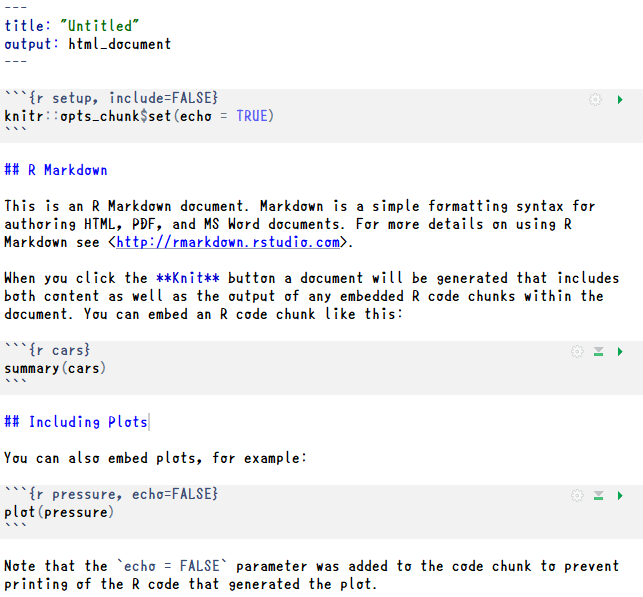

<!-- Include shared Links -->
```{r rmd_basics, child="../shared/links.Rmd"}
```

```{r setup, echo = FALSE}
knitr::opts_chunk$set(echo = TRUE, warning = FALSE, comment = "##")
```

[R <i class="fa fa-external-link"></i>][R]や[R Commander（以降、Rcmdr） <i class="fa fa-external-link"></i>][Rcmdr]に限ったことではありませんが、一般的に分析過程を記録として残すのは難しいものです。[データ分析勉強会 <i class="fa fa-external-link"></i>][1]で主に用いた[R Commander（以降、Rcmdr） <i class="fa fa-external-link"></i>][Rcmdr]やExcelのようにGUI操作のものは、操作自体は簡単ですが操作の過程（分析過程）を記録するには大変な手間がかかります。例えば[Rcmdr <i class="fa fa-external-link"></i>][Rcmdr]を例に挙げると  
　  

* 操作が自体は記録に残らない（実行された結果のみが残る）
* データセットやモデルの切り替えが出力されない（記録されない）
* 操作と出力がセットで出力されない（なので一致させるのに一苦労）
* 計算結果（出力）の整形に手間がかかる
* グラフィック出力は個々に保存する必要がある

　  
分析自体が簡単にできても分析結果を報告書にまとめるためには、分析と並行して常に手順や結果を記録しておく必要があります。このような作業は間違いを誘発することが容易に想像できます。間違いのない分析・報告書作成を行う唯一にして確実な方法は、分析と報告書作成が同時にできる[R Markdown <i class="fa fa-external-link"></i>][RMD]を利用することです。  
　  

# R Markdownとは
[R Markdown <i class="fa fa-external-link"></i>][RMD]は文字通り（軽量）マークアップ言語である
[Markdown <i class="fa fa-external-link"></i>][MD]による記述を用いた記録方法で、[R <i class="fa fa-external-link"></i>][R]におけるドキュメント作成フレームワークの一つとして位置づけられています。[R Markdown <i class="fa fa-external-link"></i>][RMD]を用いることで報告書の中にデータやコード、分析結果を手間をかけずに埋め込むことができます。  
　  

## なぜR Markdownなのか
分析にはデータの透明性だけでなく分析過程の透明性も求められる時代になっています。多くのプログラミング言語では計算結果やグラフなどを直接、最終成果物となる報告書やプレゼン資料などのドキュメントに出力することは困難であり、ドキュメントに結果を切り貼りするために多くの労力が必要になります。表計算ソフトは計算結果やグラフを切り貼りする必要はありませんが、ドキュメントの体裁を整えるのに多くの労力が必要です。特に章節構成を要求された場合は、表計算ソフト単体ではかなり困難で、文書作成ソフトに結果を切り貼りするケースがほとんどです。また、表計算ソフトは分析式が個々のセルに記載されていることが多く作成者以外、手がつけられないケースも多く見受けられます。  
　  
[R Makrdown <i class="fa fa-external-link"></i>][RMD]を利用するとドキュメントを生成するたびにデータが読み込まれ、[R <i class="fa fa-external-link"></i>][R]のコードが実行され、グラフや計算結果、表などが出力され、自動的にドキュメントに埋め込まれます。これによりグラフや計算結果、表などをドキュメント修正のたびに切り貼りし直す必要もなく[Markdown <i class="fa fa-external-link"></i>][MD]による章構成も可能で、常に指定したデータから同じ手順で同じ結果を得ることが可能になります。つまり、[R Markdown <i class="fa fa-external-link"></i>][RMD]を用いることで

* ドキュメント生産性の向上（**コピペ汚染からの解放**、簡単作成）
* 分析過程の可読性確保
* **分析再現性の確保**（[Reproducible Research <i class="fa fa-external-link"></i>][CRAN_TV_RR]）

が実現できるようになります。更に[R Markdown <i class="fa fa-external-link"></i>][RMD]では、同一ソースから複数のフォーマットのドキュメントを作成することも可能ですので、提出先に応じた形式のドキュメント作成も簡単です。  
　  

## 使うためのには
[R Markdown <i class="fa fa-external-link"></i>][RMD]を使うには必要なソフトウェアが同梱されている[RStudio <i class="fa fa-external-link"></i>][RS]環境で使うのが現状ではベストです。[RStudio <i class="fa fa-external-link"></i>][RS]のインストールは[こちら](../program/env_index.html)を参照してください。[`rmarkdown`パッケージ <i class="fa fa-external-link"></i>](https://cran.r-project.org/web/packages/rmarkdown/index.html){target="_blank" title="Dynamic Documents for R"}が必須ですので、以下のコマンドまたは[RStudio <i class="fa fa-external-link"></i>][RS]のGUIからインストールしてください。  
　  

```
install.packages("rmarkdown")
```

　  

# R Markdownの基本
[R Markdown <i class="fa fa-external-link"></i>][RMD]は[Pandoc <i class="fa fa-external-link"></i>](https://pandoc.org/){target="_blank" title="a universal document converter"}の[Markdown <i class="fa fa-external-link"></i>][MD]をベースとした記述を用います。ファイル形式はシンプルなテキスト形式になります。なお、日本語を利用する場合には言語コードとしてBOMなしのUTF-8としてください。  

下記は[RStudio <i class="fa fa-external-link"></i>][RS]のデフォルトテンプレート（HTML Document）です。  


　  

このテンプレートからドキュメントを生成するとこのページを作成している環境ではこのようなドキュメントになります。これはR Markdwon Websiteを作成する環境にしているためで、ご利用の環境によっては体裁が異なります。  


　  
このように[R Markdown <i class="fa fa-external-link"></i>][RMD]の記述には見慣れない記号などがあると思いますが、記述自体はいたってシンプルです。記述の構成は以下の３つパートから成り立っていますので、この構成を覚えてください。

* 出力フォーマットや体裁を記述する[YAML](#YAML)部
* [R <i class="fa fa-external-link"></i>][R]のコードを記述する[(Code) Chunk](#Chunk)部
* 文書を記述する[Markdown](#Markdown)部

　  

## YAML {#YAML}
[YAML <i class="fa fa-external-link"></i>][YAML]とはデータ表現形式の一種で[R Markdown <i class="fa fa-external-link"></i>][RMD]では下記のように`---`から`---`までに囲まれたブロックで表現します。  
[YAML <i class="fa fa-external-link"></i>][YAML]には[R Markdown <i class="fa fa-external-link"></i>][RMD]の出力フォーマットや体裁を定義し、下記の例ではHTML形式のドキュメントがデフォルト体裁で出力されるようになります。  

    ---
    output: html_document
    ---

出力フォーマットごとに指定できるオプションが異なりますので、詳細は「[フォーマット定義](#format)」の項を参照してください。  

　  

### フォーマット定義 {#format}
[R Markdown <i class="fa fa-external-link"></i>][RMD]で利用できる出力フォーマットはドキュメント系のフォーマットとプレゼンテーション系のフォーマットに大別できます。デフォルトでも様々なフォーマットをサポートしていますが、パッケージを追加することで更に多様なフォーマットを利用できるようになります。  
　  

#### ドキュメント系フォーマット
ドキュメント系フォーマットはHTMLやPDFを始めとして以下のようなフォーマットをサポートしています。標準でサポートされていないフォーマットのドキュメントを作成する場合には追加でパッケージをインストールしてください。  
　  

フォーマット               | 標準サポート    | output指定      | 備考
---------------------------|-----------------|-----------------|-----
[HTML <i class="fa fa-external-link"></i>][HTML]            | yes           | `html_document` | 
[PDF <i class="fa fa-external-link"></i>][PDF]              | yes           | `pdf_document`  | 
[Microsoft Word <i class="fa fa-external-link"></i>][DOCX]  | yes           | `word_document` | DOCX
[RTF <i class="fa fa-external-link"></i>][RTF]              | yes           | `rtf_document`  | 
[Markdown <i class="fa fa-external-link"></i>][MDS]         | yes           | `md_document`   | GitHub, etc
[R package vignette <i class="fa fa-external-link"></i>][Vignette] | yes    | `html_vignette` | 
[Tufte Handout <i class="fa fa-external-link"></i>][Tufte]  | no, [`tufte` <i class="fa fa-external-link"></i>][Pkg_tufte] | `tufte::tufte_handout` | PDF 
　                      | 　            | `tufte::tufte_html` | 
　                      | 　            | `tufte::tufte_book` | PDF
[rmdformat <i class="fa fa-external-link"></i>][rmdformats] | no, [`rmdformats` <i class="fa fa-external-link"></i>][Pkg_rmdformats] | `rmdformat::material` | HTML
　                      | 　            | `rmdformats::readthedown` | HTML
　                      | 　            | `rmdformats::html_clean`  | 
　                      | 　            | `rmdformats::html_docco`  | 

　  

#### プレゼンテーション系フォーマット
プレゼンテーション系フォーマットはドキュメント系フォーマットと同様にHTMLやPDFを始めとして以下のようなフォーマットをサポートしています。標準でサポートされていないフォーマットのドキュメントを作成する場合には追加でパッケージをインストールしてください。  
各フォーマットともスライド切り替えをサポートしていますが、HTML系フォーマットは[HTML widget](http://www.htmlwidgets.org/)との相性が悪いフォーマットが多いので注意してください。  
　  

フォーマット               | 標準サポート    | output指定      | 備考
---------------------------|-----------------|-----------------|-----
[Beamer <i class="fa fa-external-link"></i>][Beamer]     | yes              | `beamer_presentation` | PDF 
[ioslides <i class="fa fa-external-link"></i>][ioslides] | yes              | `ioslides_presentation` | Google ioslides
[Slidy <i class="fa fa-external-link"></i>][Slidy]       | yes              | `slidy_presentation`  | W3C Slidy
[revealjs <i class="fa fa-external-link"></i>][revealjs] | no, [`revealjs` <i class="fa fa-external-link"></i>][Pkg_revealjs] | `revealjs::revealjs_presentation` | HTML with reveal.js
[xaringan（写輪眼） <i class="fa fa-external-link"></i>][xaringan] | no, [`xaringan` <i class="fa fa-external-link"></i>][Pkg_xaringan] | `xaringan::moon_reader` | HTML with remark.js
[Shower <i class="fa fa-external-link"></i>][Shower]     | no, [`rmdshower` <i class="fa fa-external-link"></i>][Shower] | `rmdshower::shower_presentation` | HTML

　  

### YAML Option
YAMLでは出力フォーマット以外にドキュメントタイトルや作者名、作成日などの指定ができます。記述順は問いませんのでご自分で分かりやすい順で記述してください。特に出力フォーマットのオプションは多様ですのでアルファベット順にするのが分かりやすいと思います。  
　  

    ---
    title: "メインタイトル"
    subtitle: "タイトル下に表示されるサブタイトル"
    author: "作者名"
    date: "作成日、後述のinline chunkも利用可"
    output:
        # ここに出力フォーマットを指定します
        # これ以降は出力フォーマットのオプションを指定します
    ---

　  
`output`オプションは出力フォーマットごとに異なります。代表的なオプションは以降を参照してください。  
　  

#### HTML系出力オプション
HTML系フォーマットは概ね同じオプションが使えます。まずは下記のオプションを指定してみて必要に応じて調整してみてください。  

    ---
    output:
      html_document:
        code_folding: hide
        df_print: paged
        highlight: "default"
        md_extensions: -ascii_identifiers
        number_section: yes
        theme: "default"
        toc: yes
        toc_depth: 3
        toc_float:
          collapsed: yes
          smooth_scroll: no
    ---

　  
各オプションが取る値は以下のようになっています。その他のオプションは[公式ドキュメント <i class="fa fa-external-link"></i>][HTML]または[ぞうさんによる日本語での解説 <i class="fa fa-external-link"></i>](https://qiita.com/kazutan/items/726e03dfcef1615ae999){target="_blank" title="Kazutan"}を参照してください。  
　  

option | default | others                                | memo
-------|---------|---------------------------------------|------------
code_folding    | show      | hide, none           | Rコードの表示方法
df_print        | default   | kable, tibble, paged | data.frameの表示方法
highlight       | "default" | "tango", "pygments", "kate", "monochrome", "espresso", "zenburn", "haddock", "textmate" | コードハイライティング
md_extensions   | NULL      |                      | ^1)^
number_sections | false     | true, (yes, no)  | 見出し番号
theme           | "default" | "cerulean", "journal", "flatly", "readable", "spacelab", "united", "cosmo", "lumen", "paper", "sandstone", "simplex", "yeti" | [Bootswatch <i class="fa fa-external-link"></i>][Bootswatch] ^2)^
toc             | false     | true, (yes, no)      | 目次の有無
toc_depth       | 3         | 1, 2, 4, 5, 6        | 目次に表示するの階層レベル
toc_float       | false     | true, (yes, no)      | ^3)^
  collapsed     | true      | false, (yes, no)     | 目次の自動折りたたみ
  smooth_scroll | true      | false, (yes, no)     | 目次のスクロール方法


^1)^ 日本語見出しを使う場合は`-ascii_identifiers`を指定する  
^2)^ RStudioに同梱されているBootswatchのバージョンは3.3.5  
^3)^ `collapsed`, `smooth_scroll`を指定する場合は何も指定しない  

　  

#### PDF系出力オプション
PDF系フォーマットの出力オプションは今後整理する予定です。  
　  

## (Code) Chunk {#Chunk}
(コード)チャンクは文字通りプログラムコードを記述する部分です。記述したコードはドキュメントまたはプレゼンテーションを作成する際に実行されてコードと実行結果が埋め込まれます。[R <i class="fa fa-external-link"></i>][R]のコードはもちろんですが、その他の言語（Python, SQL, Stanなど）のコードを記述して実行することも可能です。  

三連のバッククォート（$```$）で囲まれたブロックがチャンクです。$\{r\}$の部分でチャンクのオプションを指定します。  
　  


　  

### チャンク・オプション
中括弧（`{`）の次にある`r`はチャンク内に記述されたコードが[R <i class="fa fa-external-link"></i>][R]言語であることを意味しています。次の`ChunkName`はチャンクの名前でファイル内でユニークに設定する必要があります。その次の`echo`や`message`は[R <i class="fa fa-external-link"></i>][R]のコードの実行結果に対するオプションです。  
知っておくと便利な基本的なオプションを下表に示しておきます。なお、詳細や他のオプションについては[R Markdown Reference Guid (PDF) <i class="fa fa-external-link"></i>](https://www.rstudio.com/wp-content/uploads/2015/03/rmarkdown-reference.pdf){target="_blank" title="RStudio"}を参照してください。  
　  

Type       | Option  | Default | Description
-----------|---------|:-------:|------------
コード評価 | eval    | TRUE    | コードを実行するかしないか
実行結果   | echo    | TRUE    | コードを出力に含めるか含めないか
　         | message | TRUE    | コードが出力するメッセージを含めるか含めないか
　         | warning | TRUE    | コードが出力する警告を含めるか含めないか
　         | error   | TRUE    | コードが出力するエラーメッセージを含めるか含めないか
コード表示 | comment | '##'    | コードの先頭に不可される文字列の指定
グラフ描画 | fig.cap | NULL    | グラフと共に表示するキャプションの指定

　  

### インライン・チャンク
文中（行中）で[R <i class="fa fa-external-link"></i>][R]のコード実行する場合にはインライン・チャンクを用います。インライン・チャンクはシングル・バッククォートで囲んだコードチャンク（$`r `$）中にコードを記述します。例えば、チャンクの中で円の面積を求める以下のようなコードがある場合  
　  

```{r}
pi * 5.0 ^ 2    # 円の面積を求める
```

　  
その計算結果を文中（行中）に小数点第1位までの桁で表示する場合には、文書中に以下のようなコードチャンクを記述します。  
　  
```{r eval=FALSE}
円の面積は`r round(pi * 5.0 ^ 2, digits = 1)`平方センチとなります。
```
　  
これを実際にR Markdown文書の中で実行すると以下のように計算結果などを文中（行中）で参照することが可能です。  
　  

> 円の面積は`r round(pi * 5.0 ^ 2, digits = 1)`平方センチとなります。

　  
ただし、グラフ（`plot`関数）や回帰モデル（`lm`関数）など返り値が複雑な場合は処理できません。  
　  

### セットアップ・チャンク
チャンク名が`setup`であるチャンクは、セットアップ・チャンクと呼ばれる[RStudio <i class="fa fa-external-link"></i>][RS]環境において特殊な動作をするチャンクです。[RStudio <i class="fa fa-external-link"></i>][RS]のエディタはチャンク単位での実行をサポートしており、任意のチャンクが実行されると自動的に`setup`チャンクを呼び出し初期処理を実行してからチャンクを実行します。この動作が行われるのは[RStudio <i class="fa fa-external-link"></i>][RS]エディタで[R Markdown <i class="fa fa-external-link"></i>][RMD]文書を開き最初に任意のチャンクを実行させたときのみです。セットアップ・チャンクには後述の共通チャンク・オプションの設定や分析に必要なパッケージの読み込み、ローカル定義関数などを記述しておくと便利です。  
　  


　  

### 共通チャンク・オプション
チャンク・オプションはチャンクごとに指定しますが、全てのチャンクに対して同様の設定を繰り返すのは面倒です。それを回避するにはセットアップ・チャンクで`knitr::opt_chenk$set`関数を用いて共通のオプションを指定します。  
```{r eval=FALSE}
knitr::opts_chunk$set(echo = TRUE, warning = FALSE, comment = "#>")
```
これにより各チャンクではチャンク・オプションを省略することが可能になります。また、共通のオプションと異なる指定をしたい場合は個別に設定することで、チャンク側のオプション設定が優先されます。  
　  

## Markdown {#Markdown}
[R Markdown <i class="fa fa-external-link"></i>][RMD]で使える[Markdown <i class="fa fa-external-link"></i>][MD]は前述のように[Pandoc <i class="fa fa-external-link"></i>](https://pandoc.org/){target="_blank" title="a universal document converter"}の[Markdown <i class="fa fa-external-link"></i>][MD]です。[R Markdown <i class="fa fa-external-link"></i>][RMD]の記述ルールは多岐に渡りますので、代表的なルールを以下に紹介します。  

### 見出し
文書の章節項に当たる見出しは最大6階層まで指定可能ですが、出力を考慮すると多くても4階層以内に止めておくのが無難です。できれば、3階層以内に抑えておくことをおすゝめします。  
　  

表記     | レベル  | HTMLタグ | 備考
---------|---------|----------|------
`#`      | 見出し1 | H1       | 「章」相当
`##`     | 見出し2 | H2       | 「節」相当
`###`    | 見出し3 | H3       | 「項」相当
`####`   | 見出し4 | H4       | 
`#####`  | 見出し5 | H5       | 
`######` | 見出し6 | H6       | 

なお、見出しは必ずしも「見出し1」から使う必要はありません。また、「見出し2」の次が「見出し4」になっていても構いませんが、目次や見出し番号を使う場合には注意してください。  
　  

### 箇条書き
箇条書きは番号なしと番号付きの二種類の箇条書きがあります。どちらもネスト可能です。  
　  

#### 順序なし箇条書き
順序なし箇条書きは`* `(半角アスタリスク＋半角空白)で始めます。ネストする場合は、箇条書きの頭に半角空白4文字を必ず入れて下さい。ネストレベルを区別するために`+ `や`- `で箇条書きを始めることが可能で、同一レベルに`+ `や`- `が混在しても区別されません。  
　  

```
* List 1
* List 2
    * sub-item 1
    + sub-item 2
        * sub-sub-item 1
        + sub-sub-item 2
        - sub-sub-item 3
    - sub-item 3
* List 3
+ List 4
- List 5
```

　  

上記の記述は下記のように出力されます。  

* List 1
* List 2
    * sub-item 1
    + sub-item 2
        * sub-sub-item 1
        + sub-sub-item 2
        - sub-sub-item 2
    - sub-item 3
* List 3
+ List 4
- List 5

　  

#### 順序付き箇条書き
順序付きの箇条書きは下表のように複数の種類があり、ネストの位置に関わらず指定が可能です。

順序の種類           | 表記  | 備考
---------------------|-------|---
数字                 | `1. ` | 
ローマ数字（小文字） | `i) ` | ローマ数字の場合は`)`になります
ローマ数字（大文字） | `I) ` | 同上
アルファベット       | `a. ` | 大文字のアルファベットは使えません
リナンバー           | `(@)` | 1から振り直す場合（数字のみに有効）

リスト名の前に半角空白文字1文字を入れる必要があるのは順序なし箇条書きと同じで、ネストがあっても順序は維持されます。  
　  

```
1. Ordered List 1
1. Ordered List 2
    i) sub-item 1
    i) sub-item 2
        a. sub-sub-item 1
        a. sub-sub-item 2
        a. sub-sub-item 2
    i) sub-item 3
1. Ordered List 3
(@) Renumber List 4
(@) Renumber List 5
```

　  

上記の記述は下記のように出力されます。  

1. Ordered List 1
1. Ordered List 2
    i) sub-item 1
    i) sub-item 2
        a. sub-sub-item 1
        a. sub-sub-item 2
        a. sub-sub-item 2
    i) sub-item 3
1. Ordered List 3
(@) Renumber List 4
(@) Renumber List 5

　  

### 表
テキストベースの表を表として出力することが可能です。これ以外にチャンクから`data.frame`などを表として出力することも可能です。これは[R Markdown Tables](./rmd_table.html)で説明しますので、本項ではテキストベースの表のみ説明となります。  
テキストベースの表は以下のように記述します。表の幅は文字数により出力フォーマットの幅に収まるように調整されます。また、文字の配置は右寄せ（`:---`）、中央揃え（`:---:`）、左寄せ（`---:`）を指定することも可能です。  
　  

  

　  
上記の記述は実際に出力されると以下の表になります。なお、`theme`などのオプションにより表の体裁は若干変わります。  
　  

列名   | 列名     | 列名   | 列名
:------|:--------:|-------:|---------
右寄せ | 中央揃え | 左寄せ | おまかせ


### 文字装飾

文字種 | 指定方法            | 備考
-------|---------------------|----------
太字   | `Bold`          | フォントによっては太字にならない場合があります
斜体   | `*Italic*`          | フォントによっては*斜体*にならない場合があります
上付き | `^Superscript^`     | リンクと組み合わせるとジャンプ可能です^[1]^
下付き | `~Subscript~`       | 同上~[2]~
取消線 | `~~Strikethrough~~` | フォントによっては~~取消線~~がつかない場合があります

上付き、下付きでリンクと組み合わせる場合は後述のハイパーリンクの項を参照してください。  
　  

### ハイパーリンク
文書中にハイパーリンクを指定する場合は以下のように記述します。  

種別             | 指定方法             | 備考
-----------------|----------------------|----------
インライン指定   | `[Link Text](URL)`   | 
インデックス指定 | `[Link Text][Index]` | 別途、インデックス記述要
インデックス指定 | `^[Index]^` or `~[Index]~` | 上付き、下付き文字で使う場合

インデックス指定の場合はインデックス（`[Index]: URL "Alt Text"`）を最後に記述しておく必要があります。なお、インデックス自体は出力ドキュメントには含まれません。  
　  

### 画像
文書中に画像（PNG, JPEGなど）ファイルを挿入する場合はリンクと似たよう以下の記述をします。  

種別             | 指定方法             | 備考
-----------------|----------------------|----------
インライン指定   | ``   | 
インデックス指定 | `![Caption][Index]`       | 別途、インデックス記述要

インデックス指定の場合はインデックス（`[Index]: file_path "alt Text"`）を最後に記述しておく必要があります。なお、インデックス自体は出力ドキュメントには含まれません。  
　  

### 数式
数式は$\LaTeX$の数式モードを利用することで表示可能です。数式モードで扱えるのはインライン数式モードとディスプレイ数式モードのみで、番号付きのディスプレイ数式モードは扱えません。また、数式モードの中でもインライン・チャンクが使えます。なお、$\LaTeX$のレンダリングは外部のレンダリング・エンジンに依存するため出力フォーマットによっては表示のためにインターネット接続が必要になるものもあります（主にHTML系フォーマット）。  

種別             | 指定方法             | 備考
-----------------|----------------------|----------
インライン数式   | `$LaTex Equation$`   | 文書と同一行中に表示する場合 
ディスプレイ数式 | `$$LaTex Equation$$` | 文書とは別段落として表示する場合

$\LaTeX$の数式モードで扱える表現は[$\LaTeX$コマンド集 <i class="fa fa-external-link"></i>](http://www.latex-cmd.com){target="_blank" title="LaTeXコマンド集"}が参考になります。  
　  

### 特殊な見出し
出力がHTML系のフォーマットの場合、見出しを利用して「タブ」表示を行うことが可能です。以下のように記述すると見出し1の一つ下のレベルの見出し2がタブとして扱われます。タブとして扱う場合は`{.unnumbered}`を明示的に指定して見出し番号が付かないようにしておくことをおすゝめします。  
なお、タブを指定した見出しと同一レベルの見出しが出てきた時点でタブ表示は自動的に終了となります。  
　  

```
# Tabset Chapter {.tabset .unnumbered}
## Tab 1 {.unnumbered}
## Tab 2 {.unnumbered}

# Non Tabset Chapter
## Non Tab 1
## Non Tab 2
```

　  

#### Tabset {.tabset .unnumbered}
見出し4のレベルでタブを指定すると見出し5のレベルが全てタブとして扱われるようになります。  
　  

##### Tab 1 {.unnumbered}
これはタブ1の内容です。  
　  

##### Tab 2 {.unnumbered}
これはタブ2の内容です。  
　  

##### Tab 3 {.unnumbered}
これはタブ3の内容です。  
　  

### 区切り線
区切り線（プレゼンテーション系ドキュメントの場合はスライド区切り）は三つ以上の連続した半角アスタリスク`*`またはハイフン`---`を記述します。  
　  

# 参考資料

* [R Markdownで楽々レポートづくり <i class="fa fa-external-link"></i>](http://gihyo.jp/admin/serial/01/r-markdown){target="_blank" title="技術評論社"}
* [R Markdown入門 <i class="fa fa-external-link"></i>](https://kazutan.github.io/kazutanR/Rmd_intro.html){target="_blank" title="ぞうさんのページ"}

　  

---

<!-- Include Footer -->
```{r child="../shared/footer.Rmd"}
```

<!-- Default Support Formats -->
<!-- Document -->
[HTML]: http://rmarkdown.rstudio.com/html_document_format.html {target="_blank" title="HTML Document"}
[PDF]: http://rmarkdown.rstudio.com/pdf_document_format.html {target="_blank" title="PDF Document"}
[DOCX]: http://rmarkdown.rstudio.com/word_document_format.html {target="_blank" title="Microsoft Word Document"}
[ODT]: http://rmarkdown.rstudio.com/odt_document_format.html {target="_blank" title="OpenDocument Text Document"}
[RTF]: http://rmarkdown.rstudio.com/rtf_document_format.html {target="_blank" title="Rich Text Format Document"}
[MDS]: http://rmarkdown.rstudio.com/markdown_document_format.html {target="_blank" title="Markdown document (various flavors)"}
[Vignette]: http://rmarkdown.rstudio.com/package_vignette_format.html {target="_blank" title="R package vignette (HTML)"}
[GitHub]: http://rmarkdown.rstudio.com/github_document_format.html {target="_blank" title="GitHub Flavored Markdown"}

<!-- Presentation -->
[Beamer]: http://rmarkdown.rstudio.com/beamer_presentation_format.html {target="_blank" title="PDF presentation with LaTeX Beamer"}
[ioslides]: http://rmarkdown.rstudio.com/ioslides_presentation_format.html {target="_blank" title="HTML presentation with Google ioslides"}
[Slidy]: http://rmarkdown.rstudio.com/slidy_presentation_format.html {target="_blank" title="HTML presentation with W3C Slidy"}

<!-- Package Support Formats -->
[revealjs]: http://rmarkdown.rstudio.com/revealjs_presentation_format.html {target="_blank" title="HTML presentation with reveal.js"}
[Tufte]: http://rmarkdown.rstudio.com/tufte_handout_format.html {target="_blank" title="Handouts in the style of Edward Tufte"}
[rmdformats]: https://github.com/juba/rmdformats {target="_blank" title="clean HTML documents"}
[Shower]: https://github.com/mangothecat/rmdshower {target="_blank" title="Template for the Shower Presentation Engine"}
[xaringan]: https://github.com/yihui/xaringan {target="_blank" title="slideshows with remark.js through R Markdown"}

[bookdown]: https://bookdown.org/ {target="_blank" title="Build eBook"}
[RmdWebsites]: http://rmarkdown.rstudio.com/rmarkdown_websites.html {target="_blank" title="Build Website with bootswatch theme"}

<!-- CRAN -->
[Pkg_Tufte]: https://cran.r-project.org/web/packages/tufte/index.html {target="_blank" title="CRAN Package tufte"}
[Pkg_rmdformats]: https://cran.r-project.org/web/packages/rmdformats/index.html {target="_blank" title="CRAN Package rmdformats"}
[Pkg_revealjs]: https://cran.r-project.org/web/packages/revealjs/index.html {target="_blank" title="CRAN Package revealjs"}
[Pkg_xaringan]: https://cran.r-project.org/web/packages/xaringan/index.html {target="_blank" title="CRAN Package xaringan"}

[CRAN_TV_RR]: https://cran.r-project.org/web/views/ReproducibleResearch.html {target="_blank" title="CRAN Task View: Reproducible Research?"}

<!-- Bootstrap -->
[Bootswatch]: https://bootswatch.com/3/ {target="_blank" title="Free themes for Bootstrap"}
[cerulean]: https://bootswatch.com/3/cerulean/ {target="_blank" title="Cerulean, A calm blue sky"}
[cosmo]: https://bootswatch.com/3/cosmo/ {target="_blank" title="Cosmo, An ode to Metro"}
<!-- [cyborg]: -->
<!-- [darkly]: -->
[flatly]: https://bootswatch.com/3/flatly/ {target="_blank" title="Flatly, Flat and modern"}
[journal]: https://bootswatch.com/3/journal/ {target="_blank" title="Journal, Crisp like a new sheet of paper"}
[lumen]: https://bootswatch.com/3/lumen/ {target="_blank" title="Lumen, Light and shadow"}
[paper]: https://bootswatch.com/3/paper/ {target="_blank" title="Paper, Material is the metaphor"}
[readable]: https://bootswatch.com/3/readable/ {target="_blank" title="Readable, Optimized for legibility"}
[sandstone]: https://bootswatch.com/3/sandstone/ {target="_blank" title="Sandstone, A touch of warmth"}
[simplex]: https://bootswatch.com/3/simplex/ {target="_blank" title="Simplex, Mini and minimalist"}
<!-- [slate]: -->
[spacelab]: https://bootswatch.com/3/spacelab/ {target="_blank" title="Spacelab, Silvery and sleek"}
<!-- [superhero]: -->
[united]: https://bootswatch.com/3/united/ {target="_blank" title="United, Ubuntu orange and unique font"}
[yeti]: https://bootswatch.com/3/yeti/ {target="_blank" title="Yeti, A friendly foundation"}