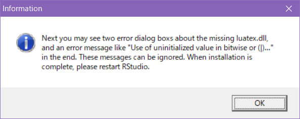
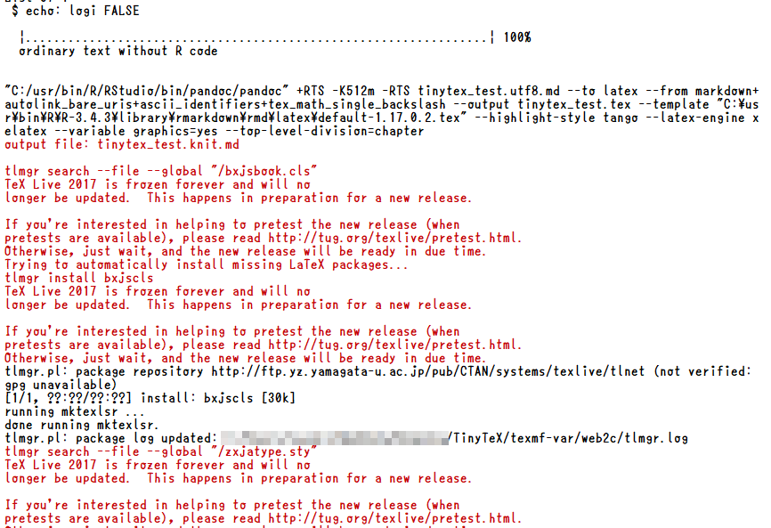

<!-- Include shared Links -->
```{r rmd_pdf, child="../shared/links.Rmd"}
```

```{r setup, include=FALSE}
# 共通chunkオプションの指定
knitr::opts_chunk$set(warning = FALSE, echo = TRUE)

# データハンドリングで利用するパッケージの読み込み
require(tidyverse)
```

R Markdownを利用するとPDFファイルの作成も可能です。ただし、PDFの作成には[R][R]以外に$\TeX/\LaTeX$環境が必要となります。RStudioが推奨する$\TeX/\LaTeX$は以下の通りです。  
　  

OS      | 推奨$\TeX/\LaTeX$ | 日本語対応
--------|-------------------|------------
Linux   | TeX Live 2013以降 | 対応
MacOS   | MacTex 2013以降   | 対応
Windows | MiKTeX            | 非対応

　  
日本語Windows環境ではMiKTeXはあまり推奨できませんので、Linux環境と同様にTeX Liveがおすゝめですが、TeX Liveは$\TeX/\LaTeX$の集大成ともいえる巨大なパッケージの集合ですので、数千ものパッケージの中から必要なパッケージのみをインストールのは$\TeX/\LaTeX$に精通していない限り難しものがあります。取り合えず"scheme-full"をインストールすることになるのですが、4GB超のサイズがあり通信環境によっては一晩かかってもインストールできない場合があります。そこでおすゝめするのが[TinyTeX][TinyTeX]です。  
　  

# TinyTeX
[TinyTeX][TinyTeX]は[RStudio社](https://www.rstudio.com/)で[R Markdown][RMD]などの開発を担当しているYihui Xie氏によるTeX Liveをベースとした軽量ディストリビューションです。実際、日本語関連のパッケージを入れても300MB程度と非常にコンパクトです。  
同名の[**`tinytex`**][tinytex]パッケージを用いることで[R][R]からインストールやメンテナンスができるようになりますので、$\TeX/\LaTeX$を使うのは[R Markdown][RMD]だけという場合に向いています。  
　  

# インストール
[TinyTeX][TinyTeX]をインストールするには、最初に[**`tinytex`**][tinytex]パッケージを[R][R]にインストールします。**`rmarkdown`**パッケージと**`knitr`**が必要になりますので、インストールされていな場合は、同時にインストールしてください。  

Package | Description
--------|-------------
tinytex | Helper Functions to Install and Maintain 'TeX Live'

## **`tinytex`**パッケージのインストール
[R][R]のターミナルから以下のコマンド（関数）を実行するか、RStudioのパッケージマネージャから**`tinytex`**パッケージをインストールします。  
　  

```{r, eval=FALSE}
# install.packages("tinytex", "rmarkdown", "knitr")   # 同時にインストールする場合

install.packages("tinytex")
```

　  

## TinyTeXのインストール
**`tinytex`**パッケージがインストールされたら、[R][R]のターミナルから以下のコマンド（関数）を実行します。  
　  

```{r, eval=FALSE}
tinytex::install_tinytex()
```

　  

途中で以下のようなメッセージが表示されますが文字通り気にしないで下さい。  
　  



　  
その後、延々とメッセージが表示され途中止まったようになりりますが気長に待ってください。回線にもよりますが10分程度でインストールは終わります。  
　  

## RStudioの再起動
**`TinyTeX`**のインストールが完了したら[RStudio][RSD]を再起動してください。  
　  

## テストビルド
[RStudio][RSD]を再起動したらYAMLを下記のように記述した日本語を含む[R Mardkown][RMD]ファイルを用意してknitしてみて下さい。特に問題なくPDFファイルがビルドされるハズです。  
パッケージが不足している場合はknit中に自動的にインストールしてくれます。  
　  



　  

### **`xelatex`**を使う場合
```
---
output: 
  pdf_document:
    latex_engine: xelatex
    pandoc_args: --top-level-division=chapter
documentclass: bxjsbook
classoption: xelatex, ja=standard
geometry: no
---
```

　  

### **`lualatex`**を使う場合
```
---
output: 
  pdf_document: 
    latex_engine: lualatex 
    pandoc_args: --top-level-division=chapter
documentclass: ltjsarticle 
---
```

　  

---

<!-- Include Footer -->
```{r child="../shared/footer.Rmd"}
```

[TinyTex]: https://yihui.name/tinytex/ "A lightweight, cross-platform, portable, and easy-to-maintain LaTeX distribution based on TeX Live"
[tinytex]: https://cran.r-project.org/web/packages/tinytex/index.html "tinytex package"