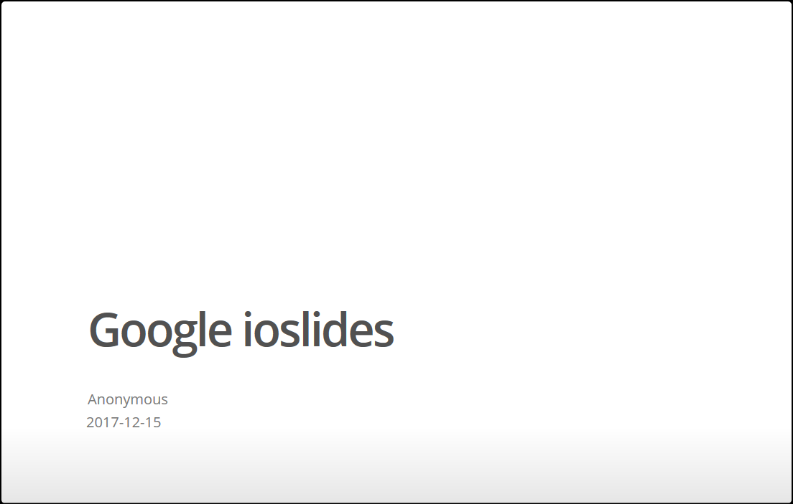

<!-- Include shared Links -->
```{r rmd_tables, child="../shared/links.Rmd"}
```

```{r setup, include=FALSE}
knitr::opts_chunk$set(echo = TRUE, message = FALSE, warning = FALSE)
require(tidyverse)

source("../shared/common.R")
```

<!-- * [xtable](https://cran.r-project.org/web/packages/xtable/) -->
<!-- * [stargazer](https://cran.r-project.org/web/packages/stargazer/) -->
<!-- * [pander](http://rapporter.github.io/pander/) -->
<!-- * [tables](https://cran.r-project.org/web/packages/tables/) -->
<!-- * [ascii](http://eusebe.github.io/ascii/) -->

　  

# はじめに
[R Markdown][RMD]では(Pandoc) Markdownによるテキストを用いた表の作成が可能すが、chunkからの出力を表形式にすることも可能です。本ページでは分析レポートで比較的利用することが多いテーブル（表）の作成方法を説明します。  
　  

# HTML系フォーマット
## 標準機能
[R Markdown][RMD]のHTML系フォーマットには**`df_print`**といオプションがあります。**`df_print`**オプションは"Data Frame Print"の略であり文字通り**`dara.frame`**型のデータを表示する方法を指定するためのオプションです。  

    ---
    output: 
      html_document:
        df_print: default
    ---

指定できる値は四種類あり、表と呼べるのは実質二種類と言っても差し支えないと思います。残る二つはいわゆるテキスト表形式です。  

値      | 出力形式
--------|----------
default | Rで`data.frame`を表示した時に使われるテキスト表形式
kable   | シンプルな表形式
paged   | ページ区切りのついたインタラクティブな表形式 
tibble  | `tibble`クラスを用いた簡易なテキスト表形式

　  

### default {#default}
**`df_print`**に**`default`**を指定した場合は、[R][R]のコンソールで**`data.frame`**を表示させた場合と同じテキスト表形式で表示されます。注意すべき点は表示対象となるデータが大きい（多数の列がある）場合でも全てのデータを表示しますので、ドキュメントの体裁に合わせて**`head`**関数や**`tail`**関数などで適宜、表示行数を調整してください。  

  
　  

[実際の表示例はこちら](./table/rmd_table_default.html)  
　  

### kable {#kable}
**`df_print`**に**`kable`**を指定した場合は、**`knitr::kabele`**関数を用いたシンプルな表形式で表示されます。注意すべき点は**`default`**を指定した場合と同じく表示対象となるデータが大きい（多数の列がある）場合でも全てのデータを表示しますので、ドキュメントの体裁に合わせて**`head`**関数や**`tail`**関数などで適宜、表示行数を調整してください。  

  
　  

[実際の表示例はこちら](./table/rmd_table_kable.html)  
　  

### paged {#paged}
**`df_print`**に**`paged`**を指定した場合は、**`default`**や**`kable`**と異なり10行単位でページ区切りされた表形式で表示されます。ページ遷移のリンクボタンが自動的に生成され、各列に変数型が表示され、列数が多いと自動的にスクロール表示になります。注意すべき点はプレゼンテーション系のフォーマットとは相性が悪いこともある点です。  

  
　  

[実際の表示例はこちら](./table/rmd_table_paged.html)  
　  

### tibble {#tibble}
**`df_print`**に**`tibble`**を指定した場合は[R][R]のコンソールで**`tibble`**クラスのオブジェクトを表示させた場合と同じテキスト表形式で表示されます。注意すべき点は表示対象となるデータが大きい（多数の列がある）場合でも自動的に10行に省略されて表示しますので、全てのデータを見たい場合は**`paged`**や追加パッケージによる表示を行って下さい。
  

  
　  

[実際の表示例はこちら](./table/rmd_table_tibble.html)  
　  

## 追加パッケージ
表を作成するために様々なパッケージがリリースされています。これらのパッケージを用いることで標準では表現できない表や様々な機能を持った表をつくることができるようになります。  
　  

### Package DT {#DT}
**`DT`**パッケージは[RStudio][RS]社製のインタラクティブな表を作成するためのパッケージです。**`df_print`**の[**`paged`**オプション](#paged)のようにページ単位で表示するだけでなく、データのソートや検索といったことも可能です。使い方の詳細については[DT: An R interface to the DataTables library](http://rstudio.github.io/DT/)でご確認ください。  
  

  
　  

[実際の表示例はこちら](./table/rmd_table_DT.html)  
　  

### Package formattable {#formattable}
**`formattable`**パッケージは[Rプログラミング本格入門](http://www.kyoritsu-pub.co.jp/bookdetail/9784320124264)の著者であるKun Renが開発しているパッケージで表現力のある表を作成できます。**`df_print`**の**`kable`**オプションで出力される表をベースに装飾されますので、データ数が多い場合は注意してください。様々な装飾ができる反面、記述するコードが他の表に比べて複雑です。詳細は[作者のGitHub](https://renkun-ken.github.io/formattable/)でご確認ください。[ホクソエムメンバーによる日本語版](https://github.com/renkun-ken/formattable/blob/master/README.ja.md)もあります。  
　  

  
　  

[実際の表示例はこちら](./table/rmd_table_formattable.html)  
　 

# プレゼンテーション系フォーマット
プレゼンテーション系フォーマットではフォーマットによりテーブルとの相性があるものがあります。代表的なフォーマットでどのように表示されるかのサンプルを作成しましたので参考にしてください。  
　  

## Google ioslieds {#ioslides}
ioslidesフォーマットは各種テーブルとの相性はまずまずですが、表によっては表示できる行数が少なくなるものがあります。見栄えを優先するなら**`df_print`**オプションで**`knitr`**を指定し、多くのデータを見せたいときは行数少な目にした**`DT::datatable`**を使うことをおすゝめします。なお、**`widescreen`**オプションは**`true`**に設定してください。  
　  
  
　  

[実際の表示例はこちら](./table/rmd_table_ioslides.html)  

　  

## W3C slidy {#slidy}
slidyフォーマットは各種テーブルとの相性はまずますですが、テキスト表形式は左詰めになるようです。また、縦方向のスクロールが出来ますので列数がさほど多くなければ**`df_print`**オプションで**`paged`**を指定することをおすゝめします。  
　  
  
　  

[実際の表示例はこちら](./table/rmd_table_slidy.html)  
　  

## HTML presentation with reveal.js {#revealjs}
revealjsフォーマットは各種テーブルとの相性があまりよくありません。また、表示できる行数が他のフォーマットに比べ少ないので**`df_print`**オプションで**`knitr`**を指定し、表示する内容は**`head`**関数などで抑制することをおすゝめします。  
　  
  
　  

[実際の表示例はこちら](./table/rmd_table_revealjs.html)  
　  

# PDF系フォーマット
準備中です。  
　  

---

<!-- Include Footer -->
```{r child="../shared/footer.Rmd"}
```
