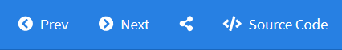

Using flexdashboard - https://rmarkdown.rstudio.com/flexdashboard/using.html

```{r setup, include=FALSE}
require(psych)
require(tidyverse)

head_tail <- function (df, n = 3, caption = "") {
  psych::headTail(df, top = n, bottom = n) %>% knitr::kable(caption = caption)
}
```


# はじめに
ダッシュボードはデータを俯瞰するために有用なツールです。Rでは`flexdashboard`パッケージを用いることで、R Markdownによる静的ダッシュボードが作成できます。静的といっても`htmlwidgets`をサポートしていますのでインタラクティブなグラフィックオブジェクトを配置するは可能です。また、shinyサーバを用いることで動的なダッシュボードの作成にも対応しています。  
　  
`flexdashboard`は、その名の通りフレキシブルにオブジェクトを配置することができ（rowまたはcolumnベースの格子配列）、ウィンドウのリサイズにも自動的に対応します。  
　  
記述は前述のようにR Markdownを用いますので、いたってシンプルです。YAMLに`flexdashboard`の出力であることを指定して、配置したいオブジェクトを記述しknitするだけで、最もベーシックなダッシュボードが作成できます。試しに以下のコードを実行してみてください。  
　  

```
---
title: "flexdashboard"
output: 
  flexdashboard::flex_dashboard
---

### Object Area 1

### Object Area 2

```

　  
二段のダッシュボードが作成できたはずです。  
　  
ダッシュボード内に配置できるオブジェクトはR Markdownで出力できるオブジェクトであれば、ほぼ問題なく配置可能です。ただし、表に関しては`df_print`オプションが利用出来ませんので、`knitr::kabele`関数や`DT::datatable`関数などを用いて表オブジェクトを作成するようにしてください。  

```{r}
iris %>% head_tail(n = 2, caption = "knitr::kableでの表示例")
```


# 配置
`flexdashboard`における配置はR Markdownの見出し（Header `#`や`##`, `###`）を用います。  
　  

Level      | 配置                                      | 備考
-----------|-------------------------------------------|---------
1（`#`）   | 最上段のメニュー（マルチページ指定）      | `=====`での指定も可
2（`##`）  | 列（Coloumn）または行（Row）の分割指定    | `-----`での指定も可
3（`###`） | レベル2内に配置するオブジェクトエリア指定 | 
　  

なお、列または行方向に分割する際には、分割割合を指定することが可能です。分割割合は合計で**`1000`**になるように調整するのが好ましいようです。また、メニューごとに分割方向を変更することも可能です。  
　  

```
---
title: "Multi page and Page rientation"
output: 
  flexdashboard::flex_dashboard
---

# Menu A

## Coloumn {data-width=600}

### Object Area 1

## Coloumn {data-width=400}

### Object Area 2


Menu B {data-orientation=rows}
==============================================================================

Row {data-height=650}
------------------------------------------------------------------------------

### Object Area 3

Row {data-height=350}
------------------------------------------------------------------------------

### Object Area 4

```


# 階層化
メニューは階層化することができます。階層化メニューごとに分割方向を変更することもできます。

```
---
title: "Menu"
output: 
  flexdashboard::flex_dashboard
---

# Second Level Menu 1 {data-navmenu="First Level Menu" data-orientation=cols}

### Object Area 1

### Object Area 2


# Second Level Menu 2 {data-navmenu="First Level Menu" data-orientation=rows}

### Object Area 3

### Object Area 4


```


# オプション
オブジェクトエリアは、ヘッダー消去、フッター追加が可能です。ヘッダーはレベル3（`###`）で指定した文字列が自動的にヘッダーとして表示されますが`{.no-title}`を指定すると非表示にすることができます。一方、フッターは`> `で指定することで表示が可能になります。  
　  

```
---
title: "Menu"
output: 
  flexdashboard::flex_dashboard
---

### Object Area 1 {.no-title}

> Note

### Object Area 2

> Note

```


# Nav-bar
[Navigation Bar <i class="fa fa-external-link"></i>](https://rmarkdown.rstudio.com/flexdashboard/using.html#navigation_bar){target="_blank" title="flexdashboard for R"}

  
メニューの右側にこのようなメニューを表示させる場合、YAMLの`output`に以下のように指定をします。リンクは固定リンクとなる点に留意してください。  
　  

```
---
output: 
  flexdashboard::flex_dashboard:
    navbar:
      - { title: "Prev", icon: "fa-chevron-circle-left", href: ""}
      - { title: "Next", icon: "fa-chevron-circle-right ", href: ""}
    social: [ "menu" ]
    source_code: embed
---
```

　  

設定   | 概要
-------|-----------------------------
navbar | HTMLのリンクを設定します。アイコン表示は常にタイトル文字の左側になります。
social | SNSシェアリンクを作成するためのリンク集が表示されます。
source_code | flexdashboards自体のコードが表示されるようになります。


　  
このようなリンクを利用するとプロジェクトごとにflexdashboardページを作成し、順次表示させるような使い方ができます。  


# Storyboards {.storyboard}
[Storyboards <i class="fa fa-external-link"></i>](https://rmarkdown.rstudio.com/flexdashboard/using.html#storyboards){target="_blank" title="flexdashboard for R"} style. 


### Storyboadsは表示を最大三分割して表示することができる表示形式です。最上段は画面切り替えリンクを兼ねた要約表示部分です。

```{r}
plot(cars)
```

> この画面がメインとなるフレームです。

***

[Commentary <i class="fa fa-external-link"></i>](https://rmarkdown.rstudio.com/flexdashboard/using.html#commentary){target="_blank" title="flexdashboard for R"} フレームはメイン・フレームの左横に展開されるフレームで補足説明などを記載することが可能です。Commentaryフレームは`***`で区切って記述します。  
　  

```
# Storyboards {.storyboard}

### Frame 1

*** 

Some commentary about Frame 1.
```

　  
なお、Commentaryフレームではフッター（ノート）を記述することはできません。  


### 紙芝居のようにストーリー立ててデータを見せることができます。ヘッダーの代わりにこのような切り替えフレームが表示されます。

```{r}
plot(iris)
```


### 切り替えフレームの数に制限はなく、画面からあふれた場合は自動的に左右にスクロールしてくれます。

```{r}
mtcars %>% head_tail()
```


### Storyboardsはページ単位（`#`レベル）で設定することができます。ページ単位で指定する場合は{.storyboard}をタイトルの後ろに記述してください。

```
---
title: "Storyboard"
output: 
  flexdashboard::flex_dashboard:
    storyboard: true
---

# Analysis {.storyboard}

### Frame 1

### Frame 2


# Details
```

