<!-- Include shared Links -->
```{r install git, child="./shared/links.Rmd", include=FALSE}
```

[RStudio <i class="fa fa-external-link"></i>][RStudio] から [GitHub <i class="fa fa-external-link"></i>][GitHub] などのリポジトリを利用することが可能ですが、利用には別途 [Git <i class="fa fa-external-link"></i>][git] をインストールする必要があります。また、 [RStudio  <i class="fa fa-external-link"></i>][RStudio] には [Git <i class="fa fa-external-link"></i>][git] のGUIクライアント機能が実装されていますが基本的な機能のみですので、別途GUIクライアントを準備しておくことをおすゝめします。  
　  

# Gitのインストール
UbuntuやMac OSの場合、公式リポジトリからインストールできますので、ここではWindow環境を中心に記述してあります。  
　  

## Git for Windown
Windows用Gitには [Git for Windows <i class="fa fa-external-link"></i>][GitWin] や [公式Git <i class="fa fa-external-link"></i>][git] がありますので、お好みで選んでください。ここでは [Git for Windows <i class="fa fa-external-link"></i>][GitWin] のインストール方法を紹介します。  
　  

1) [Git for Windows <i class="fa fa-external-link"></i>][GitWin] からインストーラをダウンロードして起動します

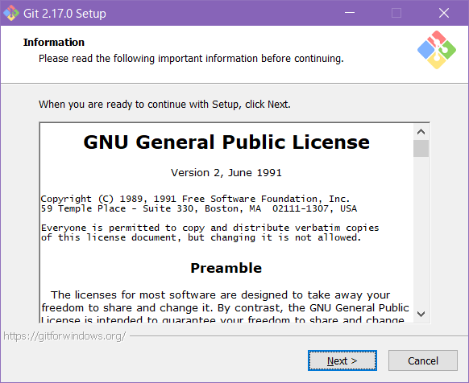

　  

2) コンポーネントの選択は任意ですがRStudioやGUIクライアントで利用する場合はミニマムで構いません

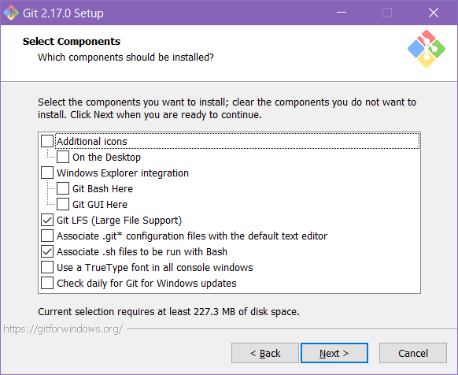

　  

3) （ソース）エディタはお好みのエディタを指定してください

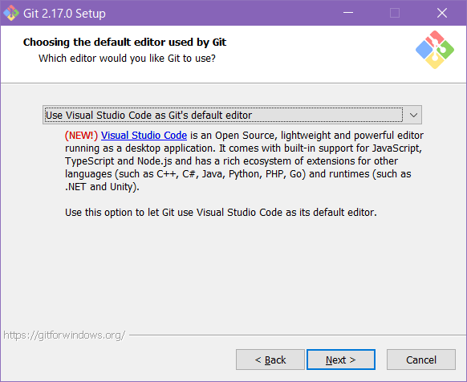

特にお好みのエディタがない場合はMicrosoftの [Visual Studio Code <i class="fa fa-external-link"></i>][VSCode] をおすゝめします。  
　  

4) Gitをコマンドラインで利用する方法を選択します

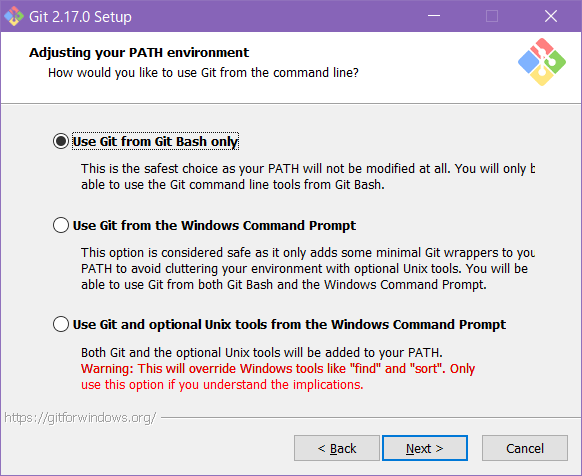

図ではGit Bashを選択していますが、Windows環境では標準のコマンドプロンプトを利用するのが無難です。  
　  

5) HTTPS接続の設定はOpenSSLを選択します

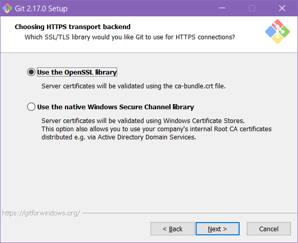

　  

6) 改行設定は何も変換しない"Checkout as-is, commit as-is"を選択しておきます

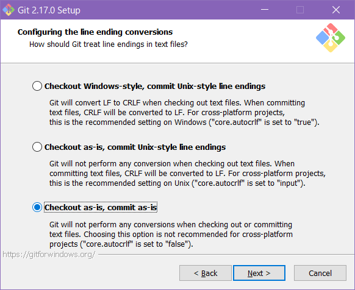

行末コードの自動変換は思わぬ問題を引き起こす可能性がありますので変換しない設定にしておくことをおすゝめします。    
　  

7) ターミナルエミュレータはお好みで選択してください

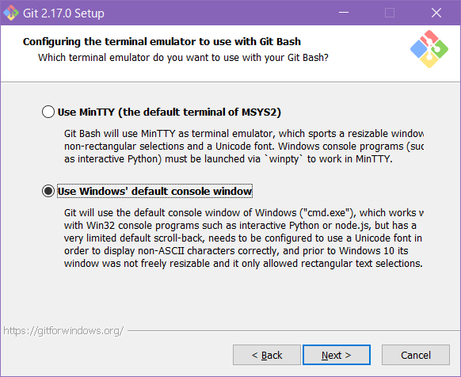

分からない場合は上図のようにWindowsのデフォルト・コンソールを設定しておいてください。  
　  

8) 追加設定はデフォルトでかまいません（下図はデフォルトではありません）

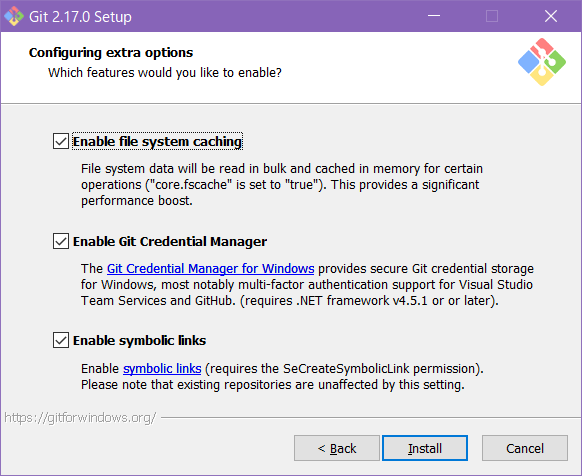

　  

9) インストールが開始されます

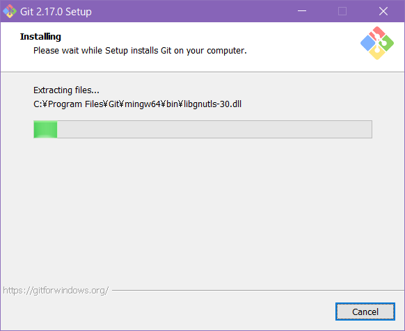

　  

10) これでインストーラは終了です

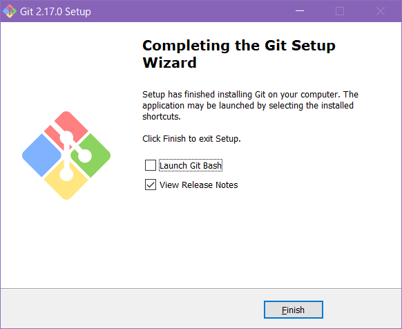

引き続きGUIクライアントをインストールしておきます。
　  

## Ubuntu
Ubuntuの場合、公式リポジトリからインストール可能ですが公式リポジトリからインストールできる [Git <i class="fa fa-external-link"></i>][git] のバージョンが古い^2^ので以下のように非公式のリポジトリからインストールすることをおすゝめします。  
　  

```{bash, eval=FALSE}
sudo add-apt-repository ppa:git-core/ppa
sudo apt-get update
sudo apt-get install git
```

^2^ [Git <i class="fa fa-external-link"></i>][git] のバージョンが古いと"Stash"機能が使えません。
　  

# GUIクライアントのインストール
Gitはコマンドライン操作になりますので、GUIで操作できるソフトウェアをインストールすることをおすゝめします。RStudioはGitの基本的な部分はGUI操作できますが細かいところまで操作が可能なGit GUIクライアントを準備しておくことをおすゝめします。  
MacやWindows環境では [Sourcetree <i class="fa fa-external-link"></i>][SourceTree] が有名ですが、ここではUbuntu環境でも利用できる [SmartGit <i class="fa fa-external-link"></i>][SmartGit] のインストール方法を紹介します。 [Sourcetree <i class="fa fa-external-link"></i>][SourceTree] のインストール方法はググってみてください。 
　  

Git GUI　Client          | Ubuntu | Mac | Windows | Memo
-------------------------|:---:|:---:|:---:|---------
[GitKraken <i class="fa fa-external-link"></i>][GitKraken]   | Yes | Yes | Yes | Free版は機能制限あり
[SmartGit <i class="fa fa-external-link"></i>][SmartGit]     | Yes | Yes | Yes | Free版でも機能制限なし^1^
[GitEye <i class="fa fa-external-link"></i>][GitEye]         | Yes | Yes | Yes | 
[Sourcetree <i class="fa fa-external-link"></i>][SourceTree] | No  | Yes | Yes | 日本語版あり

^1^ : 非商用利用の場合  
　  

## SmartGit
[SmartGit <i class="fa fa-external-link"></i>][SmartGit] はJava環境で動くGit GUIクライアントです。日本語化されていませんが [GitHub <i class="fa fa-external-link"></i>][GitHub] の"Pull Request"や"GitHub-flow"にも対応しており、非商用利用であれば無償版でも機能制限がないのが特徴です。
Windows環境ではインストーラーが自動的にJRE（Java Runtime Environment）をインストールしてくれますが、他の環境では別途JRE（またはJDK）をインストールしてくだい。  
　  

1) [SmartGit <i class="fa fa-external-link"></i>][SmartGit] からインストーラファイル（zip形式）をダウンロードしファイルを展開してインストーラを起動します

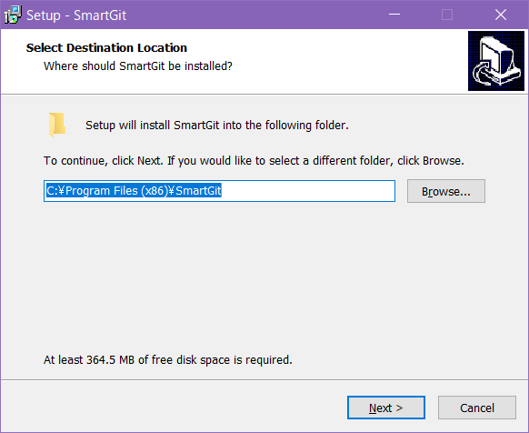

インストールフォルダを指定します。
　  

2) メニューの登録名を指定します

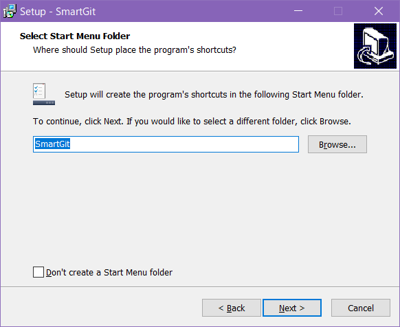

　  

3) デスクトップアイコンは任意で、他のオプションはデフォルトのままでも構いません


　  

4) インストール設定を確認します


　  

5) インストールの設定を確認したらインストールを開始します

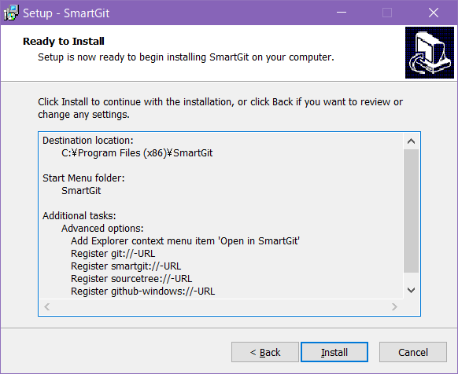

　  

6) インストールが開始されます

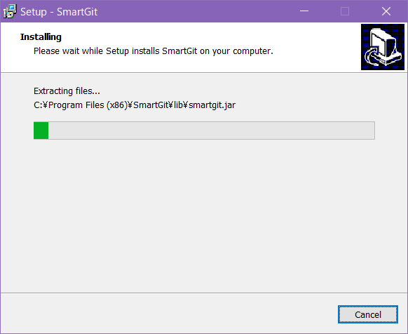

　  

7) これでインストールは終了です


　  

## 初期設定
[SmartGit <i class="fa fa-external-link"></i>][SmartGit] のインストールが完了し [SmartGit <i class="fa fa-external-link"></i>][SmartGit] が起動すると最初に初期設定のためのダイアログが表示されますので、手順にしたがって初期設定をおこないます。なお、初期設定では [GitHub <i class="fa fa-external-link"></i>][GitHub] などのホスティング・サービスのアカウントは取得していなくても問題ありません。  
　  

1) ライセンス種別の確認

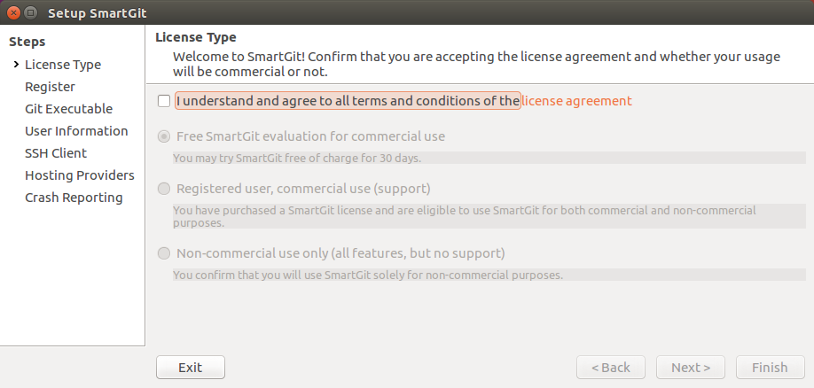

最初にライセンス許諾の確認が求められます。非商用利用であればサポートなしですがフル機能が使えます。利用形態に応じて次のステップでライセンス種別を選択してください。  
　  

2) ライセンス種別の選択

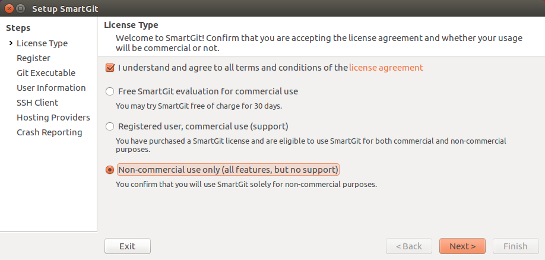

非商用利用の場合は一番したのラジオボタンをチェックします。商用利用の場合は有償登録を行わない場合は30日間のみ試用することが可能です。  
　  

3) 利用条件の確認

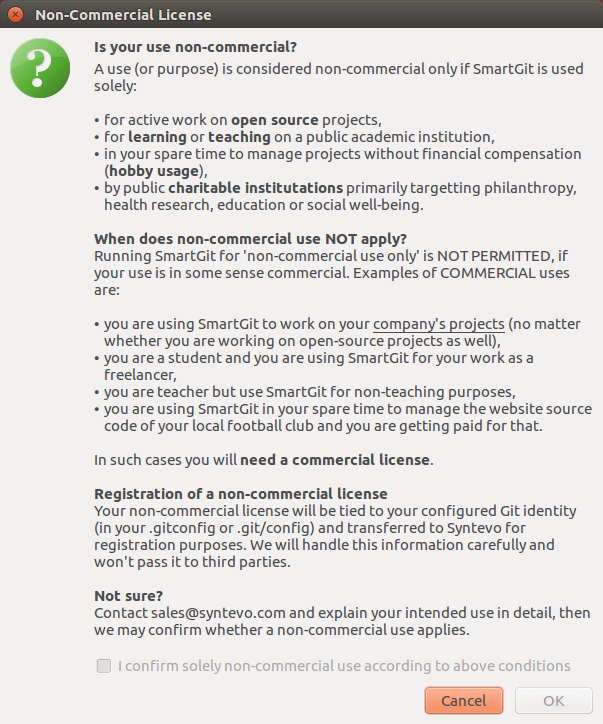

「非商用利用」を選択した場合、利用条件の確認ダイアログが表示されますので条件を再確認してください。  
　  

4) 利用条件の同意

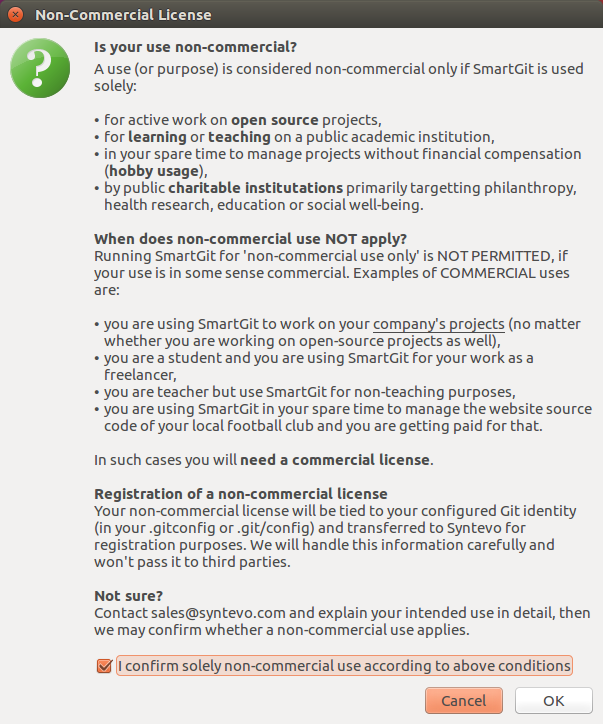

次に進むためにはチェックボックスが有効になるまでしばらく待ってください。利用条件に同意できる場合はチェックボックスにチェックを入れ、［OK］ボタンをクリックします。  
　  

5) ユーザ情報の設定

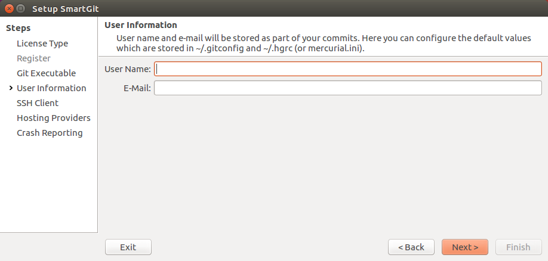

ここで設定するはユーザ情報は [Git <i class="fa fa-external-link"></i>][git] の操作履歴を識別するために使われる情報です。 [SmartGit <i class="fa fa-external-link"></i>][SmartGit] に対する登録情報でもホスティング・サービスのアカウント情報でもありません。なお、ここで設定を行わなくても [Git <i class="fa fa-external-link"></i>][git] から以下のコマンドを実行すれば設定できます。  
　  

```{bash, eval=FALSE}
git config --global user.name "your name"
git config --global user.email "your_mail@domain.com"
```

　  

6) SSHクライアントの選択

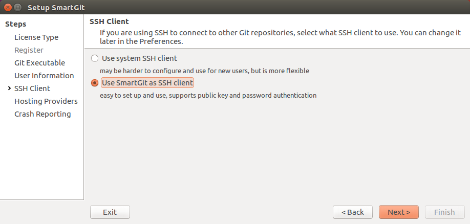

SSHクライアントとしてOS側のクライアントを利用するか [SmartGit <i class="fa fa-external-link"></i>][SmartGit] を利用するかを選択します。  
　  

7) ホスティング・プロバイダの設定

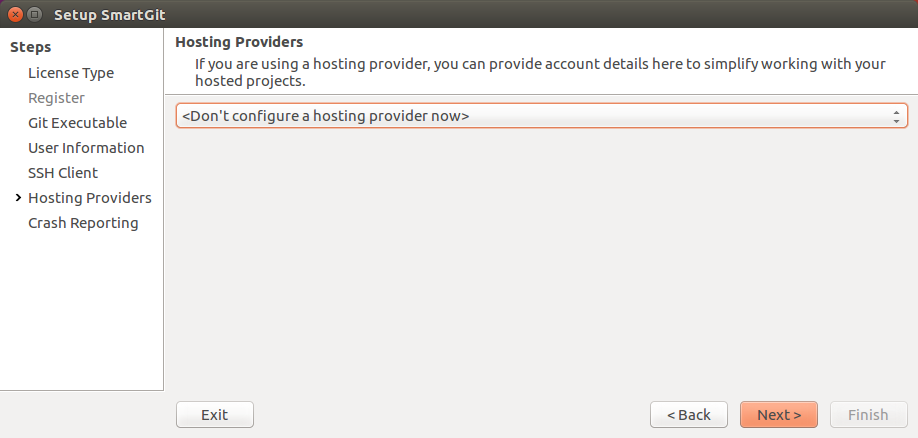

[GitHub <i class="fa fa-external-link"></i>][GitHub] などのホスティング・サービスを利用する場合はプロバイダを指定します。  
　  

8) 問題報告の設定


問題報告（クラッシュレポート）を自動送信したくない場合にはチェックを外してください。  
　  

# 参考情報

　  

## GitHub Desktop（GitHub for Windows）
Windows環境において [GitHub <i class="fa fa-external-link"></i>][GitHub] のみを利用する場合には [GitHub <i class="fa fa-external-link"></i>][GitHub] が提供している [GitHub Desktop (旧GitHub for Windows) <i class="fa fa-external-link"></i>][GitHubDesktop] を選択する手もあります。  
[GitHub <i class="fa fa-external-link"></i>][GitHub] 謹製ですのでプルリクエストへの対応など [GitHub <i class="fa fa-external-link"></i>][GitHub] を利用するには最適です。ただし、ソースがCP932（S-JIS）の場合文字化けします。  
　  

## Pro Git
[Pro Git <i class="fa fa-external-link"></i>][ProGit] は [CC BY-NC-SA 3.0 <i class="fa fa-external-link"></i>](https://creativecommons.org/licenses/by-nc-sa/3.0/){target="_blank" title="The entire Pro Git book, written by Scott Chacon and Ben Straub"} で提供されている [Git <i class="fa fa-external-link"></i>][git] の解説図書です。原著は英語ですが各国語に翻訳されており [Git <i class="fa fa-external-link"></i>][git] を理解する上で最適な図書です。  
　  

---

<!-- Include Footer -->
```{r, child="./shared/footer.Rmd", include=FALSE}
```


[git]: https://git-scm.com/ {target="_blank" title="Git公式"}
[GitWin]: https://gitforwindows.org/ {target="_blank" title="We bring the awesome Git SCM to Windows"}

[TorGit]: https://tortoisegit.org/ {target="_blank" title="The Power of Git –
in a Windows Shell"}

[GitKraken]: https://www.gitkraken.com/ {target="_blank" title="he legendary Git GUI client for Windows, Mac and Linux"}
[SmartGit]: https://www.syntevo.com/smartgit/ {target="_blank" title="SmartGit"}
[GitEye]: https://www.collab.net/downloads/giteye {target="_blank" title="CollabNet GitEye"}
[SourceTree]: https://www.sourcetreeapp.com/ {target="_blank" title="Simplicity and power in a beautiful Git GUI"}

[VSCode]: https://www.microsoft.com/ja-jp/dev/products/code-vs.aspx {target="_blank" title="Micorosoft Visual Studio Code"}

[GitHub]: https://github.com/ {target="_blank" title="The world's leading software development platform"}
[GitHubDesktop]: https://desktop.github.com/ {target="_blank" title="Simple collaboration from your desktop"}

[ProGit]: https://git-scm.com/book/ja/v2 {target="_blank" title=""}