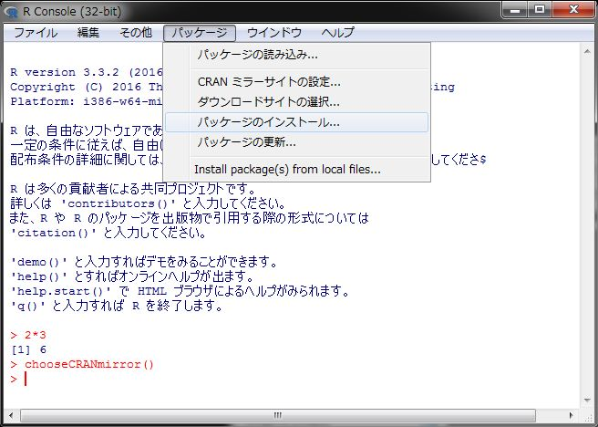

<!-- Include shared Links -->
```{r install pkg, child="./shared/links.Rmd", include=FALSE}
```

[R <i class="fa fa-external-link"></i>][R] はパッケージ（ライブラリ）を追加することで様々な分析に対応でき、機能も追加することができます。2017年4月1日の時点で10,000を超えるパッケージが [CRANに登録 <i class="fa fa-external-link"></i>](https://cran.ism.ac.jp/web/packages/){target="_blank" title="CRAN"} されています。パッケージのインストールの際にはインターネット接続が必要ですのでプロキシサーバを設定する必要がある環境にいる場合は、 [R <i class="fa fa-external-link"></i>][R] のコンソールにて以下のコマンドを実行してください。

```{r, eval=FALSE}
Sys.setenv("http_proxy"="http://<Proxyサーバ名 or IPアドレス>:<Port番号>")
```

上記のコマンドを使っても接続できない場合は、以下のサイトを参考にプロキシサーバの設定を行ってください。

* [Rのプロキシ設定 <i class="fa fa-external-link"></i>](http://noucobi.com/r/rproxy.html){target="_blank" title="脳のなかのこびと軍団"}
* [プロキシ環境でRを使うときのメモ <i class="fa fa-external-link"></i>](http://deta.hateblo.jp/entry/2014/04/01/222721){target="_blank" title="でたぁっ 感動と失敗の備忘録"}

　  

# ミラーサイトの設定
[R <i class="fa fa-external-link"></i>][R] のパッケージは基本的に [CRAN <i class="fa fa-external-link"></i>][CRAN] からダウンロードします。実際にはダウンロードする際にはなるべく近いダウンロードサイト（ミラーサイト）からダウンロードします。ミラーサイトを指定するためにRのメニューから［パッケージ］-［CRANミラーサイトの設定...］を選択します。


[CRAN <i class="fa fa-external-link"></i>][CRAN] のミラーサイト一覧が別ウィンドウに表示されますので、一番近いと思われる統数研のサーバがある [Japan(Tokyo) <i class="fa fa-external-link"></i>][ISM] を選択し、［OK］ボタンをクリックします。


　  

## Linuxの場合
Linux環境でRを利用している場合、Rはターミナル（端末）上のコマンドラインとして実行されるためメニュー表示がありませんので、以下のコマンドを実行してください。

```{r, eval=FALSE}
chooseCRANmirror()
```

### GUIモードで起動する
Linux環境もでGUIモードでRを起動することができますがWindows版に比べるとメニュー構成が非常に貧弱ですのであまりおすゝめはできません。GUIモードのRを起動するにはターミナルから以下を実行して下さい。

```{bash, eval=FALSE}
R --gui=Tk
```
　

# Rパッケージのインストール
Rのパッケージをインストールする手順は`Rcmdr`のインストールと同じく起動したRから行う方法、RStudioから行う方法、スクリプトを用いる方法があります。  
　  

## Rからインストールする方法
インターネットに接続できていることが確認できましたら [R <i class="fa fa-external-link"></i>][R] のメニューから［パッケージ］-［パッケージのインストール...］を選択します。



別ウィンドウにパッケージ一覧が表示されますのでインストールしたいパッケージを選択し［OK］ボタンをクリックします。依存関係があるパッケージがインストールされていない場合には自動的に必要なパッケージもインストールされます。  
　  

### Linuxの場合
Linux環境でRを利用している場合、Rはターミナル（端末）上のコマンドラインとして実行されるためメニュー表示がありませんので、以下のコマンドを実行してください。

```{r, eval=FALSE}
install.packages("Rcmdr")
```
　  

#### GUIモードからインストールする
Linux環のGUIモードでもパッケージの追加インストールは可能です。


　  

## RStudioからインストールする方法
[RStudio <i class="fa fa-external-link"></i>][RSD]からパッケージをインストールする場合は［Packages］タブの［Install］ボタンをクリックします。［Install Packages］ダイアログが開きますので［Packages］欄にインストールしたいパッケージ名を入力します。パッケージ名は途中まで入力すると自動的にサジェストしてくれます。


　  

## スクリプトを用いる方法
多数のパッケージを一度にインストールするには予めRのスクリプトを記述しておいてからインストールする方法が最も簡単です。[R <i class="fa fa-external-link"></i>][R]や[RStudio <i class="fa fa-external-link"></i>][RSD]ではメニューからパッケージをインストールしていますが最終的にはスクリプト（関数）呼び出しでパッケージをインストールしています。具体的には以下の手順となります。

手順 | 記述内容                 | 備考
-----|--------------------------|-----------------------------------------------------
1    | CRANミラーサイトの設定   | 最も近いサイトを選ぶとダウンロード時間を短くできます
2    | パッケージリストの作成   | インストールしたいパッケージ名のリストを作成します
3    | パッケージのインストール | 作成したリストを用いてパッケージをインストールします

上記の手順を実際のスクリプトで記述すると非常に簡単で下記のようになります。パッケージ名の部分（2行目）を変更するだけでインストールしたいパッケージをインストールすることができます。

```{r, eval=FALSE}
chooseCRANmirror()
pkg_lst <- c("tidyverse", "rmarkdown", "knitr", "DT")
install.packages(pkg_lst, dependencies = TRUE)
```
　  

# CRAN以外からのインストール
試験的なパッケージなどは [CRAN <i class="fa fa-external-link"></i>][CRAN] には登録されていないことがあります。このようなパッケージを使いたい場合は`devtool`パッケージを利用します。例えばGitHubからインストーする場合は`devtools::install_github`関数を用います。この関数で注意すべき点はリポジトリの指定方法です。必ずGitHubのユーザアカウントと共に指定して下さい。

```{r, eval=FALSE}
install.packages("devtools")        # インストールされていない場合のみ
git_rep <- c("account/repository")
devtools::install_github(git_rep)
```

`devtools`パッケージを用いるとGitHub以外にもBioconductorやbitbucket、SVNのリポジトリ等からもインストールが可能になります。詳しくは`devtools`パッケージのヘルプを参照して下さい。  
　  

# インストールが失敗する場合
Linux環境やMacOS環境ではパッケージをインストールする際に以下のようなエラーが出てパッケージのインストールが失敗する場合があります。失敗する原因はRをインストールした際に必要なアプリケーションモジュール（ライブラリ）がインストールされていないためです。

```{r, eval=FALSE}
* installing *source* package ‘openssl’ ...
  パッケージ ‘openssl’ の解凍および MD5 サムの検証に成功しました 
Using PKG_CFLAGS=
Using PKG_LIBS=-lssl -lcrypto
------------------------- ANTICONF ERROR ---------------------------
Configuration failed because openssl was not found. Try installing:
 * deb: libssl-dev (Debian, Ubuntu, etc)
 * rpm: openssl-devel (Fedora, CentOS, RHEL)
 * csw: libssl_dev (Solaris)
 * brew: openssl (Mac OSX)
If openssl is already installed, check that 'pkg-config' is in your
PATH and PKG_CONFIG_PATH contains a openssl.pc file. If pkg-config
is unavailable you can set INCLUDE_DIR and LIB_DIR manually via:
R CMD INSTALL --configure-vars='INCLUDE_DIR=... LIB_DIR=...'
--------------------------------------------------------------------
```

このようなエラーメッセージが表示された場合は、まず、`r-base-dev`というアプリケーションモジュールがインストールされているか確認してください。Ubuntu環境の場合はターミナル（端末）から以下のコマンドを実行することでインストールの有無を確認できます。

Ubuntuの場合
```{bash, eval=FALSE}
dpkg -l | grep r-base-dev
```

出力結果に`r-base-dev`が表示されない場合はインストールされていませんので、`r-base-dev`を[Install R](./env_install.html)を参考にしてインストールしてください。  
　  

## それでもインストールが失敗する場合
`r-base-dev`がインストールされているにも関わらずインストールが失敗する場合は、エラーメッセージの"ANTICONF ERROR"に注目して不足しているライブラリを手動でインストールします。上記の場合は`libssl-dev`（Ubuntuの場合）がインストールされていませんので、ターミナル（端末）から以下のコマンドを実行してインストールします。

Ubuntuの場合
```{bash, eval=FALSE}
sudo apt-get install libssl-dev
```
　  

## ファイルが見当たらない場合
前述のようにパッケージやライブラリが不足しているというメッセージが出た場合は、当該のパッケージやライブラリをインストールすれば解決できますが、パッケージによっては「ヘッダファイルが見当たらない」とか「コンフィグファイルが見当たらない」というようなエラーが出る場合があります。例えば以下のメッセージはパッケージのコンパイルに必要な`libpq-fe.h`ファイルが見当たらないのでコンパイルが中止されていることが分かります。  
　  

```{bash, eval=FALSE}
RS-PostgreSQL.h:23:26: fatal error: libpq-fe.h: そのようなファイルやディレクトリはありません
compilation terminated.
```

　  
このような場合、Ubuntuの`apt-file`コマンドを利用して当該のファイルがどのライブラリに含まれているかを調べることで解決できます。`apt-file`コマンドは標準ではインストールされていませんので以下の手順でインストール、セットアップしてください。  
　  

```{bash, eval=FALSE}
$ sudo apt-get update
$ sudo apt-get install apt-file

$ apt-file update
apt-file is now using the user's cache directory.
If you want to switch back to the system-wide cache directory,
 run 'apt-file purge'
Downloading complete file http://jp.archive.ubuntu.com/ubuntu/dists/xenial/Contents-amd64.gz
...
```

　  

`apt-file update`の実行にはしばらく時間がかかります。実行が完了したら以下のようにしてファイルがどのライブラリに含まれているか調べ、対象のライブラリが特定できたらインストールします。  
　  

```{bash, eval=FALSE}
$ apt-file search libpq-fe.h
libpq-dev: /usr/include/postgresql/libpq-fe.h

$ sudo apt-get update
$ sudo apt-get install libpq-dev
```

　  

これで必要なファイルが入手できましたので、再度、パッケージのインストールを実行します。  
　  

# 参考）インストール用スクリプト
モダンな[R <i class="fa fa-external-link"></i>][R] のプログラミングを行う際に一通り必要と思われるパッケージを一度にインストールできるスクリプトを用意しました。ご自分の環境初期設定用に必ずインストールするパッケージをリストアップしておきスクリプト化しておくとRのアップデートの際などに便利です。  
　  

## パッケージリストファイル
インストールしたいパッケージをCSV形式でリストアップしておきます。CSVファイルは以下の形式で作成するのが前提です。将来拡張を見越した項目の構成となっていますがスクリプトが未対応の為記述しても機能しないものもあります。  

項目名   | 内容                                                   | 備考
---------|--------------------------------------------------------|------------
package  | インストールしたいパッケージ名                         | 
category | パッケージのカテゴリ                                   | 現状未使用なので項目ごとの省略可
omit     | リストには残したいがインストールしたくない場合のフラグ | `y`でインストールしない
rep      | パッケージのあるリポジトリ                             | CRANのみ対応
memo     | 備考用                                                 | 省略可

　  
memo欄以外はの記述は省略しないで記述してください。  
　  

<!-- ### パッケージリストファイルの例（一部） -->
```{r, echo=FALSE, message=FALSE, warning=FALSE, eval=FALSE}
require(tidyverse)
"../../packages_new.csv" %>% 
  read.csv(fileEncoding = "UTF-8") %>% 
  dplyr::sample_n(5) %>% 
  dplyr::arrange(package)
```

## スクリプト
スクリプトはBase Rだけで動くように作成しています。  
　  
```{r, eval=FALSE}
# データ分析勉強会参加メンバー向け推奨パッケージのインストールスクリプト
# （フルインストール版）
# 処理概要
#     1. パッケージをダウンロードするCRANのミラーサイトを選ぶ
#     2. インストールしたいパッケージを記述したCSVファイルを読み込む
#     3. インストール済のパッケージを取得する
#     4. インストールすべきパッケージの一覧を作成する
#     5. パッケージをインストールする（CRAN以外は未対応）
#     6. パッケージを更新する

# Choose nearest CRAN mirror site（最も物理的に近いサイトを選択します）
chooseCRANmirror(graphics = TRUE)

# インストールしたいパッケージ・リストをファイルから取得します
pkg_lst <- read.csv("./packages.csv", fileEncoding = "UTF-8")

# インストール済のパッケージ一覧を取得
installed_list <- as.data.frame(installed.packages())$Package

# インストールするパッケージ一覧を作成
install_list <- !(pkg_lst$package %in% installed_list)
install_pkg <- pkg_lst$package[pkg_lst$omit != "y" & pkg_lst$rep != "github" &
                                 install_list]

# パッケージのインストール
install.packages(pkgs = as.character(install_pkg))

# パッケージの更新
# 新規インストール時には更新の必要なないはずですが心配ならアップデートチェックを
update.packages(ask = "graphics")

# 作成したオブジェクトを掃除
rm(pkg_lst, installed_list, install_list, install_pkg)
```
　  
　  

---
<!-- Include Footer -->
```{r, child="./shared/footer.Rmd", include=FALSE}
```
