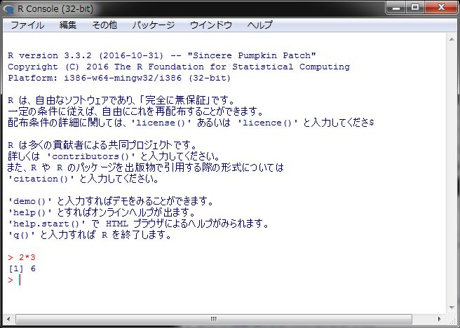

<!-- Include shared Links -->
```{r install, child="./shared/links.Rmd", include=FALSE}
```

本ページでは [R <i class="fa fa-external-link"></i>][R] のインストール手順をOS別に紹介しています。

# インストール環境の確認
Rをインストールするにはインターネット接続環境が必要です。企業内などでプロキシサーバを経由しないと外部接続ができない場合はプロキシ設定を把握しておいてください。また、管理者権限が必要ですので、管理者権限をお持ちでない場合は管理者にご相談ください。  
　  

* [Windowsをお使いの場合](#windows)
* [macOSをお使いの場合](#macos)
* [Ubuntuをお使いの場合](#ubuntu)

　  

# Windows {#windows}

## 事前準備
[CRAN <i class="fa fa-external-link"></i>][CRAN] または [CRANミラーサイト <i class="fa fa-external-link"></i>][ISM] から最新バージョンのインストーラーをダウンロードします。旧バージョンをインストールしたい場合は [Previous Release <i class="fa fa-external-link"></i>](https://cran.r-project.org/bin/windows/base/old/){target="_blank" title="CRAN"} からインストーラーを入手してください。  
念のために入手したファイルのウィルスチェックをお忘れなく。  
　  

## Rのインストール
入手したインストーラを管理者権限で起動します。WinodwsのUAC（ユーザアカウント制御）によりインストールが上手くいかない場合がありますので、その場合は [UACに関して](#UAC) をご覧ください。  
　  

### インストール設定
インストール設定はインストール・ウィザードで進みます。以下の要領で設定をして下さい。なお、インストールパスには日本語が含まれないパスにしてください。  
　  

1. コンポーネントの選択は基本的にデフォルト  

　  

2. 起動時オプションは「はい」を選択  

　  

3. 表示モードはSDIを選択  

`SDI`を選択する理由はR Commanderが`SDI`モードでの利用を推奨しているためです。  
　  

4. ヘルプの表示方法はお好みで  

　  

設定が終わるとRのインストールが開始されます。インストールが終了したらRが起動することを確認してください。  
　  

### 起動確認
インストールが終了したら簡単な動作確認を行います。 [R <i class="fa fa-external-link"></i>][R] を起動して表示されたコンソールに以下を入力して[Enter]キーを押して下さい。  
　  

```{r, eval=FALSE}
2*3
```

　  
`6`が帰ってくればOKです。起動しない場合は管理者権限で起動してみて下さい。それでも起動しない場合は、日本語が含まれないパスにインストールされているかなどを確認してください。  
　  


　  

以上でRのインストールは完了です。  
　  

### UACに関して {#UAC}
Windows Vistaから導入されたUAC機能により [R <i class="fa fa-external-link"></i>][R] に制限がでる場合があります。制限が出るのは、インストール先（フォルダ）をデフォルト設定の`C:\Program Files\R\`とした場合です。具体的には管理者権限のない状態で [R <i class="fa fa-external-link"></i>][R] を起動してパッケージを追加しようとすると以下のメッセージが表示されてライブラリフォルダにアクセスできない、インストールできなない状態になります。  
　  

```{bash, eval=FALSE}
 install.packages(NULL, .libPaths()[1L], dependencies = NA, type = type) で警告がありました: 
   'lib = "C:/Program Files/R/R-x.x.x/library"' は書き込み可能ではありません
```

　  
通常、利用するには特に問題になりませんがパッケージを追加したり更新したりする際にうまく追加、更新できない場合が出てきます。これを回避するにはいくつかの方法がありますが、特に組織内で利用する場合は組織のセキュリティポリシーに則った回避方法を選択してください。  

詳細については [Does R run under Windows Vista/7/8/Server 2008? <i class="fa fa-external-link"></i>](https://cran.ism.ac.jp/bin/windows/base/rw-FAQ.html#Does-R-run-under-Windows-Vista_003f){target="_blank" title="CRAN FQA"} でご確認ください。  
　  

# macOS {#macos}
macOSでは基本的に最新版のmacOSに適合しているバージョンしかインストールできません。詳しくは [CRAN <i class="fa fa-external-link"></i>][CRAN] または [Rwiki](http://www.okadajp.org/RWiki/?RjpWiki){target="_blank" title="CRAN FQA"} を参考にしてインストールしてください。  

　  

# Ubuntu {#ubuntu}
ここではUbuntu Desktop環境に特化して紹介しますので、他のLinuxディストリビューションについては [CRAN <i class="fa fa-external-link"></i>][CRAN] または日本の [CRANミラーサイト <i class="fa fa-external-link"></i>][ISM] で公開されているマニュアルを参照してください。  
　  

## 前提条件
ここではUbuntu(16.04LTS)を前提に紹介します。バージョンにより手順が異なる場合がありますので、他のバージョンに関しては [CRAN <i class="fa fa-external-link"></i>][CRAN] または日本の [CRANミラーサイト <i class="fa fa-external-link"></i>][ISM] で公開されているマニュアルを参照してください。  
　  

## 事前設定
Ubuntuではインストールの前に以下の事前設定を行う必要があります。

1. [リポジトリの登録](#repository)
1. [公開鍵の登録](#pubkey)

　  

### リポジトリの登録 {#repository}
管理者権限でターミナルから以下のコマンドで [CRAN <i class="fa fa-external-link"></i>][CRAN] または [CRANミラーサイト <i class="fa fa-external-link"></i>][ISM]のリポジトリを登録します。この例では [CRANミラーサイト <i class="fa fa-external-link"></i>][ISM] を登録しています。  
　  

```{bash, eval = FALSE}
sudo add-apt-repository 'deb https://cran.ism.ac.jp/bin/linux/ubuntu xenial/'
```

　  

### 公開雄鍵の登録 {#pubkey}
管理者権限でターミナルから以下のコマンドで公開鍵を登録します。公開鍵を入手するために必要な`Key ID`は念のために[CRANのREADME](https://cran.ism.ac.jp/bin/linux/ubuntu/README.html)にて確認して下さい。  
　  

```{bash, eval=FALSE}
sudo gpg --keyserver keyserver.ubuntu.com --recv-key E084DAB9
sudo gpg -a --export E084DAB9 | sudo apt-key add -
```

　  

## Rのインストール
事前設定が終わりましたら管理者権限でターミナルから [R <i class="fa fa-external-link"></i>][R] をインストールします。  
　  

```{bash, eval = FALSE}
sudo apt-get update
sudo apt-get install r-base
```

　  

### インストール確認
インストールが完了しましたら念のためにインストールされたパッケージを確認するために管理者権限でターミナルから以下のコマンドを実行します。  
　  

```{bash, eval=FALSE}
dpkg -l | grep r-base
dpkg -l | grep r-cran
```

　  
以下のパッケージがインストールされていれば、無事インストール完了となります。  
　  

1. baseパッケージ群
  * r-base
  * r-base-core
  * r-base-dev
  * r-base-html
1. CRANパッケージ群
  * r-cran-*
  * r-doc-html
  * r-recommended

　  
不足している場合は`sudo apt-get`コマンドで追加インストールしてください。  
　  

### 起動確認
ターミナルから以下のコマンドを実行して [R <i class="fa fa-external-link"></i>][R] が起動することを確認します。  
　  

```{bash, eval=FALSE}
R&
```

　  

## 追加ライブラリのインストール
必須ではありませんが、今後、様々な追加パッケージをインストールする際に必要となる以下のLinuxライブラリをインストールしておくことをおすゝめします。追加ライブラリは管理者権限でターミナルから以下のコマンドを実行してインストールします。  
　  

```{bash, eval=FALSE}
sudo apt-get install libjpeg62
sudo apt-get install libcurl4-openssl-dev
sudo apt-get install libssl-dev
sudo apt-get install libssh2-1-dev
sudo apt-get install libxml2-dev
sudo apt-get install libudunits2-dev
sudo apt-get install unixodbc-dev
sudo apt-get install xclip
```

　  

### 参考
RStudio Serverの [Dockerイメージ（RStudio公式） <i class="fa fa-external-link"></i>](https://hub.docker.com/r/rocker/rstudio/dockerfile){target="_blank" title="Docker Hub"} では下記のライブラリをインストールしています。Ubuntuのバージョンや環境によっては既にインストールされている可能性もありますが、参考まで。

`libapparmor1`, `libcurl4-openssl-dev`, `libedit2`, `libssl-dev`, `libclang-dev`,
`libclang-3.8-dev`, `libobjc-6-dev`, `libclang1-3.8`, `libclang-common-3.8-dev`,
`libllvm3.8`, `libobjc4`, `libgc1c2`

　  

# 困った時は
インストールしたけど動かない等の困った時は [RjpWiki <i class="fa fa-external-link"></i>](http://www.okadajp.org/RWiki/){target="_blank" title="RjpWiki"} や [r-wakalang <i class="fa fa-external-link"></i>](http://qiita.com/uri/items/5583e91bb5301ed5a4ba){target="_blank" title="Qiita"} 、 [Qiita <i class="fa fa-external-link"></i>](http://qiita.com/){target="_blank" title="Qiita"} 等で検索、または、勉強会のMLで質問してみてください。

　  

---

<!-- Include Footer -->
```{r, child="./shared/footer.Rmd", include=FALSE}
```