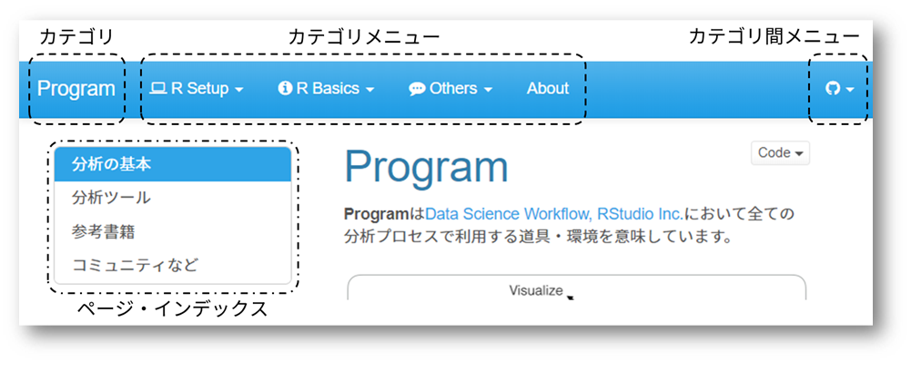
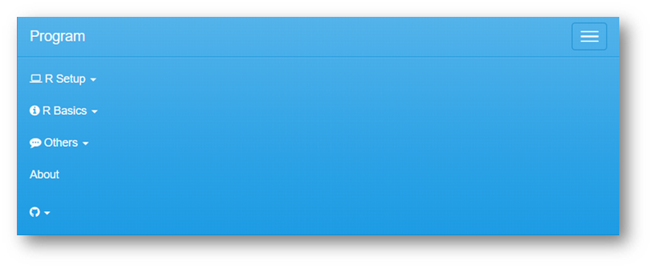

<!-- Shared Links -->
```{r index, child="./shared/links.Rmd", include=FALSE}
```

**Cabinet**は[データ分析勉強会 <i class="fa fa-external-link"></i>][0]で学んだデータ分析に関する内容を[Data Science Workflow <i class="fa fa-external-link"></i>][RSH]にて定義されているプロセスに準じてカテゴライズしています。  

  
　  

[データ分析勉強会 <i class="fa fa-external-link"></i>][0]で使われた講義資料に関しては個々のアーカイブを参照してください。  
　  

# 本サイトの構成
本サイトは前述のように[Data Science Workflow <i class="fa fa-external-link"></i>][RSH]を参考に以下のようにカテゴライズしています。

カテゴリ                 | 概要
-------------------------|----------------------------
**Import**               | データ取り込みに関する事項を扱います
**Tidy/Transfer**        | データハンドリングに関する事項を扱います
**Model/Infer**          | 分析・推定の手法に関する事項を扱います
**Visualize**            | データの可視化（主にグラフ描画）に関する事項を扱います
**Communicate/Automate** | 分析の文書化、自動化に関する事項を扱います
**Program**              | データ分析に関わるプログラミングや分析環境に関する事項を扱います
Misc                 | 上記の分類に含まれない雑多な事項を扱います（準備中）

　  

## メニュー構成
各ページは下図のようなメニュー構成になっています。  

最上段はカテゴリのためのメニューで常にこの位置に固定的に表示されます。最も左側にカテゴリ名が表示され、その右側にカテゴリ（内）のメニューであるカテゴリ・メニューが表示されます。最も右側にはカテゴリ間を移動するためのメニューが表示されます。なお、カテゴリ・メニューはカテゴリによりメニュー構成が異なります。  
　  
カテゴリのメニューの下にページが表示され、ページ内の見出しはページ・インデックスに表示されクリックすることでページ内のでジャンプが可能です。このページ・インデックスはフローティング表示されますので、ページをスクロールしても常にこの位置に表示されます。なお、ページによってはページ・インデックスが表示されないこともあります。  
　  


　  

### 縮小表示
画面の幅などによっては最上段のメニューが自動的に集約されます。右端にあるメニュー表示ボタンをクリックすることで下図のようにメニューが表示されます。  
　  


　  

## リンク
ページ内のリンクは基本的に以下のようになっています。  
　  

* サイト内へのリンクは基本的に同一ウィンドウ（タブ）で開きます
* サイト内へのリンクであっても参照文書などは意図的に別ウィンドウ（タブ）で開くようにしてあります
* 別ウィンドウ（タブ）で開くサイト内へのリンクにはアイコン（<i class="fa fa-external-link-square"></i>）がついています
* 外部サイトへのリンクは別ウィンドウ（タブ）で開きます
* 外部サイトへのリンクにはアイコン（<i class="fa fa-external-link"></i>）がついています
* 別ウィンドウ（タブ）で開くリンクには基本的にホバーテキスト（タイトル）が設定してあります
* ホバーテキストが表示されるかどうかはご利用のブラウザに依存します
* ダウンロード用ファイルのリンクに対する動作はご利用のブラウザの設定に依存します

　  

---

<!-- Footer -->
```{r child="./shared/footer.Rmd"}
```
