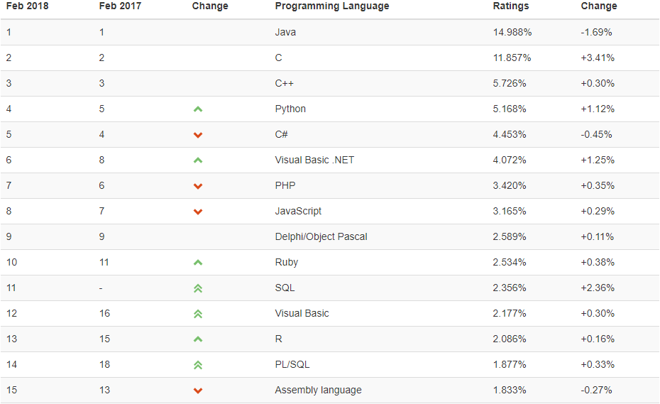
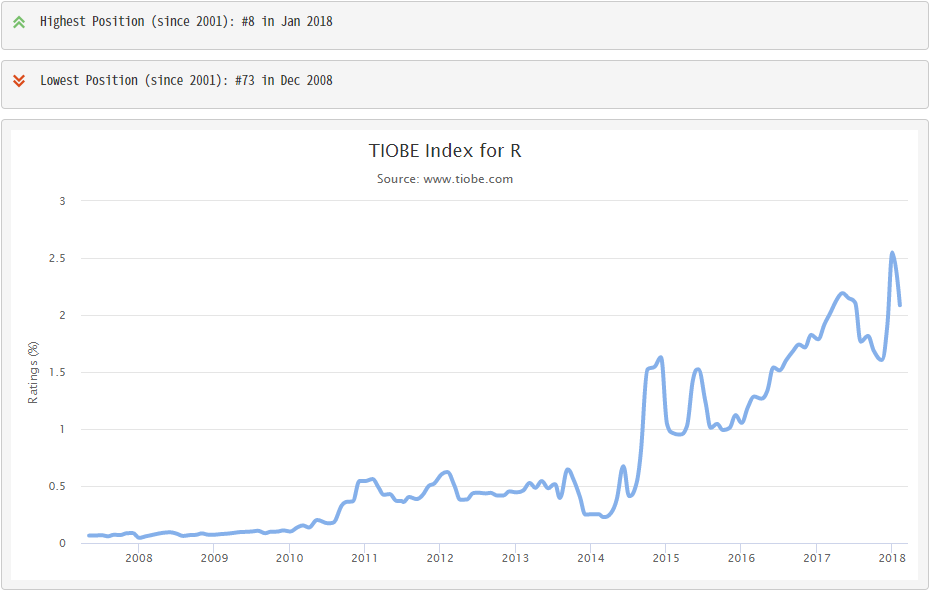
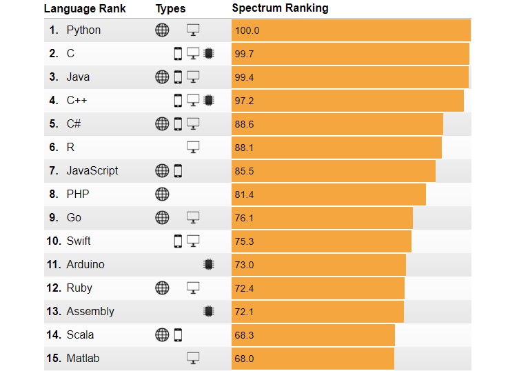
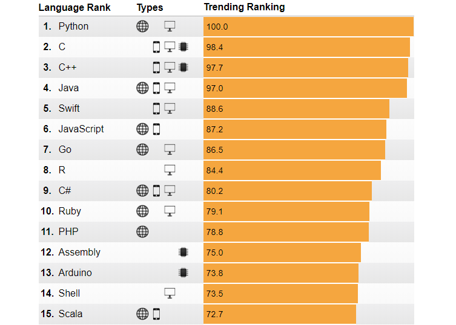
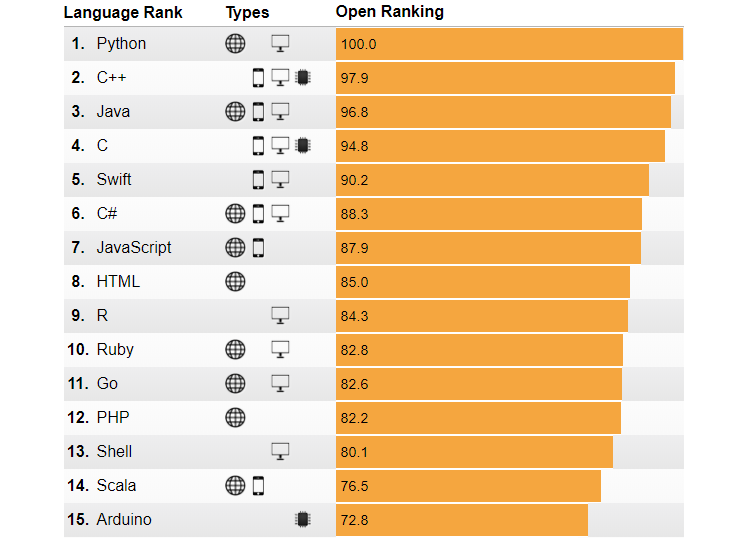

```{r setup, include=FALSE}
knitr::opts_chunk$set(echo = TRUE, message = FALSE)

require(tidyverse)
```


## [Six Reasons To Learn R For Business](https://www.r-bloggers.com/six-reasons-to-learn-r-for-business/){target="_blank"}

1. R Has The Best Overall Qualities
1. R Is Data Science For Non-Computer Scientists
1. Learning R Is Easy With The Tidyverse
    * Structured Programming Interface
1. R Has Brains, Muscle, And Heart
    * Cutting-edge algorithms and Powerful tools (packages)
1. R Is Built For Business
    * R Markdown
1. R Community Support

---



---



---



---



---



