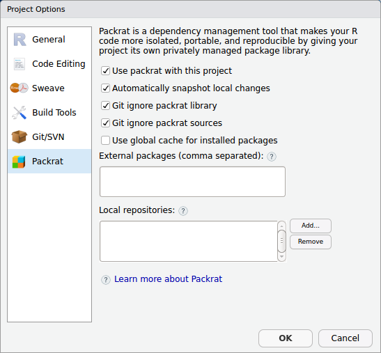

<!-- shared Links -->
```{r child="../shared/links.Rmd", include=FALSE}
```

```{r setup, include=FALSE}
# 共通chunkオプションの指定
knitr::opts_chunk$set(warning = FALSE, echo = TRUE)

# データハンドリングで利用する外部パッケージの読み込み
require(tidyverse)
# 表示で利用する外部パッケージの読み込み
require(gridExtra)
require(DT)
require(knitr)
tidyverse::tidyverse_conflicts()

# ローカル定義関数の読み込み
source("../shared/common.R")
```
---

複数のメンバーでRのコード開発を行う際に問題になりやすいのがパッケージのバージョン違いです。特に開発が活発なパッケージを利用しているとある人は動くけど別の人では動かないといった現象が出てきます。このような問題を解決し開発環境の統一を簡単に図れるのがRStudioのプロジェクト機能と組み合わせて使える**`packrat`**パッケージです。  
　  

# packratとは
**`packrat`**パッケージはCRAN Task Viewの[Reproducible Research <i class="fa fa-external-link"></i>](https://cran.r-project.org/web/views/ReproducibleResearch.html){target="_blank" title="CRAN Task View"}では補助ツール的な位置づけのパッケージですが、かなり実用的なパッケージです。にも関わらずあまり話題にならないのは[R][R]コミュニティのアーリーアダプターの方々もあまり取り上げられていないからだと思われます。  
　  

* [公式チュートリアル（英語） <i class="fa fa-external-link"></i>](http://rstudio.github.io/packrat/walkthrough.html){target="_blank" title="RStudio, Inc."}
* [packratで人類の拡大再生産に貢献する <i class="fa fa-external-link"></i>](d.hatena.ne.jp/dichika/20131220/p1){target="_blank" title="盆栽日記"}
* [Packratの使い道を考えてみた <i class="fa fa-external-link"></i>](https://qiita.com/uri/items/5d473a5df91954585e62){target="_blank" title="Qiita"}

　  
**`packrat`**パッケージはその説明に"A Dependency Management System for Projects and their R Package Dependencies"とあるようにパッケージの依存関係とバージョンをプロジェクト単位で管理することができます。  
　  

# packratの使い方
**`packrat`**の使い方は[公式チュートリアル（英語） <i class="fa fa-external-link"></i>](){target="_blank title="RStudio, Inc."}にありますがRStudioから利用を開始するのが簡単です。  
　  

## 事前準備
packratを使うには当然、**`packrat`**パッケージが必要です。また、Winodws環境では"Rtools"をデフォルトオプションでインストールしておく必要があります。これは、**`packart`**パッケージが必要なパッケージをインストールする際にソースコードからパッケージをコンパイルする場合があるためです。

1. **`packrat`**パッケージをインストールします
1. Rtoolsをデフォルトオプションでインストールします（Winodws Only）

　  

## packratの初期化
メニューの［Tools］-［Project Options...］または［Packages］ペインの［Packrat］ボタンからPackratの設定画面を開きます。



　  

1. "Use packrat with this porject"にチェックを入れます
1. 詳細オプションが表示されますので環境に応じて設定します
    * Automatically snapshot local changes
    * Git ignore packrat library
    * Git ignore packart sources
    * Use glogal chashe for installed packages
1. ［OK］ボタンをクリックします
1. 自動的に初期化が始まります

　  

これらはコンソールから以下のコマンドを実行するのとほぼ同等です。
```{r, eval=FALSE}
packrat::init("project_dir")
```

　  

初期化が完了したら、あとは必要なパッケージをインストールして環境を構築します。  
　  

## packrat情報の共有
構築した環境を共有するにはプロジェクト全体を圧縮ファイルにして渡すかGitHubのようなリポジトリを利用します。

### ファイルで直接渡す場合
ファイルを利用して環境を共有する場合は以下のコマンドを実行してtarballを作成します。tarballにはプロジェクトのディレクトリ内のすべてのファイルがアーカイブされますので

```{r, eval=FALSE}
packrat::snapshot()
packrat::bundle(file = 'tarball.tar.gz', overwrite = TRUE)
```

### リポジトリを利用する場合
GitHubのようなリポジトリを利用する場合で、パッケージ自体の開発を行っていない時には以下のpackratオプションを有効にしておくことをおすすめします。

    * Git ignore packrat library
    * Git ignore packart sources


## packrat情報の導入


---

<!-- Footer -->

```{r child="../shared/footer.Rmd"}
```
