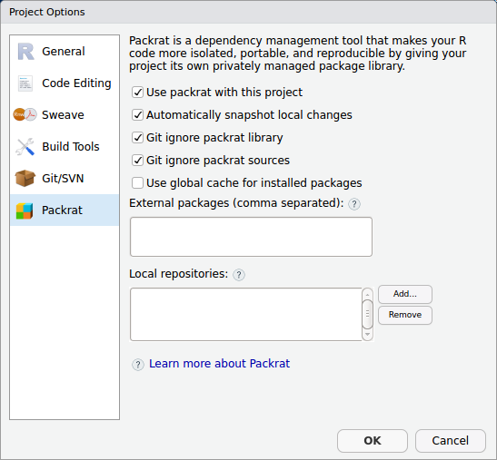

<!-- shared Links -->
```{r packrat, child="../shared/links.Rmd", include=FALSE}
```

```{r setup, include=FALSE}
knitr::opts_chunk$set(warning = FALSE, echo = TRUE)

require(tidyverse)

source("../shared/common.R")
```


複数のメンバーでRのコード開発を行う際に問題になりやすいのがパッケージのバージョン違いです。特に開発が活発なパッケージを利用していると自分の環境では動くけど別の人の環境では動かないといったことが出てきます。このような問題を解決し開発環境の統一を簡単に図るツールが**`packrat`**パッケージです。RStudioのプロジェクト機能と組み合わせて使うことでプロジェクトごとに異なった環境を整備することが可能になります。  
　  

# 必要なパッケージ
標準パッケージ以外に以下の追加パッケージが必要です。  
　  

Package | Description
--------|-------------
packrat | Reproducible dependency management

　  

# packratとは
**`packrat`**パッケージはCRAN Task Viewの[Reproducible Research <i class="fa fa-external-link"></i>](https://cran.r-project.org/web/views/ReproducibleResearch.html){target="_blank" title="CRAN Task View"}では補助ツール的な位置づけのパッケージですが、かなり実用的なパッケージです。にも関わらずあまり話題にならないのは[R][R]コミュニティのアーリーアダプターの方々もあまり取り上げられていないからだと思われます。  
　  

* [公式チュートリアル（英語） <i class="fa fa-external-link"></i>](http://rstudio.github.io/packrat/walkthrough.html){target="_blank" title="RStudio, Inc."}
* [packratで人類の拡大再生産に貢献する <i class="fa fa-external-link"></i>](http://d.hatena.ne.jp/dichika/20131220/p1){target="_blank" title="盆栽日記"}
* [Packratの使い道を考えてみた <i class="fa fa-external-link"></i>](https://qiita.com/uri/items/5d473a5df91954585e62){target="_blank" title="Qiita"}

　  
**`packrat`**パッケージはその説明に"A Dependency Management System for Projects and their R Package Dependencies"とあるようにパッケージの依存関係とバージョンをプロジェクト単位で管理することができます。  
　  

# packratの使い方
**`packrat`**の使い方は[公式チュートリアル（英語） <i class="fa fa-external-link"></i>](http://rstudio.github.io/packrat/walkthrough.html){target="_blank" title="RStudio, Inc."}にありますが、公式チュートリアルのようにコマンドラインから使うよりもRStudioのインタフェースから利用するのが便利です。  
　  

## 事前準備
packratを使うには当然**`packrat`**パッケージが必要です。また、Winodws環境では"Rtools"をデフォルトオプションでインストールしておく必要があります。"Rtools"は**`packart`**パッケージが必要なパッケージをインストールする際にソースコードからパッケージをコンパイルする場合があるためです。Windows環境以外ではOSがコンパイラを標準搭載していますので不要です。  

1. **`packrat`**パッケージをインストールします
1. Rtoolsを**デフォルトオプション^1^で**インストールします（Winodws Only）

^1^ デフォルトオプションでインストールしないと**`packrat`**がパッケージのインストールに失敗します  
　  

## packratの初期化
メニューの［Tools］-［Project Options...］または［Packages］ペインの［Packrat］ボタンからPackratの設定画面を開きます。  
　  



　  

1. "Use packrat with this porject"にチェックを入れます
1. 詳細オプションが表示されますので環境に応じて設定します
    * Automatically snapshot local changes （デフォルトオプション）
    * Git ignore packrat library
    * Git ignore packart sources
    * Use glogal chashe for installed packages
1. ［OK］ボタンをクリックします
1. 自動的に初期化が始まります

　  

これらはコンソールから以下のコマンドを実行するのと同等です。  
　  

```{r, eval=FALSE}
> packrat::init("project_dir")
```

　  

初期化が完了しましたら、プロジェクト（packrat情報）を共有します。  
　  

## プロジェクトの共有
構築した環境を共有するにはプロジェクト全体を圧縮ファイルにして共有相手に渡すかGitHubのようなリポジトリを利用して共有します。  
　  

### ファイルで渡す場合
ファイルを利用して環境を共有する場合は以下のコマンドを実行してtarballを作成します。tarballにはプロジェクトのディレクトリ内のすべてのファイルがアーカイブされます。  
　  

```{r, eval=FALSE}
> packrat::snapshot()
> packrat::bundle(file = 'tarball.tar.gz', overwrite = TRUE)
    # 'tarball.tar.gz'には任意のファイル名を入れてください
```

　  
作成されたアーカイブファイルを共有先で展開し、RStudioの［File］-［New Project...］-［Version Control］から展開先のディレクトリをプロジェクトディレクトりとして指定してください。プロジェクトが開かれると自動的にフォルダ内の**`packrat/init.R`**が実行されpackrat環境が構築されます。利用しているパッケージ数やPC、通信環境にもよりますが十数分程度かかります。  
　  

### リポジトリを利用する場合
アーカイブファイルを利用した場合、更新の都度、ファイルを再作成する必要がありますが、GitHubのようなリポジトリを利用することでリアルタイムの共有が可能になります。  
このようなリポジトリを利用してプロジェクトを共有する場合には以下のオプションを有効にしておくとリポジトリを軽くできます。  

  * Git ignore packrat library
  * Git ignore packart sources

なお、パッケージ自体の開発を行っている場合は、これらのオプションを有効にするのはおすゝめできません。  
リポジトリは［File］-［New Project...］-［Version Control］から利用しているリポジトリ（Gir or Subversion）を選択してリモートリポジトリをローカルのプロジェクトとしてクローンしてください。クローニングが完了すると自動的に**`packrat/init.R`**ファイルが実行されてpackrat環境の構築されます。利用しているパッケージ数やPC、通信環境にもよりますが十数分程度かかります。  
　  

## packrat情報の更新
プロジェクトのパッケージを更新したり追加、削除した場合は**`packrat::snapshot`**関数を用いてpackrat情報を更新します。更新された情報は**`packrat/packrat.lock`**ファイルに記録されますので、**`packrat/packrat.lock`**ファイルを更新してください。**`packrat/packrat.lock`**が更新されたらRStudioを再起動するか以下のコマンドを実行してください。  
　  

```{r, eval=FALSE}
> packrat::restore()
```

　  

## packrat情報の整理
パッケージ情報を確認するには以下のように**`packrat::status`**関数をコンソールから実行します。  
　  

```{r, eval=FALSE}
> packrat::status()

The following packages are tracked by packrat, but are no longer available in the local library nor present in your code:
               _       
    clipr        0.4.0 
    clisymbols   1.2.0 
    desc         1.1.1 
    enc          0.2.0 
    gh           1.0.1 
    git2r        0.21.0
    ini          0.3.0 
    rematch2     2.0.1 
    styler       1.0.1 
    usethis      1.3.0 

You can call packrat::snapshot() to remove these packages from the lockfile, or if you intend to use these packages, use packrat::restore() to restore them to your private library.
```

利用していないパッケージが存在する場合、**`packrat::snapshot`**関数でpackrat環境から削除することで整理ができます。
　  

```{r, eval=FALSE}
> packrat::snapshot()

Removing these packages from packrat:
               _       
    clipr        0.4.0 
    clisymbols   1.2.0 
    desc         1.1.1 
    enc          0.2.0 
    gh           1.0.1 
    git2r        0.21.0
    ini          0.3.0 
    rematch2     2.0.1 
    styler       1.0.1 
    usethis      1.3.0 

Do you want to continue? [Y/n]: 
```

---

```{r footer, child="../shared/footer.Rmd"}
```
