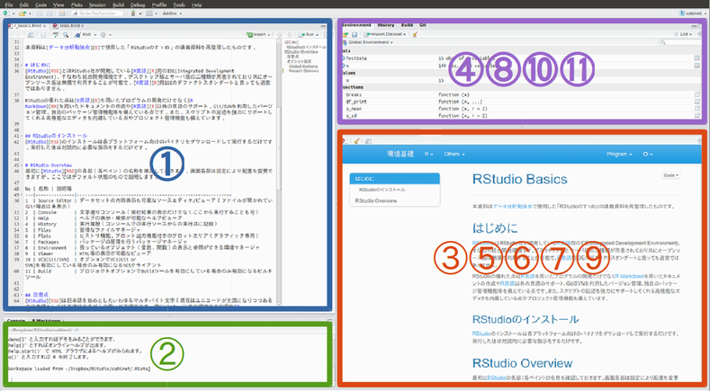
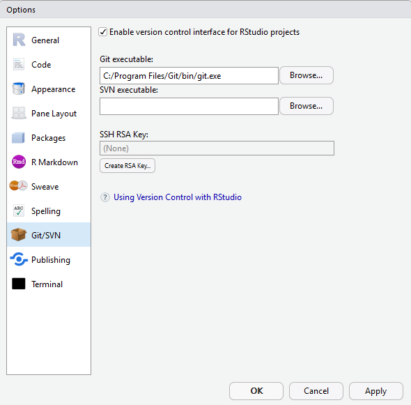
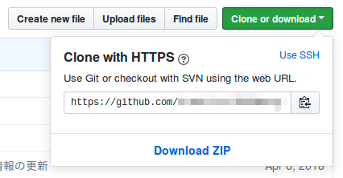
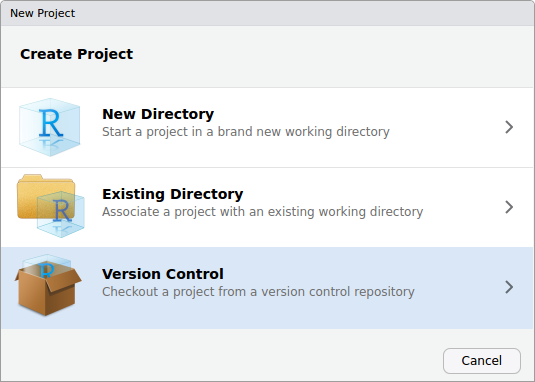
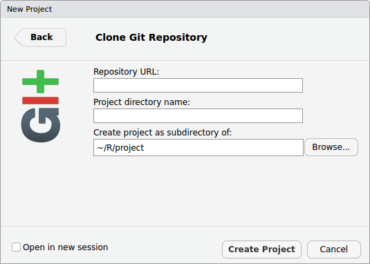

<!-- shared Links -->
```{r r basics, child="../shared/links.Rmd", include=FALSE}
```

```{r setup, include=FALSE}
# 共通chunkオプションの指定
knitr::opts_chunk$set(warning = FALSE, echo = TRUE)

# データハンドリングで利用する外部パッケージの読み込み
require(tidyverse)
tidyverse::tidyverse_conflicts()
```

本資料は[データ分析勉強会 <i class="fa fa-external-link"></i>][0]で使用した「RStudioのすゝめ」の講義資料を再整理したものです。  
　  

# はじめに
[RStudio <i class="fa fa-external-link"></i>][RSD]とはRStudio社が開発している[R言語 <i class="fa fa-external-link"></i>][R]用のIDE(Integrated Development Environment)、すなわち統合開発環境です。デスクトップ版とサーバ版の二種類が用意されており共にオープンソース版は無償で利用することが可能で、[R言語 <i class="fa fa-external-link"></i>][R]用IDEのデファクトスタンダートと言っても過言ではありません。  

RStudioの優れた点は[R言語 <i class="fa fa-external-link"></i>][R]を用いたプログラムの開発だけでなく[R Markdown <i class="fa fa-external-link"></i>][RM]を用いたドキュメントの作成や[R言語 <i class="fa fa-external-link"></i>][R]以外の言語のサポート、Git/SVNを利用したバージョン管理、独自のパッケージ管理機能等を備えている点です。また、スクリプトの記述を強力にサポートしてくれる高機能なエディタを内蔵している点やプロジェクト管理機能も備えています。  
　  

## RStudioのインストール
[RStudio <i class="fa fa-external-link"></i>][RSD]のインストールは各プラットフォーム向けのバイナリをダウンロードして実行するだけです。実行した後は対話的に必要な指示をするだけです。  
　  

# RStudio Overview
最初に[RStudio <i class="fa fa-external-link"></i>][RSD]の各部（各ペイン）の名称を確認しておきます。画面各部は設定により配置を変更できますが、ここではデフォルト状態で説明します。



No | 名称 | 説明等
---|---------------|------------------------------------------------------------
1  | Source Editor | データセットの内容表示も可能なソースエディタ/ビューア（ファイルが開かれていない場合は未表示）
2  | Console       | 文字通りコンソール（実行結果の表示だけでなくここから実行することも可）
3  | Help          | ヘルプの表示・検索が可能なヘルプビューア
4  | History       | 実行履歴（コンソールでの実行、ソースからの実行共に記録）
5  | Files         | 簡易なファイルマネージャ
6  | Plots         | ヒストリ機能、プロット出力機能付きのプロットエリア（グラフィック専用）
7  | Packages      | パッケージの管理を行うパッケージマネージャ
8  | Environment   | 扱っているオブジェクト（変数、関数）の表示と参照ができる環境マネージャ
9  | Viewer        | HTML等の表示が可能なビューア
10 | VCS(Git/SVN)  | オプションでVCS(Git or SVN)を有効にしている場合のみ有効になる簡易VCSクライアント
11 | Build         | プロジェクトオプションでBuildツールを有効にしている場合のみ有効になるビルドツール
　 | Terminal      | OSのターミナル（RStudio v1.1から）
　 | Connections   | データソース接続マネージャ（RStudio v1.1から）
　 

## 注意点
[RStudio <i class="fa fa-external-link"></i>][RSD]は日本語を始めとしたいわゆるマルチバイト文字（現在はユニコードが主流になりつつあるので表現としては不適切ですが）の扱いが不得手です。特にWindows以外の環境との共用や[R Markdown <i class="fa fa-external-link"></i>][RM]の利用を前提としている場合は以下の条件で利用するように心がけてください。  

項目       | 条件                                     | 備考
-----------|------------------------------------------|-------------------------
パス名     | 日本語（全角文字）、スペースは使用しない | フォルダ（ディレクトリ）名、ファイル名
文字コード | UTF-8                                    | UTF-8NのBOMなし
改行文字   | 基本的に各環境のRStudioに任せてOK        | LFのみが推奨
　  

## オプション設定
[RStudio <i class="fa fa-external-link"></i>][RSD]のオプション設定は[RStudio <i class="fa fa-external-link"></i>][RSD]全体に適用される［Global Option］と個々のプロジェクトのみに適用される［Project Option］の二つがあります。文字コードの設定以外は基本的にはデフォルト設定でも構いません。  
以下は推奨設定内容ならびに必須設定内容の一覧です。  
　  

### Global Options
大項目   | 中項目                       | 小項目                 | 設定内容等
---------|------------------------------|------------------------|--------------
General  | R version                    | NA                     | Windows版のみでOSのビット数に合わせる
　       | Default working directory    | NA                     | Windows版のみ
Code     | Editing                      | Insert spaces for tab  | チェックする
　       |　                            | Tab width              | 2
　       | Display                      | Show line numbers      | チェックする
　       | 　                           | Show margin            | チェックする
　       | 　                           | Margin coloumn         | 80
　       | Saving                       | Line ending conversion | Posix (LF)
　       | 　                           | Default text encording | UTF-8を選択【必須】
Packages | CRAN mirror                  | NA                     | Golbal(CND) or Japan(Tokyo)
Sweave   | Weave Rnw files using        | NA                     | knitr
　       | Typeset LaTeX into PDF using | NA                     | XeLaTeX
Terminal | Connection                   | Connect with WebSockts | Terminalが起動しない場合はチェックを外す
　  

### Project Options
大項目       | 中項目                          | 設定内容等
-------------|---------------------------------|--------------------------------
General      | 　                              | 必要に応じて変更します
Code Editing | Insert spaces for tab           | Global Optionと同設定を推奨
　           | Tab width                       | 同上
　           | Line ending conversion          | 同上
　           | Text encordint                  | 同上
Sweave       | Weace Rnw files using           | 同上
　           | Typeset LaTeX into PDF using    | 同上
Build Tools  | Project build tools             | 必要に応じて選択します
Git/SVN      | Version control system          | 同上
Packrat      | Using packrat with this project | Packratを利用する場合に使います
　  

# RStudioの使い方
[RStudio <i class="fa fa-external-link"></i>][RSD]はIDEですのでこういう使い方をしなければならないというのはありませんので、まずはヘルプにあるコードや公開されている事例コードを利用して使ってみて下さい。  
　  

## 便利なキーボードショートカット
ソースエディタを利用する際に最低限覚えておくと便利なショートカット（Windows, Linux）を下表にまとめておきます。

ショートカット           | 機能
-------------------------|---------------------------------------------
［F1］                   | 選択している関数のヘルプを呼び出す
［F2］                   | 選択している関数のコードを表示する
［TAB］                  | 入力中のコード（オブジェクト）を補完する
［Shift］+［TAB］        | 同上（Markdown部分に対するsnippet）
［Ctrl］+［1］           | ソースエディタペインをアクティブにする
［Ctrl］+［Shift］+［1］ | ソースエディタペインをウィンドウ内いっぱいに広げる
［Ctrl］+［2］           | コンソールペインをアクティブにする
［Ctrl］+［Shift］+［2］ | コンソールペインをウィンドウ内いっぱいに広げる
［Ctrl］+［Shift］+［0］ | 全てのペインを表示する
［Ctrl］+［Shift］+［C］ | 選択行をコメントアウトする
［Ctrl］+［Shift］+［I］ | カーソル行にコードチャンクを挿入する
［Alt］+［-］            | 代入（ <- ）をカーソル位置に挿入する
［Ctrl］+［Shift］+［M］ | パイプ（ %>% ）をカーソル位置に挿入する
［Ctrl］+［Enter］       | 選択行のコードを実行する
［Ctrl］+［Shift］+［K］ | R Markdownファイルをknitする
［Alt］+［Shift］+［K］  | キーボードショートカット一覧を表示する
［Ctrl］+［F］           | ファイル内、ヘルプ内検索
［Ctrl］+［Shift］+［F］ | プロジェクト内検索（grep）

　  

## Git/GitHubを使う
Git/[GitHub][GitHub]を[RStudio][RStudio]から使うためには以下の設定が必要です。

1. メニューから［Tools］-［Golobal Options...］をクリックして設定ダイアログを開きます
1. 設定ダイアログで［Git/SVN］をクリックします
1. ［Enable version control interface for RStudio project］にチェックを入れます
1. 「Git executable」にGitの実行ファイルのパスを指定します
1. ［OK］ボタンをクリックします



　  

なお、[GitHub <i class="fa fa-external-link"></i>][GitHub]のアカウントを利用しない場合は［SSH RSA Key］の設定は不要です。[GitHub <i class="fa fa-external-link"></i>][GitHub]アカウントでSSHを利用する場合はダイアログ上のヘルプリンクをクリックするか[こちらの記事 <i class="fa fa-external-link"></i>](https://www.r-bloggers.com/rstudio-and-github/){target="_blank" title="RStudio and GitHub"}を参照してください。  
　  

## リポジトリを使う
プロジェクトが[GitHub <i class="fa fa-external-link"></i>][GitHub]やSVNのリポジトリにある場合[RStudio <i class="fa fa-external-link"></i>][RSD]で直接クローン（インポート）することが可能です。  
　  

1) まずリポジトリのURLを取得します



　  

2) ［File］メニューまたはプロジェクト・メニューから［New Project...］を選択します

　  

3) ［Version Control］を選択します



　  

4) 利用しているVCSを選択します


ここでは［Git］を選択します。  
　  

5) 必要な情報を入力します



* ［Repository URL］ : 最初に取得したリポジトリのURLを入力します
* ［Project directory name］ : リポジトリ名が自動的に入力されます
* ［Create project as subdirectory of］ : プロジェクトをクローンするパス^1^を指定します

^1^ 日本語や空白が入らないパスにしてください

　  

---

<!-- Footer -->

```{r child="../shared/footer.Rmd"}
```


[GitHub]: https://github.com/ {target="_blank" title="The world's leading software development platform"}
