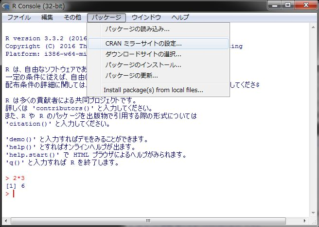
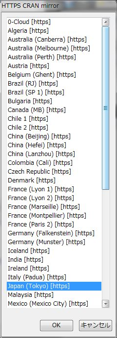
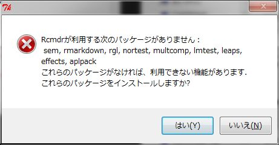
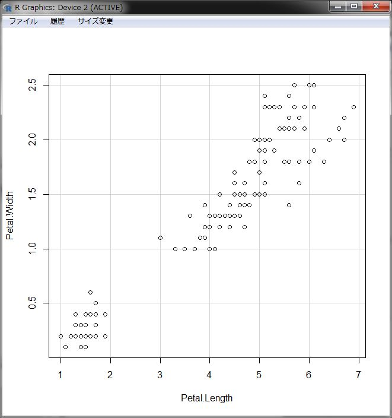

<!-- Include Common Links -->
```{r install pkg, child="../../common/links.Rmd", include=FALSE}
```

# はじめに {#installPkg}
Rはパッケージ（ライブラリ）を追加することで様々な分析に対応でき、機能も追加することができます。2017年4月1日の時点で10,000を超えるパッケージが[CRANに登録](https://cran.ism.ac.jp/web/packages/)されています。  
パッケージは起動したRからインストール可能ですが、インストールの際にはインターネット接続が必要ですので、プロキシサーバを設定する必要がある環境にいる場合は、Rのコンソールにて以下のコマンドを実行してください。

```
Sys.setenv("http_proxy"="http://<Proxyサーバ名 or IPアドレス>:<Port番号>")
```

上記のコマンドを使っても接続できない場合は、以下のサイトを参考にプロキシサーバの設定を行ってください。

* [Rのプロキシ設定](http://noucobi.com/r/rproxy.html)
* [プロキシ環境でRを使うときのメモ](http://deta.hateblo.jp/entry/2014/04/01/222721)

## ミラーサイトの設定
パッケージをダウンロードするサイトを指定するためにRのメニューから［パッケージ］-［CRANミラーサイトの設定...］を選択します。



[CRAN][CRAN]のミラーサイト一覧が別ウィンドウに表示されますので、一番近いと思われる統数研のサーバがある[Japan(Tokyo)][ISM]を選択し、［OK］ボタンをクリックします。



### Linuxの場合
Linux環境でRを利用している場合、Rはターミナル（端末）上のコマンドラインとして実行されるためメニュー表示がありませんので、以下のコマンドを実行してください。

```
chooseCRANmirror()
```


## R Commanderのインストール {#InstallRcmdr}
R Commander(Rcmdr)のインストールは起動したRから行います。インストールの際はインターネット接続が必須です。プロキシサーバを設定する必要がある場合は[はじめに](#installPkg)を参照してください。


### パッケージのインストール
ミラーサイトの設定が終わりましたら、Rのメニューから［パッケージ］-［パッケージのインストール...］を選択します。


別ウィンドウにパッケージ一覧が表示されますので`Rcmdr`を選択し、［OK］ボタンをクリックします。


#### Windowsの場合
UACによる制御がある場合には以下のようなダイアログが表示されますので、セキュリティポリシーにしたがってインストール先を決めて下さい。なお、UACについては[UACに関して](./install.html#UAC)をご覧ください。


その他のダイアログが表示され、回答していくとRcmdrパッケージならびに関連パッケージがインストールされます。インストール中はRの画面にメッセージが表示されます。


#### Linuxの場合
Linux環境でRを利用している場合、Rはターミナル（端末）上のコマンドラインとして実行されるためメニュー表示がありませんので、以下のコマンドを実行してください。

```
install.packages("Rcmdr")
```

### インストールが失敗する
Linux環境やMacOS環境ではパッケージをインストールする際に以下のようなエラーが出てパッケージのインストールが失敗する場合があります。失敗する原因はRをインストールした際に必要なアプリケーションモジュールがインストールされていないためです。

```
* installing *source* package ‘openssl’ ...
**  パッケージ ‘openssl’ の解凍および MD5 サムの検証に成功しました 
Using PKG_CFLAGS=
Using PKG_LIBS=-lssl -lcrypto
------------------------- ANTICONF ERROR ---------------------------
Configuration failed because openssl was not found. Try installing:
 * deb: libssl-dev (Debian, Ubuntu, etc)
 * rpm: openssl-devel (Fedora, CentOS, RHEL)
 * csw: libssl_dev (Solaris)
 * brew: openssl (Mac OSX)
If openssl is already installed, check that 'pkg-config' is in your
PATH and PKG_CONFIG_PATH contains a openssl.pc file. If pkg-config
is unavailable you can set INCLUDE_DIR and LIB_DIR manually via:
R CMD INSTALL --configure-vars='INCLUDE_DIR=... LIB_DIR=...'
--------------------------------------------------------------------
```

このようなエラーメッセージが表示された場合は、まず、`r-base-dev`というアプリケーションモジュールがインストールされているか確認してください。Ubuntu環境の場合はターミナル（端末）から以下のコマンドを実行することでインストールの有無を確認できます。

Ubuntuの場合
```
dpkg -l | grep r-base-dev
```

出力結果に`r-base-dev`が表示されない場合はインストールされていませんので、`r-base-dev`を[Install R](./install.html)を参考にしてインストールしてください。

#### それでもインストールが失敗する場合
`r-base-dev`がインストールされているにも関わらずインストールが失敗する場合は、エラーメッセージの"ANTICONF ERROR"に注目して不足しているライブラリを手動でインストールします。上記の場合は`libssl-dev`（Ubuntuの場合）がインストールされていませんので、ターミナル（端末）から以下のコマンドを実行してインストールします。

Ubuntuの場合
```
sudo apt-get install libssl-dev
```

### R Commanderの起動
インストールが完了したら`Rcmdr`を起動します。最初の起動時に不足しているパッケージの追加インストールを確認されますので、必ず［はい］ボタンをクリックして追加パッケージをインストールしてください。



パッケージのインストールが終わると`Rcmdr`が起動し別ウィンドウが表示されます。


#### Linuxの場合
Linux環境でRを利用している場合、Rはターミナル（端末）上のコマンドラインとして実行されるためメニュー表示がありませんので、以下のコマンドを実行してください。

```{}
library(Rcmdr)
```

## R Commanderの動作確認
Rcmdrが起動したら動作を確認しておきます。Rcmdrのメニューから［データ］-［パッケージ内のデータ］-［アタッチされたパッケージからデータセットを読み込む...］を選択します。


［パッケージからデータを読み込む］ダイアログが表示されたらパッケージ［datasets］をダブルクリックし、データセット［iris］をダブルクリックして選択します。


データが読み込まれるとRcmdrのメニューの下にある［データセット］欄に「iris」と表示されます。


データセットを読み込んだらメニューから［グラフ］-［散布図］を選択します。


下図のようなダイアログウィンドウが表示されますので、図のようにx変数とy変数を指定し［OK］ボタンをクリックします。


下図のようなグラフが描画されれば動作確認は完了です。


　  

---

<!-- Include Footer -->
```{r, child="../../common/footer.Rmd", include=FALSE}
```
