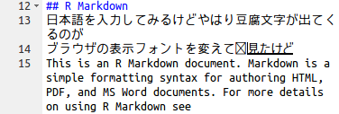

<!-- Include Common Links -->
```{r rstudio server, child="../../common/links.Rmd", include=FALSE}
```

RStudio ServerはWebブラウザをクライアントとして利用するサーバ向けのRStudioです。見た目は殆どデスクトップ版と同じです。チームでの開発で開発環境を共有したい場合やプラットフォームに依存しない環境を構築したい場合には便利です。[R][R]や[RStudio][RS]はクロスプラットフォームだと言われますが、意外と厄介なのが文字コードや日本語入力関係です。仮想環境上でRStudio Serverを動かすことによりプラットフォームに依存しない環境が構築可能になります。
　  

# 仮想環境
最近のOSは仮想環境を標準で用意していたりもしますがリソースをあまり要求しないシンプルで軽量な仮想環境としてはDockerコンテナがお薦めです。仮想環境の利点はクロスプラットフォーム対応だけでなく常にクリーンな環境を確保しておき必要に応じて短時間でクリーンな環境に戻せる点にもあります。
　  

## Docker
Dockerは乱暴な言い方をするとOS不要の仮想環境です。OS不要といっても一般的な仮想環境で必要とされるゲストOSが不要（OSレベルで仮想化している）という話で、当然、ホストOSは必要です。コンテナで扱えるアプリケーションはlinux系に限定されますが動作が他の仮想環境と比べると軽快なのが大きな特徴です。また、Docker Hubと呼ばれる公式リポジトリには仮想環境用のファイル（Dockerイメージ）が多数公開されておりDoker導入後にすぐに仮想環境で様々なアプリケーションを動作させることが可能な点も特徴の一つです。公式リポジトリ以外にもGit Hub等に非公式なDockerイメージが多数公開されておりベータ版的なアプリケーション等を仮想環境で試すことが可能です。Dockerの特徴や他の仮想マシンとの違いなどはこちらの[参考資料](http://paiza.hatenablog.com/entry/docker_intro)をご覧ください。
　  

## Rocker
[R][R]の公式なDockerイメージは[Rocker][RC]というプロジェクトで公開されています。[Rocker][RC]では構成の違いによるいくつかのイメージが提供されています。メトリクス分析の利用者側の視点からみた場合は、以下のいずれかを選択すれば良いと思います（とりあえず`tidyverse`を選んでおけば1GB近くありますが無難ではあります）。

image     | r-base | rstudio | tidyverse | LaTeX
----------|--------|---------|-----------|------
r-base    | o      | x       | x         | x
rstudio   | o      | o       | x         | x
tidyverse | o      | o       | o         | o
　  

# Install
Dockerのインストールの全体概要については[こちら](https://docs.docker.com/engine/installation/)をご覧ください。以降は、Ubuntuにインストールする場合です。
　  

## Docker
旧バージョンがある場合はアンインストールしておきます。
```
sudo apt-get remove docker docker-engine
```
　  

### Recommended extra packages for Trusty 14.04
```
sudo apt-get update
sudo apt-get install \
    linux-image-extra-$(uname -r) \
    linux-image-extra-virtual
```
　  

### Install using the repository
```
sudo apt-get install \
    apt-transport-https \
    ca-certificates \
    curl \
    software-properties-common

curl -fsSL https://download.docker.com/linux/ubuntu/gpg | sudo apt-key add -
sudo apt-key fingerprint 0EBFCD88

sudo add-apt-repository \
   "deb [arch=amd64] https://download.docker.com/linux/ubuntu \
   $(lsb_release -cs) \
   stable"
```

### Install Docker
```
sudo apt-get update
sudo apt-get install docker-ce
```
　  

## Boot Rocker Image
```
docker pull rocker/tidyverse
docker run -p 8787:8787 rocker/tidyverse
```
　

# Rcokerの課題点
上記のように簡単な手順で予め用意された仮想環境が使えるのですが、下記のような課題も残っています。

* 仮想環境が日本語化されていない（Dockerの仕様？イメージ作成時の仕様？）
* 日本語入力時に豆腐文字が表示される
* 描画系の豆腐文字問題が解決されていない（イメージ作成時の仕様）

基本的に日本語の言語環境は考慮されていないのですが最低限の日本語表示は可能です。ただ、フォントの嗜好や豆腐文字が許容できない場合は、自身でDockerイメージを変更するしかありません。
Rockerをベースに日本語対応したDockerイメージは[RStudio Server + tidyverse + RMeCab で日本語もOKなDockerイメージを作りました](http://y-mattu.hatenablog.com/entry/2017/03/28/002200)で公開されていますが日本語入力時の豆腐文字は残念ながら解決されていませんでした。ただし、RMeCabが標準で利用可能になっていますのでコンテナ環境で日本語解析を行いたい場合には便利です。




---

<!-- Include Footer -->
```{r, child="../../common/footer.Rmd", include=FALSE}
```
