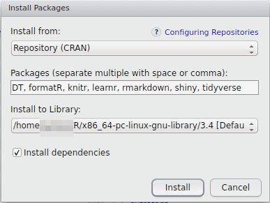
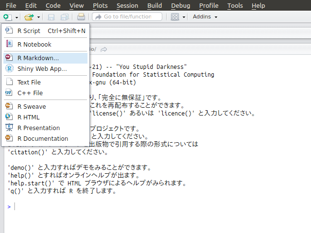
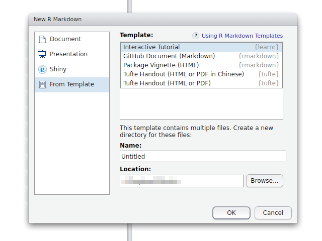
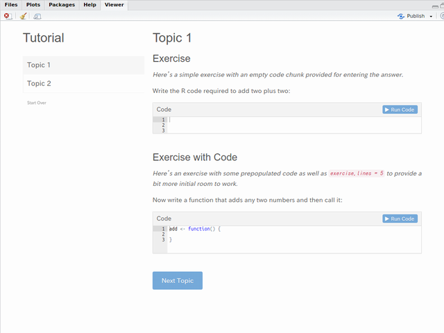

<!-- Include shared Links -->
```{r install pkg, child="../shared/links.Rmd", include=FALSE}
```

本ページはデータ分析勉強会で行うチュートリアルファイルを動かすために必要なパッケージのインストールとインストール後の動作確認方法について記述しています。  
　  

# パッケージのインストール
チュートリアルではRStudioと以下のパッケージが必要となりますので事前に[RStudioのインストール](./install_dtp.html)ならびに以下を参考に[DT <i class="fa fa-external-link"></i>][DT], [formatR <i class="fa fa-external-link"></i>][formatR], [knitr <i class="fa fa-external-link"></i>][knitr], [learnr <i class="fa fa-external-link"></i>][learnr], [rmarkdown <i class="fa fa-external-link"></i>][rmarkdown], [shiny <i class="fa fa-external-link"></i>][shiny], [tidyverse <i class="fa fa-external-link"></i>][tidyverse]パッケージをインストールして下さい。なお、バージョン情報等については[こちら](../basics_index.html)で確認して下さい。  
　  

## R GUIからのインストール
R（R GUI）のメニューからインストールする場合は[パッケージのインストール](./install_pkg.html)を参照して個々のパッケージを順に指定してインストールして下さい。  
　  

## RStudioからのインストール
RStudioからインストールする場合は［Packages］パネルにある［Install］ボタンをクリックして表示されるダイアログの［Packages］欄に以下のように入力して［Install］ボタンをクリックします。  


　  

## R Consoleからのインストール
R GUI, R Commander, RStudioのコンソールからスクリプトを用いて直接インストールする場合は以下のコマンドを実行して下さい。  
```{r, eval=FALSE}
chooseCRANmirror()
pkg_lst <- c("DT", "formatR", "knitr", "learnr", "rmarkdown", "shiny", "tidyverse")
install.packages(pkg_lst, dependencies = TRUE)
```
　  

# RStudioの動作確認
チュートリアルに必要なパッケージをインストールしましたら以下の手順でRStudioを用いて動作確認を行います。  
　  

## 新規ファイルの作成
RStudioの左上のアイコンから［R Markdown...］をクリックするか麺ヒューから［File］-［New File］-［R Markdown...］を選択します。  

　  

## テンプレートの選択
テンプレート選択画面が開きますので左側のリストから［From Template］を選択し右側に表示されたテンプレート一覧から［Interactive Tutorial］を選択し［OK］ボタンをクリックします。  

　  

## ドキュメントのレンダリング
テンプレートが開きましたら［Run Document］ボタンをクリックして下さい。R Markdownファイルのレンダリングが実行されます。  

　  

## ドキュメントの実行
レンダリングが終了し［Viewer］パネルに下図のような表示が出れば動作確認終了です。  

　  

# 困った場合は
［Console］パネルまたは［R Markdown］パネルにエラーメッセージが表示されていますので、それらを参考に不足しているパッケージをインストールして下さい。特にWindows環境ではUACが原因でパッケージのインストールができない場合もありますので、管理者権限でアプリケーションを立ち上げから実行してください。  

---

<!-- Include Footer -->
```{r, child="../shared/footer.Rmd", include=FALSE}
```
