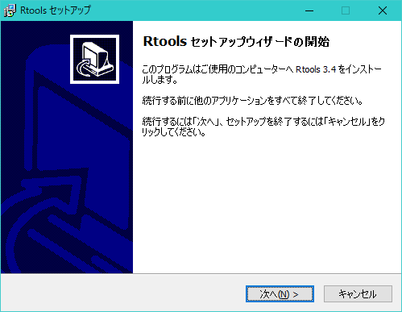
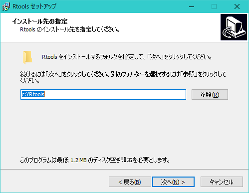
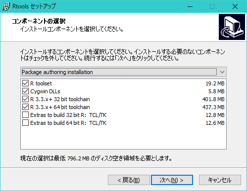
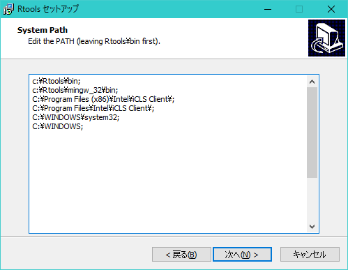
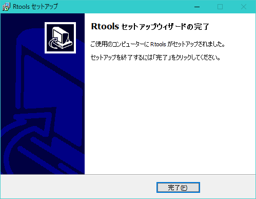

<!-- Include shared Links -->
```{r install pkg, child="../shared/links.Rmd", include=FALSE}
```

Windows環境においてCRANからパッケージをインストールする場合、基本的にビルドされたバイナリパッケージがインストールされますが、一部のパッケージにおいてソース（tarball）からパッケージをインストールしなければならない場合があります。この場合、ソースからパッケージをビルドするために[Rtools <i class="fa fa-external-link"></i>](https://cran.r-project.org/bin/windows/Rtools/){target="_blank" title="CRAN"}というツールが必要になります。  

ソースからのインストールをレコメンドされる例
```
  There are binary versions available but the source versions are later:
           binary  source needs_compilation
backports   1.0.5   1.1.0             FALSE
Rcpp      0.12.10 0.12.11              TRUE

Do you want to install from sources the package which needs compilation?
y/n: 
```

なお、パッケージのインストールや更新のタイミングによってレコメンドされるパッケージは異なる場合もありますし、レコメンドされない場合もあります。
```
  There are binary versions available but the source versions are later:
          binary  source needs_compilation
quantmod   0.4-8   0.4-9             FALSE
tseries  0.10-40 0.10-41              TRUE

Do you want to install from sources the package which needs compilation?
y/n: 


  There are binary versions available but the source versions are later:
                   binary      source needs_compilation
devtools           1.13.1      1.13.2             FALSE
RcppArmadillo 0.7.800.2.0 0.7.900.2.0              TRUE

Do you want to install from sources the package which needs compilation?
y/n: 
```
　  

# インストール
[Rtools <i class="fa fa-external-link"></i>](https://cran.r-project.org/bin/windows/Rtools/){target="_blank" title="CRAN"}から利用している[R <i class="fa fa-external-link"></i>][R]のバージョンにあったバイナリをダウンロードしてインストールして下さい。32bit版と64bit版が同梱されていますので環境に応じて選択して下さい。なお、インストール先はデフォルトのままとしてください。  
　  

## インストールされるもの
環境にもよりますが、gccを始めとしたツール類がインストールされますので相応のインストール時間を要しますのでご注意下さい。インストールされるプログラム等については[Rtools README <i class="fa fa-external-link"></i>](https://cran.r-project.org/bin/windows/Rtools/Rtools.txt){target="_blank" title="CRAN"}を参照して下さい。  
　  

## インストール手順
Rtoolsは前述のようにWinodws環境のみで必要です。Rtoolを起動したらウィザードにしたがってインストールしてください。  
　  



　  


　  
インストール先はデフォルト（`"C:\Rtools"`）のままとします。これは`packrat`を使用する際にデフォルト以外のインストール先にインストールしているとRtoolsを起動できなくなってしまうのを回避するためです。  



　  
[R][R]を利用するだけでしたらインストールするコンポーネントはデフォルトで構いません。  



　  
PATHを追加しないとRtoolsが起動しない場合がありますのでPATHを追加しておきます。PATHに`"C:\Rtools\bin"`が含まれていない場合はチェクボックスにチェックを入れてください。  


　  
`"C:\Rtools\bin"`がPATHに含まれていることを確認してください。Rtools34の場合は`"C:\Rtools\mingw_32"`へのPATHも自動的に追加されます。  



　  
なお、Rtools35ではこのPATHは追加されません。Rtools34をインストールした後にRtools35をインストールする場合はPATHが重複する場合がありますので適宜編集してください。  


　  
インストール条件を確認したらインストールを確認します。  


　  


　  



　  

## 組み合わせについて
Rtools35を利用する場合は以下の組み合わせで利用する必要があります。  
　  

Rtools | R | RStudio
-------|---|--------
Rtools35 | 3.3.x or later | **1.1.447** or later
Rtools34 | 3.3.x or later | 1.0.x or later

　  

# Windows以外の環境
Windows以外の環境では[Rtools <i class="fa fa-external-link"></i>](https://cran.r-project.org/bin/windows/Rtools/){target="_blank" title="CRAN"}のインストールは必要ありません。  
OS Xではビルド関連ツールを別途インストールする必要がある場合があります。その場合はOSの説明書などを参考に必要なツールをインストールしてください。  
　  

---

<!-- Include Footer -->
```{r, child="../shared/footer.Rmd", include=FALSE}
```
