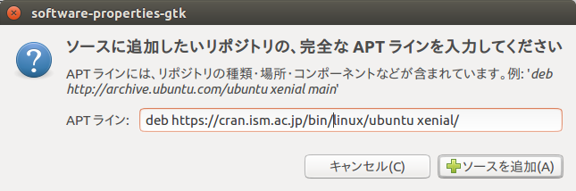

<!-- Include shared Links -->
```{r ubuntu, child="../shared/links.Rmd", include=FALSE}
```

分析環境としてのR/RStudioはWindows環境よりもLinux環境の方が動作が軽快であり分析効率が高くなります（特にPDFを作成するために必要なTeX環境は圧倒的にLinux環境の方が高速に生成できます）。そこで、本ページではLinuxに詳しくない人でもLinuxで[R <i class="fa fa-external-link"></i>][R]/[RStudio Desktop <i class="fa fa-external-link"></i>][RSD]を使える環境を整えるための情報を整理してあります。  
　  
Linuxには様々なディストリビューションと呼ばれる配布形態がありますが、[R <i class="fa fa-external-link"></i>][R]/[RStudio Desktop <i class="fa fa-external-link"></i>][RSD]を利用する場合は、

* Ubuntu/Debian系
* Fedora/RedHat/openSUSE系

の二つの選択肢がありますが、後述の日本語入力パッチや情報の豊富さを考えるとDesktop系として広く普及しているUbuntu/Debian系を選択するのがベターだと思いますので、以降は[Ubuntu Desktop <i class="fa fa-external-link"></i>][UJT]を前提に説明します。なお、サーバ系に関しては本資料では説明しません。  
　  

# Ubuntu
## Ubuntuの入手
日本語環境に必要なパッケージ全てが含まれている[Ubuntu Desktop Japanese Remix <i class="fa fa-external-link"></i>][UDJR]を入手するのが最も簡単です。複数のバージョンが提供されていますがサポート期限の長いLTS(Long Term Support)版のISOイメージを入手するのがベストです。

**注意**

* 本ページは**_16.04LTS_**を対象として記述しています
    * 後述のRStudioの日本語入力パッチは16.04LTS用で、他のバージョンでは利用できません
* BIOS（含む互換モード）でインストールする場合は必ずISOイメージを焼いたDVD媒体を利用してください
    * USBメモリでインストール媒体を作成するとUEFIモードでインストールされます  
　  

### 補足
UbuntuはWindowsに比べると軽快に動作するように感じますが、以前と異なり最新版LTSでは相応のハードウェアリソースを要求します。特にDesktopはSeverと異なりGUI関連でリソースが必要になります。Ubuntu公式での[公式推奨環境 <i class="fa fa-external-link"></i>](https://www.ubuntu.com/download/desktop){target="_blank" title="Recommended system requirements"}は以下の通りです。参考までにR/RStudio + TeX/LaTeXを使うのであれば表の右側程度の環境を準備した方がベターです。

項目  | 公式推奨環境               | 参考（おすゝめ環境）
----- | -------------------------- | ----------------------------
CPU   | 2GHz dual core or better   | Core iシリーズ（dual core or better）
RAM   | 2GB                        | 8GB以上の実装
Disk  | 25GB of free space or more | 64GB以上の空き
Media | DVD drive or USB port      | 公式推奨環境に同じ

また、GUIであるUnityの評判はあまり良くないようです（個人的には、そんなに使いにくさを感じませんが）。このあたりは好みですので使い勝手が良くないと感じる場合はUbuntuの公式バリエーションである[Ubuntu flavors <i class="fa fa-external-link"></i>](https://www.ubuntu.com/download/ubuntu-flavours){target="_blank" title="Ubuntu flavours"}から選択するのも手です。  
　  

## Ubuntuのインストール
[Ubuntu Desktop Japanese Remix <i class="fa fa-external-link"></i>][UDJR]のISOイメージを入手しましたらDVDに焼きDVDからブートしてインストールを実行します。基本的にはガイダンスにしたがってインストールするだけですので詳細は割愛します。最新のチップセットや特殊なハードウェアでない限り問題なくインストールできるはずです。なお、マルチブートを用いてWindowsと共存させたい場合は、Google等でその方法を検索して下さい。インストールが完了して[Ubuntu Desktop Japanese Remix <i class="fa fa-external-link"></i>][UDJR]に無事ログインできたら日本語が使えるか確認しておきます。  
　  

### 暗号化時の注意
インストール時にディスク暗号化オプションを選択した場合、パスワードに記号を使う場合は注意が必要です。これはインストール時にJISキーボードで記号を入力しても初回のUbuntu起動時（コールドスタート時）等にはASCIIキーボードとして認識されるためです。この誤認識により記号のキー位置がJISではなくASCIIとして認識されてしまうことがあります。  
　  

### 追加パッケージの利用方法
日本語環境の含まれない[Ubuntu <i class="fa fa-external-link"></i>][U]のオリジナル版DVDでインストールしてしまったり、日本語環境が使えない場合は、[追加パッケージの利用方法 <i class="fa fa-external-link"></i>][UAP]にしたがってパッケージリポジトリを追加してアップデートを行って下さい。  
　  

### アップグレードの確認
[Ubuntu Desktop <i class="fa fa-external-link"></i>][UJT]をアップグレードした場合等は[追加パッケージの利用方法 <i class="fa fa-external-link"></i>][UAP]にしたがって、日本語環境もアップグレードしておきます。まず、［Ctrl+Alt+t］を押下して起動させたターミナル（端末）を起動し以下のコマンドを実行しGPG鍵とレポジトリを追加します。  

```
wget -q https://www.ubuntulinux.jp/ubuntu-ja-archive-keyring.gpg -O- | sudo apt-key add -
wget -q https://www.ubuntulinux.jp/ubuntu-jp-ppa-keyring.gpg -O- | sudo apt-key add -
sudo wget https://www.ubuntulinux.jp/sources.list.d/xenial.list -O /etc/apt/sources.list.d/ubuntu-ja.list
sudo apt-get update
```

次にパッケージのアップグレードを同様にターミナル（端末）から実行します。
```
sudo apt-get upgrade
```

以上で[Ubuntu Desktop <i class="fa fa-external-link"></i>][UJT]のインストールは終了です。GUI環境であるUnityの操作性がWindowsとは、かなり異なるため慣れるまでは戸惑うことも多いと思いますがWindowsとは異なった快適性もありますので、色々と操作してお楽しみ下さい。  
　  

## その他
### 無線LAN
無線LANで接続を行う場合、アクセスポイントのSSIDが秘匿（ステルスモードに設定）されていると無線LANの接続ができない場合があります。この場合はアクセスポイントの設定を変更してください。  
　  

### Bluetooth
一度、Bluetooth機器を接続した後にシャットダウン、起動を行うとBluetooth機器を認識しなくなる場合があります。調べてみるとPC側のBluetoothのTx(送信)側がエラーを起こしているのが原因のようで、Atheros(Qualcomm Atheros)のチップを使った機種で発生しやすいようです。ただ、試してみた限り根本的な解決策はないようですので、Bluetoothドングルを使うことで回避した方が早そうです。  
　  

#### 回避方法
ネットで言われている回避方法は、標準でインストールされている`bluez`を`blueman`に入れ替える方法です。ただ、不安定な状況が発生する時は発生しますし、Ubuntuに標準で入っているコントロールセンターが削除されてしまう弊害もあります。  
　  

#### 参考
[Ask ubunt <i class="fa fa-external-link"></i>](http://askubuntu.com/questions/787023/bluetooth-not-working-on-ubuntu-16-04-lts){target="_blank" title="ask ubuntu"}  
　  

### 最初の設定
[R <i class="fa fa-external-link"></i>][R]や[RStudio Desktop <i class="fa fa-external-link"></i>][RSD]等をインストールする前にUbuntuの基本的な設定を行っておくことをおすゝめします。具体的な設定方法は[こちら <i class="fa fa-external-link"></i>](http://sicklylife.at-ninja.jp/memo/ubuntu1604/settings.html#mozc_ppa){target="_blank" title="Ubuntu 16.04 LTSをインストールした直後に行う設定 & インストールするソフト"}を参考にしてください。  
　  

#### 最低限の設定
紹介したサイトでの設定は多岐に渡りますので、最低限、設定しておくべき項目を上げておきます。

* [ソフトウェアの更新 <i class="fa fa-external-link"></i>](http://sicklylife.at-ninja.jp/memo/ubuntu1604/settings.html#update){target="_blank" title="Ubuntu 16.04 LTSをインストールした直後に行う設定 & インストールするソフト"}
* [ファイアーウォール(gufw)の導入と設定 <i class="fa fa-external-link"></i>](http://sicklylife.at-ninja.jp/memo/ubuntu1604/settings.html#gufw){target="_blank" title="Ubuntu 16.04 LTSをインストールした直後に行う設定 & インストールするソフト"}
* [ゲストセッションの無効化 <i class="fa fa-external-link"></i>](http://sicklylife.at-ninja.jp/memo/ubuntu1604/settings.html#update){target="_blank" title="Ubuntu 16.04 LTSをインストールした直後に行う設定 & インストールするソフト"}
* [日本語入力ソフト(Mozc)のアップデート <i class="fa fa-external-link"></i>](http://sicklylife.at-ninja.jp/memo/ubuntu1604/settings.html#mozc_ppa){target="_blank" title="Ubuntu 16.04 LTSをインストールした直後に行う設定 & インストールするソフト"}
* [HDDのロード/アンロード抑制 <i class="fa fa-external-link"></i>](http://sicklylife.at-ninja.jp/memo/ubuntu1604/settings.html#load_unload){target="_blank" title="Ubuntu 16.04 LTSをインストールした直後に行う設定 & インストールするソフト"}

　  

# R (Base R)
[Ubuntu Desktop <i class="fa fa-external-link"></i>][UJT]の準備ができましたら、まず、[R <i class="fa fa-external-link"></i>][R]本体をインストールします。[UbuntuにRをインストール <i class="fa fa-external-link"></i>][lref1]に記載されているように単純に`sudo apt-get install r-base`を実行してしまうと古いバージョンが登録されてしまうようなので以下の手順にしたがってインストールします。なお、インストールの公式手順は[CRANのREADME <i class="fa fa-external-link"></i>](https://cran.ism.ac.jp/bin/linux/ubuntu/README.html){target="_blank" title=""}にて開示されています。

[lref1]: http://qiita.com/wonder_zone/items/c0cb4033c2a599b3d662/ {target="_blank" title="Qitta"}

　  

## ミラーサイトの登録
インストールを行う前にCRANまたはCRANのミラーサイトをRepositoryとして登録しておきます。日本であれば統計数理研究所がベターだと思いますが、環境に応じて[CRAN Mirrors <i class="fa fa-external-link"></i>](https://cran.ism.ac.jp/mirrors.html){target="_blank" title="UBUNTU PACKAGES FOR R"}から選択して下さい。ターミナル（端末）から以下を実行すれば登録できます。  
　  

### R3.4.4まで
```
sudo add-apt-repository 'deb https://cran.ism.ac.jp/bin/linux/ubuntu xenial/'
```

　  

### R3.5.x以降の場合
```
sudo add-apt-repository 'deb https://cran.ism.ac.jp/bin/linux/ubuntu xenial-cran35/'
```

　  

<!-- ### ツールの場合 -->
<!-- GUIツールを用いて登録するには［システム設定］-［ソフトウェアのアップデート］-［他のソフトウェア］で以下のサイトを追加します。 -->

<!--  -->

<!-- ``` -->
<!-- deb https://cran.ism.ac.jp/bin/linux/ubuntu xenial/ -->
<!-- ``` -->

<!-- ### エディタの場合 -->
<!-- システム管理者（root）権限でエディタを起動し、 -->
<!-- ``` -->
<!-- sudo gedit /etc/apt/sources.list   -->
<!-- ``` -->

<!-- 以下の一行を追加（Ubuntu 16.04 LTSの場合）して保存します。 -->
<!-- ``` -->
<!-- deb https://cran.ism.ac.jp/bin/linux/ubuntu xenial/ -->
<!-- ``` -->

<!-- Ubuntuのバージョン（コードネーム）が分からない場合は、ターミナル（端末）で以下のコマンドを実行します。`DISTRIB_CODENAME`の項がバージョン（コードネーム）ですので、コピーしておきます。 -->
<!-- ``` -->
<!-- cat /etc/lsb-release -->
<!-- ``` -->

## 公開鍵の登録
次にターミナル（端末）から以下のコマンドを実行して公開鍵を入手してインストールします。公開鍵を入手するために必要な`Key ID`は現時点では`E084DAB9`ですが、変わる可能性もありますので、上手くいかない場合は、[CRANのREADME](https://cran.ism.ac.jp/bin/linux/ubuntu/README.html){target="_blank" title="UBUNTU PACKAGES FOR R"}で確認して下さい。  

```
gpg --keyserver keyserver.ubuntu.com --recv-key E084DAB9
gpg -a --export E084DAB9 | sudo apt-key add -
```

　  

### Rのインストール
最後にターミナル（端末）から以下のコマンドを実行してRをインストールします。これで、必要となるソフトウェアは一通りインストールされます。  

```
sudo apt-get update
sudo apt-get install r-base
```

なお、`r-cran-*`という名称のRのパッケージもリポジトリからインストール可能ですが、パッケージのバージョンがCRANよりが古い場合がありますので、Rのパッケージを追加する場合はCRANからインストールすることをおすゝめします。  

CRANからRのパッケージをインストールする際には、`r-base-dev`に含まれているソフトウェアを利用してコンパイルが行われます。`r-base-dev`がインストールされてコンパイルエラーになりパッケージがインストールされませんので注意して下さい。必要なソフトウェアがインストールされていることの確認は以下のコマンドをターミナル（端末）から実行して下さい。`r-base-dev`が表示されればインストールされています。  

```
dpkg -l | grep r-base
```

　  

<!-- #### Lixun Mintの場合 -->
<!-- Linux Mintの場合は基本的にソフトウェアマネージャからインストールを行いますが、Ubuntuと異なり`r-base`をインストールしただけでは必要なソフトウェアがインストールされませんので、別途、インストールが必要になります。別途、インストールが必要なソフトウェアはCRANからRのパッケージをインストールする際に必要なソフトウェアですので、必ずインストールして下さい。   -->

<!-- ``` -->
<!-- # 実際にはソフトウェアマネージャから実行する -->
<!-- sudo apt-get update -->
<!-- sudo apt-get install r-base -->
<!-- sudo apt-get install r-base-core -->
<!-- sudo apt-get install r-base-dev -->
<!-- ``` -->

# RStudio Desktop
## RStudioの入手
まず、[RStudio Desktop <i class="fa fa-external-link"></i>][RSD]からUbuntu用のインストーラをダウンロードします。  
　  

## libjpeg62のインストール
RStudioをインストールするには`libjpeg62`が必要となります。`libjpeg62`がインストールされていない場合もありますので以下のコマンドでインストールされているかを確認してください。  

```
dpkg -l | grep libjpeg62
```

インストールされていない場合は、以下のコマンドでインストールしておきます。  

```
sudo apt-get update
sudo apt-get install libjpeg62
```

　  

## RStudioのインストール
ダウンロードしたRStudioのインストーラを右クリックして［ソフトウェアのインストールで開く］を選択します。  


Ubuntu Softwareのウィンドウが開いてインストールするかどうか確認してきますので、［インストール］ボタンをクリックしてインストールを行います。  


　  

## 日本語入力のためのパッチ
RStudioのインストールが完了しましたら、RStudioで日本語入力ができるように[Ubuntu 16.04 + Fcitx + RStudio 1.0で日本語を入力する方法 <i class="fa fa-external-link"></i>](http://blog.goo.ne.jp/ikunya/e/8508d21055503d0560efc245aa787831){target="_blank" title="いくやの斬鉄日記"}で公開されているパッケージをインストールします。
［Ctrl+Alt+t］を押下して起動させたターミナル（端末）から当該ページに記載されているコマンドを実行します。  

**注意**  
RStudio **1.0.153以降**の場合は[Ubuntu 16.04 + Fcitx + RStudio 1.0.153以降で日本語を入力する方法 <i class="fa fa-external-link"></i>](http://blog.goo.ne.jp/ikunya/e/48b3e547dd2b8c7cfbe2a8dadc0b962a){target="_blank" title="いくやの斬鉄日記"}を参照してください。  
**_Ubuntu 18.04LTS_**ではデフォルトのインプットメソッドであるIBusを利用すればRStudioで日本語入力ができるそうです。ただし、16.04LTSから18.04LTSにアップグレードした場合はibus-mozcがインストールされず日本語入力が使えないそうなので、別途、ibus-mozcをインストールしてください。なお、18.04LTSでFcitxを使いたい場合は18.04LTS用の日本語入力パッチを適用する必要があります。  
　  

ダウンロードしたファイルが不安な方はハッシュ値（SHA256）を確認してからインストールして下さい。また、ソースからビルドしたい方は同ページを参照してビルドして下さい。  

```
sha256sum fcitx-qt5-rstudio.tar.gz
```

`sha256sum`の使い方の詳細は以下のコマンドで確認してください。
```
man sha256sum
````

　  

# R Commander
Rcmdr(R Commander)は必要に応じてCRANからインストールします。  
　  

## エラーが出る場合
Rcmdrのインストール中に以下のようなエラーが表示されてインストール出来ない場合は、`r-base-dev`がインストールされていない可能性がありますので前述の方法で再確認してください。  

なお、`r-base-dev`がインストールされているにもかかわらず下記のようなエラーが出た場合は、エラーメッセージにあるOSのライブラリ、この場合は`libssl-dev`を個別にインストールして下さい。  

```
* installing *source* package ‘openssl’ ...
**  パッケージ ‘openssl’ の解凍および MD5 サムの検証に成功しました 
Using PKG_CFLAGS=
Using PKG_LIBS=-lssl -lcrypto
------------------------- ANTICONF ERROR ---------------------------
Configuration failed because openssl was not found. Try installing:
 * deb: libssl-dev (Debian, Ubuntu, etc)
 * rpm: openssl-devel (Fedora, CentOS, RHEL)
 * csw: libssl_dev (Solaris)
 * brew: openssl (Mac OSX)
If openssl is already installed, check that 'pkg-config' is in your
PATH and PKG_CONFIG_PATH contains a openssl.pc file. If pkg-config
is unavailable you can set INCLUDE_DIR and LIB_DIR manually via:
R CMD INSTALL --configure-vars='INCLUDE_DIR=... LIB_DIR=...'
--------------------------------------------------------------------
```

`libssl-dev`はターミナル（端末）で以下のコマンドを実行してインストールします。  

```
sudo apt-get update
sudo apt-get install libssl-dev
```

なお、`libxml2-dev`や`libcurl4-openssl-dev`などの下表のライブラリが見つからない旨のエラーメッセージが出ることがありますので合わせてインストールしておくことをおすゝめします。  
　  

Ubuntu Library       | Libraryを必要とするパッケージの例
---------------------|---------
libssl-dev           | openssl
libxml2-dev          | xml2
libcurl4-openssl-dev | curl
libudunits2-dev      | ggforce
unixodbc-dev         | odbc

　  

### エラーの確認方法
Rcmdrのインストール中にエラーがでた場合、エラーメッセージ中の"ANTICONF ERROR"に着目します。Ubuntu環境では2行目にある`deb:`以降のメッセージが該当します。この場合、`libxml2-dev`ライブラリがインストールされていませんので、コンソール（端末）からライブラリをインストールします。  

```
------------------------- ANTICONF ERROR ---------------------------
Configuration failed because libxml-2.0 was not found. Try installing:
 * deb: libxml2-dev (Debian, Ubuntu, etc)
 * rpm: libxml2-devel (Fedora, CentOS, RHEL)
 * csw: libxml2_dev (Solaris)
If libxml-2.0 is already installed, check that 'pkg-config' is in your
PATH and PKG_CONFIG_PATH contains a libxml-2.0.pc file. If pkg-config
is unavailable you can set INCLUDE_DIR and LIB_DIR manually via:
R CMD INSTALL --configure-vars='INCLUDE_DIR=... LIB_DIR=...'
--------------------------------------------------------------------
```

　  

### ファイルの確認方法
パッケージによっては"ANTICONF ERROR"を吐き出してくれずに「何々というヘッダーファイルが不足している」というような出力のみの場合があります。このような場合`apt-file`コマンドを用いて、そのファイルがどのライブラリに含まれるのかを確認します。`apt-file`コマンドは標準ではインストールされていませんので以下のコマンドを実行してインストールします。  

```
sudo apt-get update
sudo apt-get install apt-file
```

インストールが完了したら以下のコマンドで検索用データベースを更新します。  

```
apt-file update
```

データベースの更新が完了したら以下のように検索を実行します。  

```
apt-file search filename
```

　  

# Git
RStudioではVCS(Version Control System)としてGitまたはSVCが利用できます。VCSを用いるとソースの版管理ができますので、VCSの利用をおすゝめします。VCSはGitHubやGitHub Pagesの利用を考慮して現在の主流とも言えるGitを選択するのがベターです。  

［Ctrl+Alt+t］を押下して起動させたターミナル（端末）から以下のコマンドを実行してGitをインストールします。Ubuntu公式リポジトリのGitはバージョンが古くstashなどの一部機能が利用できませんので、ppaから最新版をインストールします。  

```
sudo add-apt-repository ppa:git-core/ppa
sudo apt-get update
sudo apt-get install git
sudo git --version
```

　  

## Gitの初期設定
インストールが完了したら続いて初期設定でユーザ名とメールアドレスを登録します。この設定はこの後にでてくるGit GUIクライアント側で設定しても構いません。  

```
git config --global user.name "User Name"
git config --global user.email "hoge@hoge.com"
```

* "User Name"と"hoge\@hoge.com"は、任意のユーザ名とメールアドレスに置き換えて下さい

なお、Gitではファイル名に日本語を利用する場合には文字化け対策が必要ですが、RStudioを使う場合は日本語ファイル名はご法度ですので日本語ファイル名の文字化け対策は必須ではありませんので、ここでは省略します。  
　  

## Git GUI Client
Gitはコマンドライン操作が基本です。RStudioはGitの基本的なコマンドに関してはGUI操作できますが、細かいところまで操作が可能なGit GUIクライアントを準備しておくことをおすゝめします。  
MacやWindows環境では[SourceTree <i class="fa fa-external-link"></i>](https://www.sourcetreeapp.com/){target="_blank" title="Free Git GUI for Mac and Windows"}が有名ですがSourceTreeはUbuntu環境では利用できませんので、以下から好みに応じて選択してください。Ubuntu環境以外にMacやWindows環境を利用する場合はGUI環境を統一しておくことをおすゝめします。  

Git GUI                  | Ubuntu | Mac | Windows | Memo
-------------------------|:---:|:---:|:---:|---------
[GitKraken <i class="fa fa-external-link"></i>][GitKraken]   | Yes | Yes | Yes | Free版は機能制限あり
[SmartGit <i class="fa fa-external-link"></i>][SmartGit]     | Yes | Yes | Yes | Free版でも機能制限なし^1^
[GitEye <i class="fa fa-external-link"></i>][GitEye]         | Yes | Yes | Yes | 
[SourceTree <i class="fa fa-external-link"></i>][SourceTree] | No  | Yes | Yes | 日本語版あり

^1^ : 非商用利用の場合  
　  

上記以外のGUIクライアントは[こちら <i class="fa fa-external-link"></i>](https://git-scm.com/downloads/guis/){target="_blank" title="GUI Clients"}を参照してください。  
　  　  

### SmartGit
SmartGitはJavaベースのソフトウェアですので、後述のJava環境（JREまたはJDK）を別途インストールする必要があります。GUIクライアント本体は開発元の[ダウンロードページ <i class="fa fa-external-link"></i>](http://www.syntevo.com/smartgit/download){target="_blank" title="SmartGit"}からDebianパッケージ(deb)をダウンロードして、Ubuntu Softwareからインストールしてください。  
　  

## Java Runtime
SmartGitを利用する場合はJava環境が必要ですので、以下の手順にしたがってインストールします。  
　  

### JRE
JRE(Java Runtime Enveironment)は、文字通りJavaの実行環境のみを提供します。デフォルトのJREは、Open Javaで以下の手順でインストールします。  

```
sudo apt-get update
sudo apt-get install default-jre
```

なお、JREをインストールしてもSmartGitが起動しない場合は、JDKをインストールしてみてください。  
　  

### JDK
JDK(Java Development Kit)はJREと異なりJavaでプログラム開発する場合に用いる環境です。現在は、Oracle Javaとなっており、以下の手順でインストールします。  
　  

#### Java 8
Java 8は以下の手順でインストールします。
```
sudo add-apt-repository ppa:webupd8team/java
sudo apt-get update

sudo apt-get install oracle-java8-installer
```

<!-- #### Java 9 -->
<!-- 最新版のJava 9は以下の手順でインストールします。 -->
<!-- ``` -->
<!-- sudo add-apt-repository ppa: -->
<!-- sudo apt-get update -->

<!-- sudo apt-get install oracle-java9-installer -->
<!-- ``` -->

[参考 <i class="fa fa-external-link"></i>](https://www.digitalocean.com/community/tutorials/how-to-install-java-with-apt-get-on-ubuntu-16-04){target="_blank" title="How To Install Java with Apt-Get on Ubuntu 16.04"}

　  

# TeX Live
R Markdownを使ってPDFを作成する場合にはTeX/LaTeX環境が必要です。WindowsでもMac OSでも使えるTeX Liveをインストールしておくのがおすゝめですが、TeX Liveは巨大なディストリビューションなので軽量の派生ディストリビューションである`TinyTeX`がおすゝめです。インストール方法は[こちら](./env_install_tex.html)から。  

<!-- には様々なTeX/LaTeXが含まれていますが、ディスク容量を必要とするもののFullインストールしておくのが何かと便利です。   -->
<!-- 　   -->

<!-- ## Ubuntuリポジトリを使う場合 -->
<!-- 一番簡単な方法ですが最新版とは限りませんのでインストール後にアップデートが必要になる場合があります。   -->

<!-- ``` -->
<!-- sudo apt-get update -->
<!-- sudo apt-get install texlive-full -->
<!-- ``` -->

<!-- 　   -->

<!-- ## ネットワークインストーラを使う場合 -->
<!-- ［Ctrl+Alt+t］を押下して起動させたターミナル（端末）から以下のコマンドを実行してネットワークインストーラを入手し展開します。   -->

<!-- ``` -->
<!-- wget http://mirror.ctan.org/systems/texlive/tlnet/install-tl-unx.tar.gz -->
<!-- tar xvf install-tl-unx.tar.gz -->
<!-- ``` -->

<!-- 　   -->

<!-- ### インストール -->
<!-- [インストールガイド <i class="fa fa-external-link"></i>](https://texwiki.texjp.org/?Linux#texlive){target="_blank" title="TeX Wiki"}にしたがって展開したインストーラのディレクトリに移動しインストーラを起動します。起動後、コマンド入力が促されますので`I`を入力してインストールを行います。インストール完了までにはかなりの時間（ネットワーク環境等にもよりますが〜３時間程度）を要します。   -->

<!-- ``` -->
<!-- cd install-tl* -->
<!-- sudo ./install-tl --repository http://mirror.ctan.org/systems/texlive/tlnet/ -->
<!-- ``` -->

<!-- 上記はCTANのオリジナルサーバにアクセスしますので、実際には[ミラーサイト <i class="fa fa-external-link"></i>](https://texwiki.texjp.org/?TeX%20Live){target="_blank" title="CTAN Mirror"}からリポジトリを選択してください。   -->
<!-- 　   -->

<!-- ### インストールできない場合 -->
<!-- 3GB近いファイルをネットワークからインストールしますので、環境によってはうまくインストールできない場合があります。その場合は[ISOイメージをダウンロード <i class="fa fa-external-link"></i>](https://texwiki.texjp.org/?TeX%20Live#iso){target="_blank" title="TeX Wiki"}して媒体からインストールしてみて下さい。   -->
<!-- 　   -->

<!-- #### ISOイメージからのインストール方法 -->
<!-- ターミナル（端末）を起動してマウントしたISOイメージまたはDVDドライブに移動し以下のコマンドを実行します。   -->

<!-- ``` -->
<!-- sudo ./install-tl -->
<!-- ``` -->

<!-- 　   -->

<!-- ## 初期設定等 -->
<!-- インストールが完了したらTeX Live脆弱性が確認されていますので念の為に以下のコマンドでアップデートを行っておきます。   -->

<!-- ``` -->
<!-- sudo tlmgr update --self --all -->
<!-- ``` -->

<!-- `tlmgr`が実行されない場合は、[インストールガイド <i class="fa fa-external-link"></i>](https://texwiki.texjp.org/?Linux#texlive){target="_blank" title="TeX Wiki"}を参照してパスを追加してください。   -->
　  

# Fonts
Ubuntuに標準でインストールされている日本語フォントはあまりバリエーションがありませんので[フォントのインストール <i class="fa fa-external-link"></i>](https://wiki.ubuntulinux.jp/UbuntuTips/Desktop/InstallFont){target="_blank" title="UbuntuTips"}からお好みのフォントをインストールすることをおすすめします。使えるフォントはTrueTypeフォントまたはOpenTypeフォントです。
特にR Markdownを使ってPDFファイルを作成するのであれば`IPAフォント`や`Notoフォント`をインストールすることをおすゝめします。  
　  

# Utilities
R/RStudioを使う上で必須ではありませんがインストールしておくと便利なユーティリティを紹介しておきます。  
　  

## Dropbox
Ubuntuで利用できる数少ないクラウドストレージ・クライアントですのでインストールしておくことをおすゝめします。インストールはUbuntu Softwareから行えます。[Dropboxのサイトからダウンロード <i class="fa fa-external-link"></i>](https://www.dropbox.com/ja/install){target="_blank" title="Dropbox"}してインストールすることも可能です。  
　  

## wine
（準備中）  
　  

## PDF Mod
（準備中）  
　  

## Redshift
（準備中）  
　  

# Tips
　  

## Ubuntu Software
Ubuntu Softwareが起動しなくなることがあります。起動しなくなった場合は以下のコマンドを実行して再インストール後にキャッシュファイルなどを削除してみてください。  
　  

```
sudo apt purge gnome-software gnome-software-common ubuntu-software
sudo apt install ubuntu-software gnome-software*
sudo appstreamcli refresh --force --verbose
sudo rm -r /var/cache/app-info && sudo appstreamcli refresh --force --verbose
rm -rf ~/.local/share/gnome-software/
```

　  

<!-- # Install 1Password -->
<!-- ## wineの導入 -->

<!-- wineではインストール対象のファイル形式によりインストール方法が異なりますのでご注意ください。 -->
<!-- ``` -->
<!-- wine hoge.exae -->
<!-- wine msiexec /i hoge.msi -->
<!-- wine rundll32 setupapi,InstallHinfSection DefaultInstall 132 hoge.inf -->
<!-- ``` -->

<!-- ## 1passwordのインストール -->

<!-- ## Helperのインストール -->

# Appendix
　  

## Ubuntu

* [Ubuntu Desktop 日本語 Remix <i class="fa fa-external-link"></i>](https://www.ubuntulinux.jp/download/ja-remix){target="_blank" title="ubuntu Japanese Team"}  
* [追加パッケージの利用方法 <i class="fa fa-external-link"></i>](https://www.ubuntulinux.jp/japanese){target="_blank" title="ubuntu Japanese Team"}  
* [第520回　Ubuntu 18.04 LTSの日本語入力 <i class="fa fa-external-link"></i>](http://gihyo.jp/admin/serial/01/ubuntu-recipe/0520){target="_blank" title="Ubuntu Weekly Recipe"}  

　  

## R/RStudio

* [UbuntuにRをインストールするための手順 <i class="fa fa-external-link"></i>](http://www.trifields.jp/install-r-in-ubuntu-1000){target="_blank" title="トライフィールズ"}  
* [UbuntuにRStudioをインストールするための手順 <i class="fa fa-external-link"></i>](http://www.trifields.jp/install-rstudio-in-ubuntu-1006){target="_blank" title="トライフィールズ"}  
* [RStudio Desktop <i class="fa fa-external-link"></i>](https://www.rstudio.com/products/rstudio/download/){target="_blank" title="RStudio"}  
* [Ubuntu 16.04 + Fcitx + RStudio 1.0で日本語を入力する方法 <i class="fa fa-external-link"></i>](http://blog.goo.ne.jp/ikunya/e/8508d21055503d0560efc245aa787831){target="_blank" title="いくやの斬鉄日記"}  
* [Ubuntu 16.04 + Fcitx + RStudio 1.0.153以降で日本語を入力する方法 <i class="fa fa-external-link"></i>](https://blog.goo.ne.jp/ikunya/e/48b3e547dd2b8c7cfbe2a8dadc0b962a){target="_blank" title="いくやの斬鉄日記"}
* [Ubuntu 18.04 LTS + Fcitx + RStudio 1.1.xで日本語を入力する方法 <i class="fa fa-external-link"></i>](https://blog.goo.ne.jp/ikunya/e/6fbb9d057a83aeaab9860709c7da049f){target="_blank" title="いくやの斬鉄日記"}
* [第527回　UbuntuにRStudioをインストールする方法 <i class="fa fa-external-link"></i>](http://gihyo.jp/admin/serial/01/ubuntu-recipe/0527){target="_blank" title="Ubuntu Weekly Recipe"}  

　  

## TeX Live

* [インストールガイド <i class="fa fa-external-link"></i>](https://texwiki.texjp.org/?Linux#texlive){target="_blank" title="TeX Wiki"}  
* [ISOイメージをダウンロード <i class="fa fa-external-link"></i>](https://texwiki.texjp.org/?TeX%20Live#iso){target="_blank" title="TeX Wiki"}  

　  

## Fonts

* [フォントのインストール <i class="fa fa-external-link"></i>](https://wiki.ubuntulinux.jp/UbuntuTips/Desktop/InstallFont){target="_blank" title="ubuntu Japanese Team"}  
* [Google Noto Fonts <i class="fa fa-external-link"></i>](https://www.google.com/get/noto/){target="_blank" title="Beautiful and free fonts for all languages"}
---

<!-- Include Footer -->
```{r, child="../shared/footer.Rmd", include=FALSE}
```

[GitKraken]: https://www.gitkraken.com/ {target="_blank" title="he legendary Git GUI client for Windows, Mac and Linux"}
[SmartGit]: https://www.syntevo.com/smartgit/ {target="_blank" title="SmartGit"}
[GitEye]: https://www.collab.net/downloads/giteye {target="_blank" title="CollabNet GitEye"}
[SourceTree]: https://www.sourcetreeapp.com/ {target="_blank" title="Simplicity and power in a beautiful Git GUI"}
