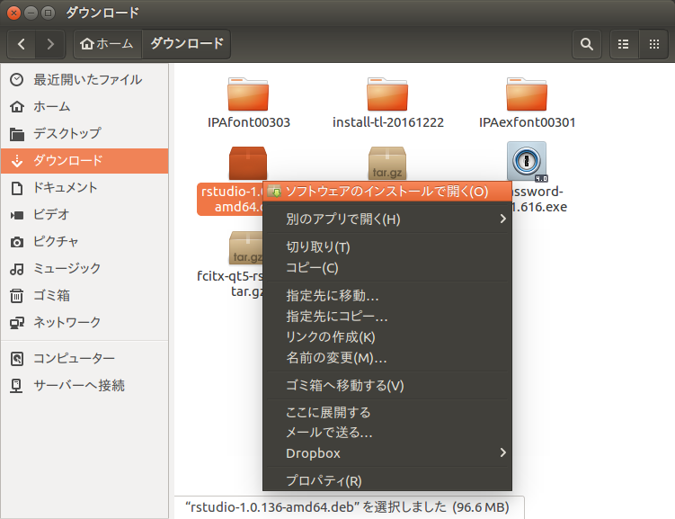

<!-- Include shared Links -->
```{r ubuntu, child="../shared/links.Rmd", include=FALSE}
```

分析環境としての[R <i class="fa fa-external-link"></i>][R]/[RStudio Desktop <i class="fa fa-external-link"></i>][RSD]はWindows環境よりもLinux環境の方が動作が軽快なので効率のよい分析ができます。特に日本語の扱いやTeX環境はLinux環境の方が優れています。そこで、本ページではLinuxに詳しくない人でもLinuxで[R <i class="fa fa-external-link"></i>][R]/[RStudio Desktop <i class="fa fa-external-link"></i>][RSD]を使える環境を整えるための情報を整理してあります。  
　  
Linuxには様々なディストリビューションと呼ばれる配布形態がありますが、[R <i class="fa fa-external-link"></i>][R]/[RStudio Desktop <i class="fa fa-external-link"></i>][RSD]を利用する場合は、

* Ubuntu/Debian系
* Fedora/RedHat/openSUSE系

の二つの選択肢があります。後述の日本語入力パッチや情報の豊富さを考えるとDesktop系として広く普及しているUbuntu/Debian系を選択するのがベターだと思いますので[Ubuntu Desktop <i class="fa fa-external-link"></i>][UJT]を前提に説明しています。なお、サーバ系に関しては本資料では説明しません。  

コード中の`$`文字はプロンプトを意味しますので、コピペしてコードを実行する場合は`$`文字を除いてコピペしてください。  
　  

# Ubuntu
## Ubuntuの入手
日本語環境に必要なパッケージ全てが含まれている[Ubuntu Desktop Japanese Remix <i class="fa fa-external-link"></i>][UDJR]を入手するのが最も簡単です。複数のバージョンが提供されていますがサポート期限の長いLTS(Long Term Support)版のISOイメージを入手するのがベストです。

**注意**

* 本ページは**_16.04LTS_**を対象として記述しています
    * 後述のRStudioの日本語入力パッチは16.04LTS用で、他のバージョンでは利用できません
* BIOS（含む互換モード）でインストールする場合は必ずISOイメージを焼いたDVD媒体を利用してください
    * USBメモリでインストール媒体を作成するとUEFIモードでインストールされます  
　  

### 補足
UbuntuはWindowsに比べると少ないリソースで軽快に動作するように思えますが、相応のハードウェアリソースを要求します。Ubuntu公式での[公式推奨環境 <i class="fa fa-external-link"></i>](https://www.ubuntu.com/download/desktop){target="_blank" title="Recommended system requirements"}は以下の通りです。参考として[R <i class="fa fa-external-link"></i>][R]/[RStudio Desktop <i class="fa fa-external-link"></i>][RSD] + TeX/LaTeXを使う場合のおすゝめ環境を合わせて記載しておきます。

項目  | 公式推奨環境               | 参考（おすゝめ環境）
----- | -------------------------- | ----------------------------
CPU   | 2GHz dual core or better   | Core iシリーズ（dual core or better）
RAM   | 2GB                        | 8GB以上の実装
Disk  | 25GB of free space or more | 64GB以上の空き
Media | DVD drive or USB port      | 公式推奨環境に同じ

また、GUIがお好みに合わない場合にはUbuntuの公式バリエーションである[Ubuntu flavors <i class="fa fa-external-link"></i>](https://www.ubuntu.com/download/ubuntu-flavours){target="_blank" title="Ubuntu flavours"}から選択する手もあります。  
　  

## Ubuntuのインストール
[Ubuntu Desktop Japanese Remix <i class="fa fa-external-link"></i>][UDJR]のISOイメージを入手しDVDに焼いてください。そのDVDからブートしてインストールを実行します。基本的にはガイダンスにしたがってインストールするだけですので詳細は割愛します。なお、マルチブートを用いてWindowsと共存させたい場合は、Google等でその方法を検索して下さい。インストールが完了しログインできたら念のために日本語入力が使えるか確認しておきます。もし、日本語環境が使えない場合は、下記の「追加パッケージの利用方法」を参照してください。  
　  

### 暗号化時の注意
インストール時にディスク暗号化オプションを選択した際、環境によっては初回起動時にキーボード種別が正しく認識されずキートップの表示とは異なる文字（特に記号）が入力されることがありますので注意してください。パスワード認証が通らない場合にはASCIIキーボードの配置で入力を試みてください。  
　  

### 追加パッケージの利用方法
日本語環境が使えない場合や日本語環境を含まない[Ubuntu <i class="fa fa-external-link"></i>][U]のオリジナル版DVDでインストールしてしまった場合には、[追加パッケージの利用方法 <i class="fa fa-external-link"></i>][UAP]にしたがって日本語環境を追加してください。  
　  

### アップグレードの確認
[Ubuntu Desktop <i class="fa fa-external-link"></i>][UJT]をアップグレードした場合等は[追加パッケージの利用方法 <i class="fa fa-external-link"></i>][UAP]にしたがって日本語環境もアップグレードしてください。手順は以下の通りです。  

［Ctrl+Alt+t］を押下して起動させたターミナル（端末）を起動し以下のコマンドを実行しGPG鍵とレポジトリを追加します。  

```{bash, eval=FALSE}
$ wget -q https://www.ubuntulinux.jp/ubuntu-ja-archive-keyring.gpg -O- | sudo apt-key add -

$ wget -q https://www.ubuntulinux.jp/ubuntu-jp-ppa-keyring.gpg -O- | sudo apt-key add -

$ sudo wget https://www.ubuntulinux.jp/sources.list.d/xenial.list -O /etc/apt/sources.list.d/ubuntu-ja.list

$ sudo apt-get update
```

次にパッケージのアップグレードを実行します。
```{bash, eval=FALSE}
$ sudo apt-get upgrade
```

　  

以上で[Ubuntu Desktop <i class="fa fa-external-link"></i>][UJT]のインストールは終了です。GUIの操作性がWindowsとは異なるため慣れるまでは戸惑うことも多いと思いますがWindowsとは異なった快適性もありますので色々と操作してお楽しみ下さい。  
　  

## トラブルシューティング
### 無線LAN
無線LAN接続を行う場合、アクセスポイントのSSIDが秘匿（ステルスモードに設定）されていると無線LANの接続ができない場合があります。この場合はアクセスポイントの設定を変更してください。  
　  

### Bluetooth
一度、Bluetooth機器を接続した後にシャットダウン、起動を行うとBluetooth機器を認識しなくなる場合があります。主にPC側のBluetoothがTx(送信)エラーを起こしているのが原因のようです。Atheros(Qualcomm Atheros)チップセットを使った機種で発生しやすいようで、この場合は、Bluetoothドングルを使うことで回避することをおすゝめします。  
　  

#### 回避方法
ネットで言われている回避方法は、標準でインストールされている`bluez`を`blueman`に入れ替える方法です。ただ、不安定な状況が発生する時は発生しますし、Ubuntuに標準で入っているコントロールセンターが削除されてしまうなどの弊害もあります。  
　  
[Ask ubunt <i class="fa fa-external-link"></i>](http://askubuntu.com/questions/787023/bluetooth-not-working-on-ubuntu-16-04-lts){target="_blank" title="ask ubuntu"}  
　  

### 最初の設定
[R <i class="fa fa-external-link"></i>][R]/[RStudio Desktop <i class="fa fa-external-link"></i>][RSD]等をインストールする前にUbuntuの基本的な設定を行っておくことをおすゝめします。具体的な設定方法は[こちら <i class="fa fa-external-link"></i>](http://sicklylife.at-ninja.jp/memo/ubuntu1604/settings.html#mozc_ppa){target="_blank" title="Ubuntu 16.04 LTSをインストールした直後に行う設定 & インストールするソフト"}を参考にしてください。  
　  

#### 最低限の設定
紹介したサイトでの設定は多岐に渡りますので、最低限、設定しておくべき項目を上げておきます。

* [ソフトウェアの更新 <i class="fa fa-external-link"></i>](http://sicklylife.at-ninja.jp/memo/ubuntu1604/settings.html#update){target="_blank" title="Ubuntu 16.04 LTSをインストールした直後に行う設定 & インストールするソフト"}
* [ファイアーウォール(gufw)の導入と設定 <i class="fa fa-external-link"></i>](http://sicklylife.at-ninja.jp/memo/ubuntu1604/settings.html#gufw){target="_blank" title="Ubuntu 16.04 LTSをインストールした直後に行う設定 & インストールするソフト"}
* [ゲストセッションの無効化 <i class="fa fa-external-link"></i>](http://sicklylife.at-ninja.jp/memo/ubuntu1604/settings.html#update){target="_blank" title="Ubuntu 16.04 LTSをインストールした直後に行う設定 & インストールするソフト"}
* [日本語入力ソフト(Mozc)のアップデート <i class="fa fa-external-link"></i>](http://sicklylife.at-ninja.jp/memo/ubuntu1604/settings.html#mozc_ppa){target="_blank" title="Ubuntu 16.04 LTSをインストールした直後に行う設定 & インストールするソフト"}
* [HDDのロード/アンロード抑制 <i class="fa fa-external-link"></i>](http://sicklylife.at-ninja.jp/memo/ubuntu1604/settings.html#load_unload){target="_blank" title="Ubuntu 16.04 LTSをインストールした直後に行う設定 & インストールするソフト"}

　  

# R (Base R)
[Ubuntu Desktop <i class="fa fa-external-link"></i>][UJT]の準備ができましたら、まず、[R <i class="fa fa-external-link"></i>][R]本体をインストールします。[UbuntuにRをインストール <i class="fa fa-external-link"></i>][lref1]に記載されているように  
　  

```{bash, eval=FALSE}
$ sudo apt-get install r-base
```

　  
だけを実行してしまうと古いバージョンの[R <i class="fa fa-external-link"></i>][R]がンストールされてしまう場合がありますので、CRANのリポジトリ（Ubuntuから見ると非公式リポジトリ）からインストールします。インストールの公式手順は[CRANのREADME <i class="fa fa-external-link"></i>](https://cran.ism.ac.jp/bin/linux/ubuntu/README.html){target="_blank" title=""}にて開示されています。

[lref1]: http://qiita.com/wonder_zone/items/c0cb4033c2a599b3d662/ {target="_blank" title="Qitta"}

　  

## ミラーサイトの登録
CRANまたはCRANのミラーサイトをRepositoryとして登録しておきます。日本であれば統計数理研究所がベターだと思いますが、環境に応じて[CRAN Mirrors <i class="fa fa-external-link"></i>](https://cran.ism.ac.jp/mirrors.html){target="_blank" title="UBUNTU PACKAGES FOR R"}から選択して下さい。  
　  
統数研の場合は以下をターミナルから実行します。  
　  

### R3.4.4まで
```{bash, eval=FALSE}
$ sudo add-apt-repository 'deb https://cran.ism.ac.jp/bin/linux/ubuntu xenial/'
```

　  

### R3.5.x以降の場合
```{bash, eval=FALSE}
$ sudo add-apt-repository 'deb https://cran.ism.ac.jp/bin/linux/ubuntu xenial-cran35/'
```

　  

## 公開鍵の登録
次にターミナル（端末）から以下のコマンドを実行して公開鍵を入手してインストールします。公開鍵を入手するために必要な`Key ID`は`E084DAB9`です。詳細は[CRANのREADME](https://cran.ism.ac.jp/bin/linux/ubuntu/README.html){target="_blank" title="UBUNTU PACKAGES FOR R"}で確認して下さい。  
　  

```{bash, eval=FALSE}
$ gpg --keyserver keyserver.ubuntu.com --recv-key E084DAB9
$ gpg -a --export E084DAB9 | sudo apt-key add -
```

　  

### Rのインストール
最後にターミナル（端末）から以下のコマンドを実行してRをインストールします。これで、必要となるソフトウェアは一通りインストールされます。  
　  

```{bash, eval=FALSE}
$ sudo apt-get update
$ sudo apt-get install r-base
```

　  
CRANからRのパッケージをインストールする際には`r-base-dev`パッケージに含まれているソフトウェアを利用します。`r-base-dev`がインストールされていませんとエラーでパッケージがインストールされませんので`r-base-dev`がインストールされていることを以下のコマンドで確認してください。`r-base-dev`が表示されていればインストールされています。  
　  

```{bash, eval=FALSE}
$ dpkg -l | grep r-base
```

　  
インストールされていない場合は、以下のコマンドでインストールしておきます。  

```{bash, eval=FALSE}
$ sudo apt-get update
$ sudo apt-get install r-base-dev
```

　  

# RStudio Desktop
## RStudioの入手
[RStudio Desktop <i class="fa fa-external-link"></i>][RSD]からUbuntu用のインストーラをダウンロードします。  
　  

## libjpeg62のインストール
RStudioをインストールするには`libjpeg62`が必要となります。`libjpeg62`がインストールされていない場合もありますので以下のコマンドでインストールされているかを確認してください。  

```{bash, eval=FALSE}
$ dpkg -l | grep libjpeg62
```

　  
インストールされていない場合は、以下のコマンドでインストールしておきます。  
　  

```{bash, eval=FALSE}
$ sudo apt-get update
$ sudo apt-get install libjpeg62
```

　  

## RStudioのインストール
ダウンロードしたRStudioのインストーラを右クリックして［ソフトウェアのインストールで開く］を選択します。  



　  
Ubuntu Softwareのウィンドウが開いてインストールするかどうか確認してきますので、［インストール］ボタンをクリックしてインストールを行います。  
　  


ターミナルからインストールする場合は、以下を実行します。  
　  

```{bash, eval=FALSE}
$ sudo dpkg -i <Path of RStudio Installer file>
```

　  

## 日本語入力のためのパッチ
RStudioのインストールが完了しましたら、RStudioで日本語入力ができるように[Ubuntu 16.04 + Fcitx + RStudio 1.0で日本語を入力する方法 <i class="fa fa-external-link"></i>](http://blog.goo.ne.jp/ikunya/e/8508d21055503d0560efc245aa787831){target="_blank" title="いくやの斬鉄日記"}の説明にしたがって日本語入力パッチファイルをインストールします。  
　  

**注意**  
RStudio **1.0.153以降**の場合は[Ubuntu 16.04 + Fcitx + RStudio 1.0.153以降で日本語を入力する方法 <i class="fa fa-external-link"></i>](http://blog.goo.ne.jp/ikunya/e/48b3e547dd2b8c7cfbe2a8dadc0b962a){target="_blank" title="いくやの斬鉄日記"}を参照してください。  

**_Ubuntu 18.04LTS_**ではデフォルトのインプットメソッドであるIBusを利用すればRStudioで日本語入力ができるそうです。ただし、16.04LTSから18.04LTSにアップグレードした場合はibus-mozcがインストールされず日本語入力が使えないそうなので、別途、ibus-mozcをインストールしてください。なお、18.04LTSでFcitxを使いたい場合は18.04LTS用の日本語入力パッチを適用する必要があります。  
　  

# R Commander
Rcmdr(R Commander)パッケージは必要に応じてCRANからインストールしてください。  
　  

## エラーが出る場合
Rcmdrパッケージのインストール中に以下のようなエラーが表示されてインストール出来ない場合があります。このようなエラーメッセージが出た場合はメッセージに表示されているOSのライブラリファイル、この場合は`libssl-dev`を個別にインストールして下さい。  
　  

```{bash, eval=FALSE}
* installing *source* package ‘openssl’ ...
**  パッケージ ‘openssl’ の解凍および MD5 サムの検証に成功しました 
Using PKG_CFLAGS=
Using PKG_LIBS=-lssl -lcrypto
------------------------- ANTICONF ERROR ---------------------------
Configuration failed because openssl was not found. Try installing:
 * deb: libssl-dev (Debian, Ubuntu, etc)
 * rpm: openssl-devel (Fedora, CentOS, RHEL)
 * csw: libssl_dev (Solaris)
 * brew: openssl (Mac OSX)
If openssl is already installed, check that 'pkg-config' is in your
PATH and PKG_CONFIG_PATH contains a openssl.pc file. If pkg-config
is unavailable you can set INCLUDE_DIR and LIB_DIR manually via:
R CMD INSTALL --configure-vars='INCLUDE_DIR=... LIB_DIR=...'
--------------------------------------------------------------------
```

　  

### ライブラリのインストール方法
ライブラリは以下のコマンドを実行することでインストーできます。  
　  

```{bash, eval=FALSE}
$ sudo apt-get update
$ sudo apt-get install libssl-dev
```

　  
`libssl-dev`の他に`libxml2-dev`や`libcurl4-openssl-dev`などもエラーメッセージに出ることがありますので合わせてインストールしておくことをおすゝめします。  
　  

Ubuntu Library       | Libraryを必要とするRのパッケージ例
---------------------|---------
libssl-dev           | openssl
libxml2-dev          | xml2
libcurl4-openssl-dev | curl
libudunits2-dev      | ggforce
unixodbc-dev         | odbc

　  

### エラーの確認方法
Rcmdrのインストール中にエラーがでた場合、エラーメッセージ中の"ANTICONF ERROR"に着目します。Ubuntu環境では2行目にある`deb:`以降のメッセージが不足しているライブラリファイルを示しています。  
　  

```{bash, eval=FALSE}
------------------------- ANTICONF ERROR ---------------------------
Configuration failed because libxml-2.0 was not found. Try installing:
 * deb: libxml2-dev (Debian, Ubuntu, etc)
 * rpm: libxml2-devel (Fedora, CentOS, RHEL)
 * csw: libxml2_dev (Solaris)
If libxml-2.0 is already installed, check that 'pkg-config' is in your
PATH and PKG_CONFIG_PATH contains a libxml-2.0.pc file. If pkg-config
is unavailable you can set INCLUDE_DIR and LIB_DIR manually via:
R CMD INSTALL --configure-vars='INCLUDE_DIR=... LIB_DIR=...'
--------------------------------------------------------------------
```

　  

### ファイルの確認方法
パッケージによっては"ANTICONF ERROR"を吐き出してくれずに「何々というヘッダーファイルが不足している」というような出力のみの場合があります。このような場合`apt-file`コマンドを用いて、そのファイルがどのライブラリに含まれるのかを確認します。`apt-file`コマンドは標準ではインストールされていませんので以下のコマンドを実行してインストールします。  
　  

```{bash, eval=FALSE}
$ sudo apt-get update
$ sudo apt-get install apt-file
```

　  
インストールが完了したら以下のコマンドで検索用データベースを更新します。  
　  

```{bash, eval=FALSE}
$ apt-file update
```

　  
データベースの更新が完了したら以下のように検索を実行します。  
　  

```{bash, eval=FALSE}
$ apt-file search filename
```

　  

# Git
RStudioではVCS(Version Control System)としてGitまたはSVCが利用できます。VCSにはGitHubやGitHub Pagesの利用を考慮して現在の主流とも言えるGitを選択するのがベターです。  

Ubuntu公式リポジトリのGitはバージョンが古くstashなどの一部機能が利用できませんので、Gitのリポジトリから最新版をインストールします。  
　  

```{bash, eval=FALSE}
$ sudo add-apt-repository ppa:git-core/ppa
$ sudo apt-get update
$ sudo apt-get install git
$ sudo git --version
```

　  

## Gitの初期設定
インストールが完了したら続いて初期設定でユーザ名とメールアドレスを登録します。この設定はGit GUIクライアントを利用する場合はクライアント側で設定しても構いません。  
　  

```{bash, eval=FALSE}
$ git config --global user.name "User Name"
$ git config --global user.email "hoge@hoge.com"
```

　  

* "User Name"と"hoge\@hoge.com"は、任意のユーザ名とメールアドレスに置き換えて下さい

Gitではファイル名に日本語を利用する場合には文字化け対策が必要ですが、RStudioを使う場合は日本語ファイル名はご法度ですので日本語ファイル名の文字化け対策は省略します。  
　  

## Git GUI Client
Gitはコマンドライン操作が基本です。RStudioはGitの基本的なコマンドのGUI操作ができますが、細かいところまで操作が可能なGit GUIクライアントを準備しておくことをおすゝめします。  
MacやWindows環境では[SourceTree <i class="fa fa-external-link"></i>](https://www.sourcetreeapp.com/){target="_blank" title="Free Git GUI for Mac and Windows"}が有名ですがSourceTreeはUbuntu環境では利用できませんので、以下から好みに応じて選択してください。  
　  

Git GUI                  | Ubuntu | Mac | Windows | Memo
-------------------------|:---:|:---:|:---:|---------
[GitKraken <i class="fa fa-external-link"></i>][GitKraken]   | Yes | Yes | Yes | Free版は機能制限あり
[SmartGit <i class="fa fa-external-link"></i>][SmartGit]     | Yes | Yes | Yes | Free版でも機能制限なし^1^
[GitEye <i class="fa fa-external-link"></i>][GitEye]         | Yes | Yes | Yes | 
[SourceTree <i class="fa fa-external-link"></i>][SourceTree] | No  | Yes | Yes | 日本語版あり

^1^ : 非商用利用の場合  
　  

上記以外のGUIクライアントは[こちら <i class="fa fa-external-link"></i>](https://git-scm.com/downloads/guis/){target="_blank" title="GUI Clients"}を参照してください。  
　  

### SmartGit
SmartGitはJavaベースのソフトウェアですので、後述のJava環境（JREまたはJDK）を別途インストールしておく必要があります。GUIクライアント本体は開発元の[ダウンロードページ <i class="fa fa-external-link"></i>](http://www.syntevo.com/smartgit/download){target="_blank" title="SmartGit"}からDebianパッケージ(deb)をダウンロードして、Ubuntu Softwareまたはコマンドからインストールしてください。  
　  

## Java Runtime
SmartGitを利用する場合はJava環境が必要ですので、以下の手順にしたがってインストールします。  
　  

### JRE
JRE(Java Runtime Enveironment)は、文字通りJavaの実行環境のみを提供します。デフォルトのJREは、Open Javaで以下の手順でインストールします。  

```{bash, eval=FALSE}
$ sudo apt-get update
$ sudo apt-get install default-jre
```

なお、JREをインストールしてもSmartGitが起動しない場合は、JDKをインストールしてみてください。  
　  

### JDK
JDK(Java Development Kit)はJREと異なりJavaでプログラム開発する場合に用いる環境です。現在は、Oracle Javaとなっており、必要に応じてインストールしてください。  
　  

[参考 <i class="fa fa-external-link"></i>](https://www.digitalocean.com/community/tutorials/how-to-install-java-with-apt-get-on-ubuntu-16-04){target="_blank" title="How To Install Java with Apt-Get on Ubuntu 16.04"}

　  

# TeX Live
R Markdownを使ってPDFを作成する場合にはTeX/LaTeX環境が必要です。WindowsでもMac OSでも使えるTeX Liveをインストールしておくのがおすゝめですが、TeX Liveは巨大なディストリビューションですので、取り敢えず利用する場合は軽量の派生ディストリビューションである`TinyTeX`がおすゝめです。インストール方法は[こちら](./env_install_tex.html)から。  
　  

# Fonts
Ubuntuに標準でインストールされている日本語フォントはあまりバリエーションがありませんので[フォントのインストール <i class="fa fa-external-link"></i>](https://wiki.ubuntulinux.jp/UbuntuTips/Desktop/InstallFont){target="_blank" title="UbuntuTips"}からお好みのフォントをインストールすることをおすすめします。使えるフォントはTrueTypeフォントまたはOpenTypeフォントです。
特にR Markdownを使ってPDFファイルを作成するのであれば`IPAフォント`や`Notoフォント`をインストールすることをおすゝめします。  
　  

# Utilities
R/RStudioを使う上で必須ではありませんがインストールしておくと便利なユーティリティを紹介しておきます。  
　  

## Dropbox
Ubuntuで利用できる数少ないクラウドストレージ・クライアントですのでインストールしておくことをおすゝめします。インストールはUbuntu Softwareから行えます。[Dropboxのサイトからダウンロード <i class="fa fa-external-link"></i>](https://www.dropbox.com/ja/install){target="_blank" title="Dropbox"}してインストールすることも可能です。  
　  

## wine
（準備中）  
　  

## PDF Mod
（準備中）  
　  

## Redshift
（準備中）  
　  

# Tips
　  

## Ubuntu Software
Ubuntu Softwareが起動しなくなることがあります。起動しなくなった場合は以下のコマンドを実行して再インストール後にキャッシュファイルなどを削除してみてください。  
　  

```{bash, eval=FALSE}
$ sudo apt purge gnome-software gnome-software-common ubuntu-software
$ sudo apt install ubuntu-software gnome-software*
$ sudo appstreamcli refresh --force --verbose
$ sudo rm -r /var/cache/app-info && sudo appstreamcli refresh --force --verbose
$ rm -rf ~/.local/share/gnome-software/
```

　  

# Appendix
　  

## Ubuntu

* [Ubuntu Desktop 日本語 Remix <i class="fa fa-external-link"></i>](https://www.ubuntulinux.jp/download/ja-remix){target="_blank" title="ubuntu Japanese Team"}  
* [追加パッケージの利用方法 <i class="fa fa-external-link"></i>](https://www.ubuntulinux.jp/japanese){target="_blank" title="ubuntu Japanese Team"}  
* [第520回　Ubuntu 18.04 LTSの日本語入力 <i class="fa fa-external-link"></i>](http://gihyo.jp/admin/serial/01/ubuntu-recipe/0520){target="_blank" title="Ubuntu Weekly Recipe"}  

　  

## R/RStudio

* [UbuntuにRをインストールするための手順 <i class="fa fa-external-link"></i>](http://www.trifields.jp/install-r-in-ubuntu-1000){target="_blank" title="トライフィールズ"}  
* [UbuntuにRStudioをインストールするための手順 <i class="fa fa-external-link"></i>](http://www.trifields.jp/install-rstudio-in-ubuntu-1006){target="_blank" title="トライフィールズ"}  
* [RStudio Desktop <i class="fa fa-external-link"></i>](https://www.rstudio.com/products/rstudio/download/){target="_blank" title="RStudio"}  
* [Ubuntu 16.04 + Fcitx + RStudio 1.0で日本語を入力する方法 <i class="fa fa-external-link"></i>](http://blog.goo.ne.jp/ikunya/e/8508d21055503d0560efc245aa787831){target="_blank" title="いくやの斬鉄日記"}  
* [Ubuntu 16.04 + Fcitx + RStudio 1.0.153以降で日本語を入力する方法 <i class="fa fa-external-link"></i>](https://blog.goo.ne.jp/ikunya/e/48b3e547dd2b8c7cfbe2a8dadc0b962a){target="_blank" title="いくやの斬鉄日記"}
* [Ubuntu 18.04 LTS + Fcitx + RStudio 1.1.xで日本語を入力する方法 <i class="fa fa-external-link"></i>](https://blog.goo.ne.jp/ikunya/e/6fbb9d057a83aeaab9860709c7da049f){target="_blank" title="いくやの斬鉄日記"}
* [第527回　UbuntuにRStudioをインストールする方法 <i class="fa fa-external-link"></i>](http://gihyo.jp/admin/serial/01/ubuntu-recipe/0527){target="_blank" title="Ubuntu Weekly Recipe"}  

　  

## TeX Live

* [インストールガイド <i class="fa fa-external-link"></i>](https://texwiki.texjp.org/?Linux#texlive){target="_blank" title="TeX Wiki"}  
* [ISOイメージをダウンロード <i class="fa fa-external-link"></i>](https://texwiki.texjp.org/?TeX%20Live#iso){target="_blank" title="TeX Wiki"}  

　  

## Fonts

* [フォントのインストール <i class="fa fa-external-link"></i>](https://wiki.ubuntulinux.jp/UbuntuTips/Desktop/InstallFont){target="_blank" title="ubuntu Japanese Team"}  
* [Google Noto Fonts <i class="fa fa-external-link"></i>](https://www.google.com/get/noto/){target="_blank" title="Beautiful and free fonts for all languages"}

---

<!-- Include Footer -->
```{r, child="../shared/footer.Rmd", include=FALSE}
```

[GitKraken]: https://www.gitkraken.com/ {target="_blank" title="he legendary Git GUI client for Windows, Mac and Linux"}
[SmartGit]: https://www.syntevo.com/smartgit/ {target="_blank" title="SmartGit"}
[GitEye]: https://www.collab.net/downloads/giteye {target="_blank" title="CollabNet GitEye"}
[SourceTree]: https://www.sourcetreeapp.com/ {target="_blank" title="Simplicity and power in a beautiful Git GUI"}
