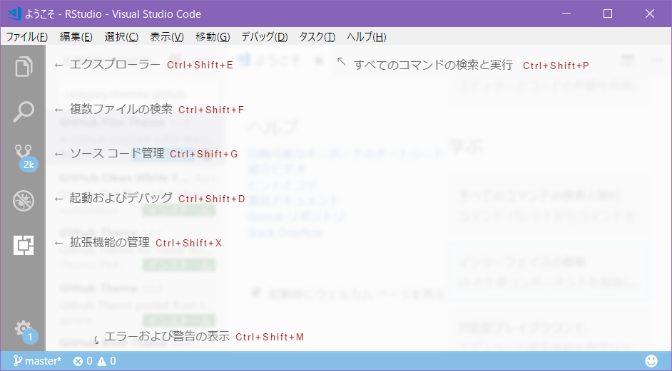
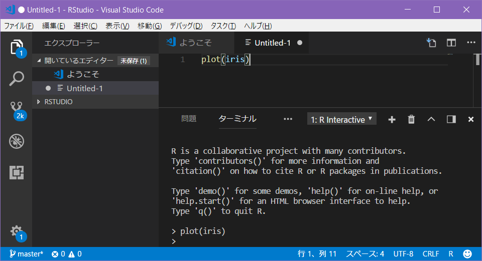

<!-- Include shared Links -->
```{r visual studio code, child="../shared/links.Rmd", include=FALSE}
```

Microsoftの[Visual Studio Code](https://www.microsoft.com/ja-jp/dev/products/code-vs.aspx)（以降、VSCode）は、WindowsだけでなくMac OS X、Linuxでも動作する軽量・高機能なタブ型エディターです。拡張機能を追加することで様々な言語の開発環境に対応することが可能です。軽量なので特に[RStudio][RSD]の動作が今一つなWindows環境で簡単な処理確認などを行うのには向いていると思います。  
　  


　  

# VSCodeのインストール
[VSCodeのダウンロードサイト](https://code.visualstudio.com/download)からプラットフォーム用のインストーラをダウンロードして、インストールしてください。インストール自体は対話的に進めれば問題なくインストールできるはずです。  
　  

# 拡張機能のインストールと設定
VSCodeから[R][R]を利用するには[R][R]の拡張機能（Extention）をインストールして設定する必要があります。  
　  

## R拡張機能のインストール
R拡張機能は利用しているプラットフォームに関わらず以下の手順でインストールします。なお、[Visual Studio Marketplace](https://marketplace.visualstudio.com/items?itemName=Ikuyadeu.r)からでもインストール可能です。  

1. VSCodeを起動します
1. ［Ctrl+Shift+X］を押下するかウィンドウ左端にある［拡張機能］ボタンをクリックします
1. 拡張機能が表示されたら検索ボックスに**`R`**と入力します
    * **`@sort:installs`**と入力されている場合がありますが無視して上書きします
1. 検索結果が検索ボックスの下に表示されますので、**`R`**と表示された拡張機能を選択します
1. R拡張機能の説明などが表示されます
    * "Yuki Ueda"氏による"Support for R languaage"とある拡張機能であることを確認します
1. ［インストール］ボタンをクリックします
    * 依存関係にある拡張機能もインストールされます
1. インストールが完了したらVSCodeを再起動します

以上でR拡張機能のインストールは終了です。  
　  

## R拡張機能の設定
VSCodeを再起動したらR拡張機能のために[R][R]の実行ファイルがあるパスの設定を行います。

1. メニューから［ファイル］-［基本設定］-［設定］を選択します
    * もしくは［Ctrl+Comma］を押下します
1. ［ユーザ設定］タブが表示されますので検索ボックスに**`r.rterm`**と入力します
1. 利用しているプラットフォームに応じた**`r.rterm`**を確認します
1. 修正が必要な場合は右側に表示されている"ユーザ設定"に変更内容を記述します
    * 記述はJSONのobject形式なので**`{}`**内に**`string:value`**形式です記述します
    * 複数記述する場合は**`,`**で区切ります
1. ［ユーザ設定］を閉じます
    * 変更したら必ず保存してください

以上でR拡張機能の基本的な設定は終了です。  
　  

## フォルダーを開く
R拡張機能を使うためには「フォルダ」を以下の手順で開いておく必要があります。この「フォルダ」は[RStudio][RSD]のプロジェクトホームと同様で、開いているフォルダがcurrent working directory（**`getwd()`**で得られるパス）になります。[RStudio][RSD]を使っている場合は[RStudio][RSD]のデフォルトフォルダを初期フォルダとしておくのがいいかと思います。  

1. メニューから［ファイル］-［フォルダーを開く...］
    * もしくは［Ctrl+K Ctrl+O］を押下します
1. フォルダー選択ダイアログが表示されますので任意のフォルダーを選択します

以上でフォルダーの設定は終了です。  
　  

# 動作の確認
R拡張機能のインストールと設定が確認したら以下の手順で動作確認を行います。

1. メニューから［ファイル］-［新規ファイル］選択します
    * もしくは［Ctrl+N］を押下します
1. ウィンドウ右下にある［プレーンテキスト］の部分をクリックします
1. 言語モードリストが表示されますので、検索ボックスに**`R`**と入力します
1. 検索結果が表示されますので**`R (r)`**を選択します
1. ［プレーンテキスト］が［R］に変わっていることを確認します
1. 新規ファイルに**`plot(iris)`**と入力します
1. ［F1］キーを押下してコマンドウィンドウが表示されたら**`R:`**と入力します
1. **`R: Run Selection/Line`**を選択して入力したコードを実行します
    * 一番最初の実行ではRが起動するだけでコードは実行されません
    * 自動的にターミナルが開かれますので、コードを選択して、再度、実行してみてください
1. **`iris`**データセットの散布図行列が別ウィンドウで描画されます

以上で動作確認は終了ですが、動作しない場合は、以下を再確認してください。

* **`r.rterm.*`**にRの実行ファイルに対するパスが設定されている
* フォルダが開かれている

　  



　  

# メリット・デメリット
VSCodeは比較的軽量かつ多機能ですが[R][R]でのコーディングに限定した場合、[RStudio][RSD]と比べて以下のメリット・デメリットがあります。  

| 項目                   | VSCode + R Ext. | RStudio              |
|------------------------|-----------------|----------------------|
| マルチプラットフォーム | Linux, Mac, Win | Linux, Mac, Win^1^   | 
| マルチ言語対応         | Yes             | Python, Stan等限定的 | 
| シンタックスハイライト | Yes             | Yes                  |
| コード補完機能         | Snipet only     | Yes^2^               |
| パッケージ管理         | No              | Yes                  |
| ソースファイル管理     | Built-in Git    | Git/SVNで選択可      |
| デバッガー             | Yes             | Yes                  |
| 機能拡張               | Yes             | Yes^3^               |
| 日本語公式サポート     | Yes^4^          | No^5^                |

^1^ 2018/3時点では32bit版のみです  
^2^ Rに関しては作成したobjectに対しても補完可能です  
^3^ Addinsとしてパッケージに同梱されているものあります  
^4^ R拡張機能は日本人の作成なので日本語でのやりとり可です  
^5^ r-wakalangなどの日本語コミュニティはあります  

---

<!-- Include Footer -->
```{r, child="../shared/footer.Rmd", include=FALSE}
```
