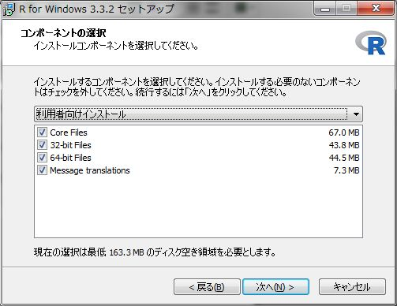
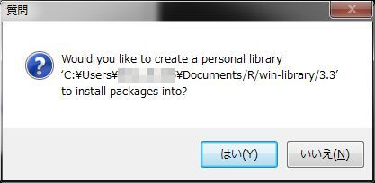

### Windowsでのインストール
Windowsではインストールの際に管理者権限が必要になる場合があります。管理者権限をもたないアカウントでインストールする場合は、管理者権限情報を把握しておいて下さい。  
　  

### Rのインストール
[R <i class="fa fa-external-link"></i>][R]をインストールする前に[CRAN <i class="fa fa-external-link"></i>][CRAN]または日本の[ミラーサイト <i class="fa fa-external-link"></i>][ISM]で、サポートOSを確認しておいてください。  
　  

#### Rの入手 {#DownloadR}
[CRAN <i class="fa fa-external-link"></i>][CRAN]または日本の[ミラーサイト <i class="fa fa-external-link"></i>][ISM]から最新版の`base`をダウンロードします。なんらかの都合で旧版を入手したい場合は[Previous Release](https://cran.r-project.org/bin/windows/base/old/)から入手してください。  
　  

#### インストーラの起動
入手したインストーラを起動します。WinodwsのUAC（ユーザアカウント制御）によりインストールが上手くいかない場合は管理者権限でインストールしてみてください。[UACに関して](#UAC)も合わせてご覧ください。

インストールウィザードでいくつかの設定を確認されますので、以下の要領で設定をしてください。

1. コンポーネントの選択は基本的にデフォルト  


2. 起動時オプションは「はい」を選択  


3. 表示モードはSDIを選択  


表示モードで`SDI`を選択する理由はR Commanderが`SDI`モードでの利用を推奨しているからです。

4. ヘルプの表示方法はお好みで  


5. インターネット接続
最新版のR for Windows 3.3.2ではインターネット接続に関する設定表示がありませんので、プロキシ接続が必要な場合は[R Commanderのインストール](./install_rcmdr.html)に記載している設定方法をご確認ください。

設定が終わるとRがインストールされます。インストールが終了したらRが起動することを確認してください。  
　  

#### インストール後の確認
Rのインストールが完了したら簡単な動作確認を行います。Rを起動して、表示されたコンソールに

```
2*3
```

と入力してみて下さい。`6`が帰ってくればOKです。起動しない場合は管理者権限で起動してみて下さい。それでも起動しない場合は、日本語を含まないパスにインストールされているか等を確認してください。


以上でRのインストールは完了です。  
　  

### R Commanderのインストール
R Commander(Rcmdr)のインストールと動作確認については[R Commanderのインストール](./install_rcmdr.html)を参照して下さい。その他のパッケージインストール方法については[パッケージのインストール](./install_pkg.html)を参照して下さい。  
　  

### UACに関して {#UAC}
Windows Vistaから導入されたUAC機能によりRのパッケージライブラリ管理に制限がでる場合があります。これは、インストール先（フォルダ）をデフォルト設定の`C:\Program Files\R\`とした場合です。
具体的には管理者権限のない状態でRを起動してRのパッケージを追加しようとすると以下のメッセージが表示されてライブラリフォルダにアクセスできない、インストールできなない状態になります。

```
 install.packages(NULL, .libPaths()[1L], dependencies = NA, type = type) で警告がありました: 
   'lib = "C:/Program Files/R/R-3.3.2/library"' は書き込み可能ではありません
```

通常、利用するには特に問題になりませんがパッケージを追加したり更新したりする際にうまく追加、更新できない場合が出てきます。これを回避するにはいくつかの方法がありますが、特に組織内で利用する場合は組織のセキュリティポリシーに則った回避方法を選択してください。  

詳細については[Does R run under Windows Vista/7/8/Server 2008? <i class="fa fa-external-link"></i>](https://cran.ism.ac.jp/bin/windows/base/rw-FAQ.html#Does-R-run-under-Windows-Vista_003f){target="_blank" title="CRAN FQA"}でご確認ください。  
　  

#### 回避方法1
パッケージをインストールする際に前述のエラーメッセージの後に表示される質問ダイアログにて`はい(Y)`を選択しマイドキュメントフォルダ内に個人用のライブラリフォルダを作成する。



この方法の場合、ユーザの権限変更や管理者権限により起動をする必要がありません。ただし、インストールフォルダにある`Base`パッケージを更新する場合は管理者権限が必要になります。  
　  

#### 回避方法2
Rを管理者権限で起動することでUAC機能を無効にする。管理者権限ですので制限されることなく`Program Files`フォルダにパッケージをインストールすることが可能になります。パッケージのインストール時、更新時のみこの方法を使うのも手です。  
　  

#### 回避方法3
インストール先をデフォルトの`C:\ProgramFiles\R`以外に設定する。ただし、この場合はRに対してUAC機能は機能しなくなります。


　  

#### 参考)Rのライブラリパス
Rを一番最初にインストールする時には以下のようなダイアログが表示されまう。このダイアログに対する回答によりパッケージがインストールされるフォルダ、ライブラリパスが変わります。


1) [はい]と答えた場合  
My Documents配下に「R\win-library\x.x」というフォルダを作成し、そこにライブラリをインストールします（x.xはRのバージョン番号）。

2) [いいえ]と答えた場合  
Rがインストールされたフォルダ直下にある「library」フォルダにライブラリをインストールします。ただし、管理者権限がない場合はUWindowsのUACによりアクセスできずインストールが失敗に終わります。

インストール時の選択肢は上記の二つですが、環境変数を用いることで他の場所に配置することも可能です。ただし、最新版での動作は確認していません。  

* OSの環境変数で指定する場合  

環境変数名  | デフォルト値                          | 説明
------------|---------------------------------------|---
R_LIBS      | NULL                                  | 設定すると`.libPaths()`に設定され参照が可能になる  
R_LIBS_USER	| ${R_USER_HOME}/R/win-library/x.y      | 上記で[はい]を選択した場合
R_LIBS_SITE	| NULL                                  | 起動時に.Library.siteに設定される 

* baseパッケージの変数で指定する場合  

環境変数名    | デフォルト値      | 説明
--------------|-------------------|---------------------------------------------
.Library		  | ${R_HOME}/library | 
.Library.site |	NULL              | .Rprofile.site内にコードを書くことで設定可能

参照順は下記の順になりますが存在しているディレクトリのみ参照される点に注意してください。
R_LIBS, R_LIBS_USER, .Library.site, .Library  
　  

[Rのインストールに戻る](#DownloadR)

---