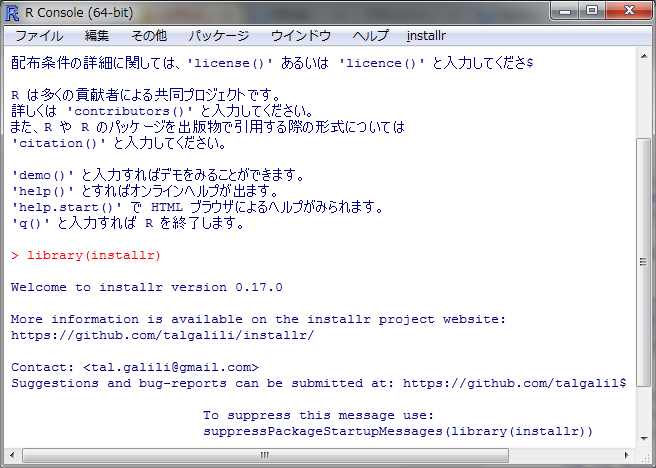

<!-- Include shared Links -->
```{r install, child="../shared/links.Rmd", include=FALSE}
```

本ページでは[R <i class="fa fa-external-link"></i>][R]本体の更新方法をOS別に紹介します。

# 利用環境 {.tabset .unnumbered}
[R <i class="fa fa-external-link"></i>][R]本体を更新する場合、OS毎に更新方法が異なっていますのでご注意ください。


## OSの選択
お使いのOSを上記のタブから選択して下さい。利用しているOSがない場合は[CRAN <i class="fa fa-external-link"></i>][CRAN]または日本の[ミラーサイト <i class="fa fa-external-link"></i>][ISM]で公開されているマニュアルを参照してください。  
なお[R <i class="fa fa-external-link"></i>][R]ではメジャーバージョンが変わる（例 v3.3.xからv3.4.x）の場合は"Release"、マイナーバージョンが変わる（例 v3.3.2からv3.3.3）の場合は"Patched"と呼んで区別をしておりアップデート方法もこの区分により手順の差異があります。

---

## Windows
Windowsは他のOSと異なり3rd partyアプリケーションの更新はアプリケーションごとで実施することになります。Windows版[R <i class="fa fa-external-link"></i>][R]の場合、[R <i class="fa fa-external-link"></i>][R]自体を更新する方法は提供されず"Release"、"Patched"に関わらず新しいバージョンの[R <i class="fa fa-external-link"></i>][R]を新たにインストールする必要があります。したがって変更した設定情報や基本パッケージと同じディレクトリにインストールしたパッケージなどはまったく引き継がれませんので注意が必要です。  

### installr
Windows版[R <i class="fa fa-external-link"></i>][R]の更新における手間を省いてくれるのが`installr`パッケージです。
　  

#### パッケージの導入と起動
他のパッケージと同様の手順でパッケージをインストールしロードするとR GUIのメニューに[installr]が追加されます。
```{r, eval=FALSE}
install.packages("installr")
library(installr)
```
　  

　  

#### 更新の実行
[installr]メニューから[Update R]または以下のコマンドを実行すると自動的に最新のバージョンを検索し対話的な更新が始まります。常に最新バージョンへの更新しかできませんので意図時に途中のバージョンにしたい場合には手動で更新を行ってください。
```{r, eval=FALSE}
installr::updateR()
```


以降、対話式に進めていくとRの更新が完了します。

#### パッケージの更新
新しい[R <i class="fa fa-external-link"></i>][R]が起動したら再度`installr`パッケージを読み込んで[installr]-[Update R packages]を実行してインストールされているパッケージを最新版にしておきましょう。  
`installr`パッケージはこのように便利ですが一部のパッケージ(`Rcmdr`)との相性が悪いようで更新後にパッケージが読み込めない場合には当該パッケージを再インストールしてください。

#### 関連ソフトウェアのインストール
[installr]-[Install software]から関連ソフトウェアのインストールも可能なようですが、このあたりは自らインストールするのが無難かと思います。


---

## MacOS
[CRAN <i class="fa fa-external-link"></i>][CRAN]または[Rjpwiki <i class="fa fa-external-link"></i>](http://www.okadajp.org/RWiki/?RjpWiki){target="_blank" title="Rjpwiki"}を参考にしてください。

---

## Ubuntu
Ubuntu等のLinux系はリポジトリから更新情報を受取り既存ファイルを更新しますので、"Release"でない限りはOSのシステム更新機能に任せておけます。"Release"の場合はパッケージを再インストール（再コンパイル）する必要がありますので注意をしてください。

---

# 困った時は
インストールしたけど動かない等の困った時は[RjpWiki <i class="fa fa-external-link"></i>](http://www.okadajp.org/RWiki/){target="_blank" title="Rjpwiki"}や[r-wakalang <i class="fa fa-external-link"></i>](http://qiita.com/uri/items/5583e91bb5301ed5a4ba){target="_blank" title="r-wakalang"}、[Qiita <i class="fa fa-external-link"></i>](http://qiita.com/){target="_blank" title="Qiita"}等で検索、または、勉強会のMLで質問してみてください。

---

<!-- Include Footer -->
```{r, child="../shared/footer.Rmd", include=FALSE}
```