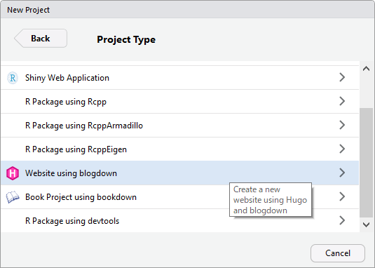
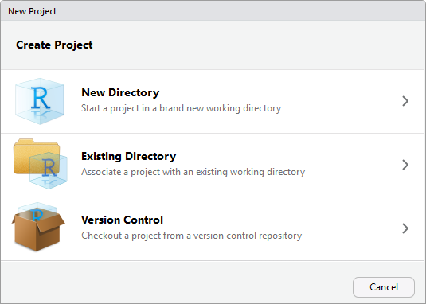
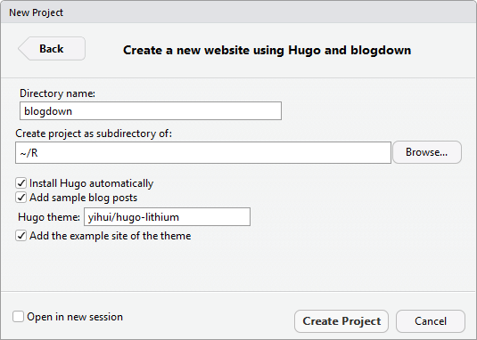

<!-- shared Links -->
```{r child="../shared/links.Rmd", include=FALSE}
```

```{r setup, include=FALSE}
# 共通chunkオプションの指定
knitr::opts_chunk$set(warning = FALSE, echo = TRUE)

# データハンドリングで利用する外部パッケージの読み込み
require(tidyverse)
```

静的なブログを作るための手順まとめです。  
　  
[R Markdown Websites][RmdWebsites]機能で勉強会のページを作成していますが、ページ数が増えてくると構成管理が面倒なため、Blogのタグ機能を使うことで構成管理の代わりにできないかと考えています。このきっかけになったのは、Twitterでバズっていた「[静的サイトを公開するならどこがいいの？ #技術書典 <i class="fa fa-external-link"></i>](https://nabettu.hatenablog.com/entry/staticsite){target="_blank" title="フロントエンドの地獄"}」という記事です。この記事に書いてある情報を元にググってみたところ「[静的サイトジェネレーターは脱CMSなブログが作れるツール <i class="fa fa-external-link"></i>][Qookie]」という構築の参考になりそうなページに辿りつきましたので、そのあたりの情報を元に静的なブログを作るための情報を忘備録として整理しておきます。  
　  

# 静的ブログ作成のプロセス
[R][R]には[R Markdown <i class="fa fa-external-link"></i>][RMD]で静的ブログを作成できる[blogdown <i class="fa fa-external-link"></i>][blogdown]という静的ジェネレータ的なパッケージが公開されています。最新版ではDeploy工程までマニュアルに記載されており「[静的サイトジェネレーターは脱CMSなブログが作れるツール <i class="fa fa-external-link"></i>][Qookie]」で説明されている内容と親和性が高いと判断し、下表の構成で静的ブログの作成に挑戦してみます。  
　  

Process         | Service or Tools
----------------|--------
Page Create     | [blogdown <i class="fa fa-external-link"></i>][blogdown]
Generator       | [Hugo <i class="fa fa-external-link"></i>][Hugo] or [Hexo <i class="fa fa-external-link"></i>][Hexo]
Version Control | [GitHub <i class="fa fa-external-link"></i>]()
Deploy          | [Netlify <i class="fa fa-external-link"></i>][Netlify]

　  

## blogdown
[blogdown <i class="fa fa-external-link"></i>][blogdown]はジェネレータとして[Hugo <i class="fa fa-external-link"></i>][Hugo]を利用していますので、これだけでも静的ブログの作成は可能です。  
　  

## Hugo
[Hugo <i class="fa fa-external-link"></i>][Hugo]はGo言語で作成されておりジェネレート速度が格段に速いのが特徴です。使用するテーマにより設定できる機能が異なるなど注意点も多々あるようです。
　  

## Hexo
[Hexo <i class="fa fa-external-link"></i>][Hexo]はプラグインを追加することで気軽に機能拡張ができるジェネレータです。生成速度が[Hugo <i class="fa fa-external-link"></i>][Hugo]に劣るもののそこそこ早いそうです。日本語ドキュメントが少ないのが難点。
　  

## GitHub
[GitHub Pages <i class="fa fa-external-link"></i>][GitHub Pages]は、ご存知、GitHubリポジトリを利用してWebページを公開できる機能です。ただし、Webページのジェネレートは予め行ってHTMLファイルを用意しておく必要があります。  
　  

## Netlify
[Netlify <i class="fa fa-external-link"></i>][Netlify]は最近注目の静的サイトのホスティングサービスです。[GitHub Pages <i class="fa fa-external-link"></i>][GitHub Pages]などと異なりホスティングサービス内で静的サイトジェネレータを用いて自動的にビルドしてデプロイする機能が無料プランでも提供されているのが特徴です。  
　  

* [NetlifyはGitHubなどからデプロイできる静的Webホスティングサービス <i class="fa fa-external-link"></i>](https://tech.qookie.jp/posts/info-netlify-static-web-deploy/){target="_blank" title="Qookie TECH"}

　  

# 環境構築

## ローカル環境の構築
ホスティングサービス上にいきなりサイトを構築するのはハードルが高いため、まずは、ローカルで環境を構築してサイト構築に必要な厚生や手順を把握しておきます。  
　  

### blogdownのインストール
[R][R]/[RStudio][RSD]環境の構築は終わっていることを前提とし、まずは、[blogdown <i class="fa fa-external-link"></i>][blogdown]パッケージを[CRAN][CRAN]からインストールします。  
　 

```{r, eval=FALSE}
install.packages("blogdown")
```

　  

### Hugoのインストール
パッケージのインストールが完了しましたら、次に[Hugo <i class="fa fa-external-link"></i>][Hugo]をインストールします。[Hugo <i class="fa fa-external-link"></i>][Hugo]は[blogdown <i class="fa fa-external-link"></i>][blogdown]パッケージを利用して最新版をインストールすることができます。  
　  

```{r, eval=FALSE}
blogdown::install_hugo()
```

　  
再インストールやアップデートしたい場合には、以下を実行してください。  
　  

```{r, eval=FALSE}
blogdown::update_hugo()
```

　  

#### blogdownの動作確認
[blogdown <i class="fa fa-external-link"></i>][blogdown]パッケージと[Hugo <i class="fa fa-external-link"></i>][Hugo]のインストールが完了しましたら簡単に動作確認を行います。  
最新版の[RStudio][RSD]ではプロジェクト作成ウィザードから直接、blogdownプロジェクトを作成することができます。







[Addins]メニューから[Server Site]を選択し[Viewer]ペインにBlogが表示されたら無事、インストール完了です。


<!-- #### テーマの変更 -->
<!-- ```{r, eval=FALSE} -->
<!-- blogdown::install_theme() -->
<!-- ``` -->

<!-- テーマパッケージ内のファイル名にマルチバイト文字が使われているとエラーになってインストールエラーで中断する。 -->

<!-- ``` -->
<!-- Error in utils::unzip(zipfile, exdir = tmpdir) :  -->
<!--   invalid multibyte string at '<87><e6><b8>ｬ隧ｦ.md' -->
<!-- ``` -->


### Hexoのインストール
[Hexo <i class="fa fa-external-link"></i>][Hexo]のサイトから推奨版（LTS）インストーラーをダウンロードしインストールを行います。Windowsの場合はウィザードにしたがってインストールしてください。

インストールの確認はWindows環境の場合、コマンドプロンプトまたはPowerShellから行います。[RStudio][RSD]のTerminalを使う場合には、[Hexo <i class="fa fa-external-link"></i>][Hexo]をインストール後に[RStudio][RSD]を再起動してください。


#### Hexoの設定

```{bash, eval=FALSE}
npm install hexo-cli -g
```


* [Hexoでローカルに静的なブログを作ってみて基本構成を把握する <i class="fa fa-external-link"></i>](https://tech.qookie.jp/posts/info-hexo-local/){target="_blank" title="Qookie TECH"}


# 参考資料
* [blogdownのTips <i class="fa fa-external-link"></i>](https://kazutan.github.io/blog/2017/04/blogdown-tips/){target="_blank" title="日々是独想"}
* [Making a Website Using Blogdown, Hugo, and GitHub pages. <i class="fa fa-external-link"></i>](http://amber.rbind.io/blog/2016/12/19/creatingsite/){target="_blank" title="Amber Thomas"}
* [Rとblogdownでかんたんにgithub.io上にブログを使ってみよう！！ <i class="fa fa-external-link"></i>](https://qiita.com/masato_t/items/7bbfa74f8de0dc06c91c){target="_blank" title="Qiita"}

---

<!-- Footer -->
```{r child="../shared/footer.Rmd"}
```

[Qookie]: https://tech.qookie.jp/posts/info-static-site-generator/ {target="_blank" title="Qookie TECH"}

[blogdown]: https://bookdown.org/yihui/blogdown/ {target="_blank" title="Creating Websites with R Markdown"}
[GitHub Pages] https://pages.github.com/ {target="_blank" title="Websites for you and your projects."}[Hexo]: https://hexo.io/ {target="_blank" title="A fast, simple & powerful blog framework"}
[Hugo]: https://gohugo.io/ {target="_blank" title="The world's fastest framework for building websites"}
[Netlify]: https://www.netlify.com/ {target="_blank" title="Build, deploy, and manage modern web projects"}
[RmdWebsites]: https://rmarkdown.rstudio.com/lesson-13.html {target="_blank" title="R Markdown from RStudio"}
